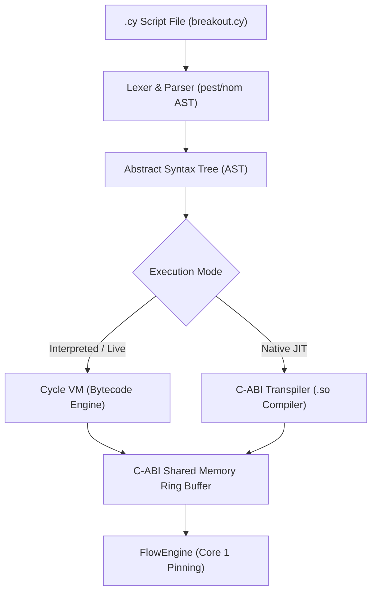

# 🚀 CYCLELANG / CYCLESCRIPT (HFT DOMAIN-SPECIFIC PROGRAMMING LANGUAGE)
## Advanced Architecture, Syntax Specification, and Implementation Plan

---

## 1. 📌 Introduction and Architectural Vision

**CycleLang (`.cy`)** is a high-performance strategy and plugin orchestration domain-specific programming language (DSL) designed to run on top of the Cycle Orchestrator High-Frequency Trading (HFT) infrastructure.

### Core Architectural Principles:
1. **Micro-Modular Plugin Architecture:** `.so` dynamic libraries (C-ABI) provide raw performance, memory buffering, and exchange connections (muscle power).
2. **Orchestration and Wiring Layer (`.cy`):** Manages stream flow logic, inter-plugin data pipelines, strategy triggers, and risk management rules (brain power).
3. **Zero Latency Overhead:** `.cy` scripts are compiled into bytecode or direct C-ABI calls, ensuring no microsecond blocking on the HFT core thread (Core 1).
4. **Live Hot-Reloading:** `.cy` scripts can be updated instantly on live data feeds without restarting or interrupting the system.

---

## 2. 📜 Language Syntax Specification

### A. Variables and Data Types
```cyclescript
// Primitive Data Types
let symbol: string = "BTCUSDT"
let leverage: int = 20
let risk_pct: float = 1.5
let is_active: bool = true

// Dictionary / JSON Type
let config = {
    "target_symbol": symbol,
    "max_slippage": 0.02,
    "stop_loss_pct": 0.5
}
```

### B. Plugin Loading and Lifecycle (`plugin`)
```cyclescript
// 1. Load Dynamic C-ABI Plugins into Memory
let gateway  = plugin.load("libplugin_binance_gateway.so")
let stats    = plugin.load("libplugin_aggtrade_stats.so")
let breakout = plugin.load("libplugin_breakout.so")
let paper    = plugin.load("libplugin_paper_exchange.so")
let db       = plugin.load("libplugin_sqlite_query.so")

// 2. Configure and Start Plugins
gateway.set_config({ "ws_url": "wss://fstream.binance.com/ws" })
gateway.pin_core(0) // Background Networking -> Core 0
breakout.pin_core(1) // Ultra-Low Latency Calculation -> Core 1

gateway.start()
stats.start()
breakout.start()
paper.start()
```

### C. Inter-Plugin Data Pipelines (`pipe`)
Connects output memory buffers of producer plugins directly to input buffers of consumer plugins with zero-copy:

```cyclescript
pipe HFT_Data_Flow {
    gateway.stream("best_price")  -> paper.inbox("market_data")
    gateway.stream("aggtrades")   -> stats.inbox("trades")
    stats.stream("delta_summary") -> breakout.inbox("delta")
    breakout.stream("signals")    -> paper.inbox("orders")
}
```

### D. Live Stream Listeners & Triggers (`when`, `on_event`)
```cyclescript
// Conditional Event Trigger
when (stats.delta_1m > 100.0 && gateway.spread < 0.05) {
    let price = gateway.best_ask
    let qty = calc_position_size(price, leverage)
    
    paper.buy(symbol, qty: qty, price: market, leverage: leverage)
    log("🚀 HFT BREAKOUT BUY TRIGGERED | Qty: " + qty)
}

// Risk & Position Control Listener
on_event(paper, "position_update") { |pos|
    if (pos.unrealized_pnl_pct >= 2.0) {
        paper.close(pos.symbol)
        log("🎯 TAKE PROFIT TARGET REACHED: Position Closed.")
    } else if (pos.unrealized_pnl_pct <= -0.5) {
        paper.close(pos.symbol)
        log("⏹ STOP LOSS TRIGGERED: Position Closed.")
    }
}
```

### E. Functions & Custom Logic (`fn`)
```cyclescript
fn calc_position_size(entry_price: float, lev: int) -> float {
    let account = paper.get_balance()
    let margin = account.available_margin * 0.1 // 10% of balance
    return (margin * lev) / entry_price
}
```

---

## 3. ⚙️ Compiler and Execution Engine Architecture



1. **Parser & Lexer:** Uses Rust `pest` or `nom` crate to parse `.cy` text files into AST nodes.
2. **Cycle Virtual Machine (VM):** Converts AST nodes to compact bytecode executed in memory.
3. **C-ABI JIT Transpiler (Future Stage):** Transpiles `.cy` scripts directly to C/Rust code compiled to `.so` shared objects via `gcc`/`rustc`.

---

## 4. 💻 Shell Integration (Interactive Shell Commands)

The following commands will be integrated into the `interactive_shell`:

| Command | Description |
| :--- | :--- |
| **`run <script.cy>`** | Parses, validates, and executes the specified `.cy` script. |
| **`watch <script.cy>`** | Watches script file changes and updates execution live (Hot-Reloading). |
| **`compile <script.cy> -o <out.so>`** | Compiles the script directly to a native C-ABI `.so` plugin. |
| **`scripts`** | Lists active `.cy` scripts running in memory and their statuses. |
| **`stop script <id>`** | Stops the specified script execution and its triggers. |

---

## 5. 🗺️ Step-by-Step Implementation Roadmap

### 🔹 Stage 1: Lexer & AST Parser Infrastructure
* Create a new crate named `cycle_lang` (under `crates/core` or `apps`).
* Define `.cy` syntax grammar (`pest` parser for variables, `plugin.load`, `set`, `start`).

### 🔹 Stage 2: Bytecode Interpreter & Orchestrator Binding
* Build bytecode interpreter that takes AST output and invokes `Orchestrator` methods (`call_endpoint` / `load_plugin`).
* Add `run script.cy` command to the interactive shell.

### 🔹 Stage 3: Data Pipelines (`pipe`) and Event Listeners (`when`, `on_event`)
* Complete the `pipe` engine for dynamic zero-copy data routing between plugins.
* Implement event loop evaluating `when` blocks in nanoseconds as WebSocket/SQLite data arrives.

### 🔹 Stage 4: Hot-Reloading and Native `.so` Compiler (JIT)
* Build `watch` module to re-parse updated script files live without stopping the system.
* Add `compile` module to transpile `.cy` scripts to C/Rust `.so` libraries.

---

## 📌 Conclusion

This specification transforms **Cycle Orchestrator** from a core runtime shell into a **full-fledged high-frequency trading platform with its own domain-specific programming language**. Plugins remain modular C-ABI micro-services while execution logic is flexibly orchestrated via `.cy` scripts.
