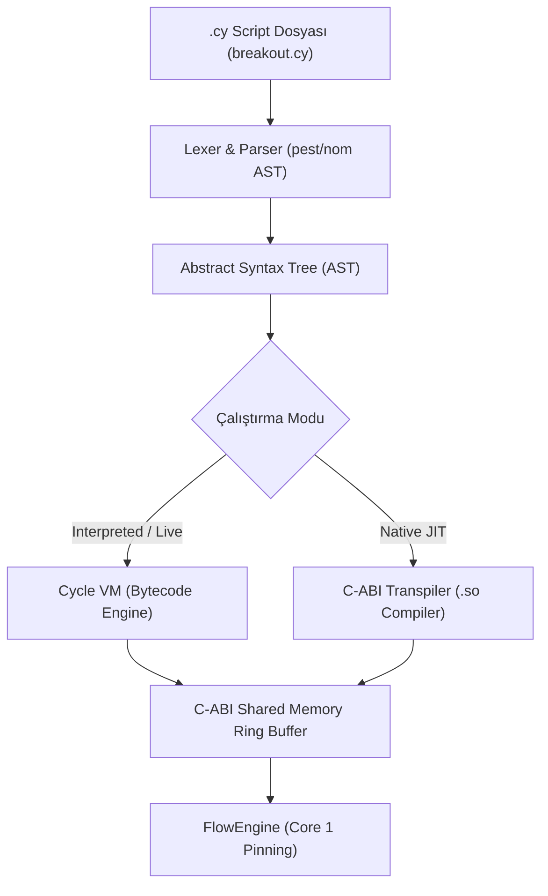

# 🚀 CYCLELANG / CYCLESCRIPT (HFT DOMAIN-SPECIFIC PROGRAMMING LANGUAGE)
## Gelişmiş Mimari, Sözdizimi Spesifikasyonu ve Uygulama Planı

---

## 1. 📌 Giriş ve Mimari Vizyon

**CycleLang (`.cy`)**, Cycle Orchestrator High-Frequency Trading (HFT) altyapısı üzerinde çalışan, **Domain-Specific Programming Language (DSL)** olarak tasarlanmış yüksek performanslı bir strateji ve eklenti orkestrasyon dilidir.

### Temel Mimari İlkeler:
1. **Mikro-Modüler Eklenti Mimarisi:** `.so` kütüphaneleri (C-ABI) saf performans, bellek tamponlaması ve borsa bağlantılarını (kas gücünü) sağlar.
2. **Orkestrasyon ve İlişki Katmanı (`.cy`):** Akış mantığını, eklentiler arası veri iletim hatlarını (piping), strateji tetikleyicilerini (triggers) ve risk kurallarını (aklı) yönetir.
3. **Sıfır Gecikme Bozulması (Zero Latency Overhead):** `.cy` betikleri derlenerek bytecode veya doğrudan C-ABI çağrılarına dönüştürülür; HFT çekirdeğindeki (Core 1) mikro-saniye işlemlerini engellemez.
4. **Canlı Sıcak Yükleme (Hot-Reloading):** Sistemi yeniden başlatmadan veya kesintiye uğratmadan `.cy` betikleri canlı akış esnasında anında güncellenebilir.

---

## 2. 📜 Programlama Dili Sözdizimi (Language Syntax Specification)

### A. Değişkenler ve Veri Tipleri
```cyclescript
// Temel Veri Tipleri
let symbol: string = "BTCUSDT"
let leverage: int = 20
let risk_pct: float = 1.5
let is_active: bool = true

// Sözlük / JSON Tipi
let config = {
    "target_symbol": symbol,
    "max_slippage": 0.02,
    "stop_loss_pct": 0.5
}
```

### B. Eklenti Yükleme ve Yaşam Döngüsü (`plugin`)
```cyclescript
// 1. Dinamik C-ABI Eklentilerini Hafızaya Yükle
let gateway  = plugin.load("libplugin_binance_gateway.so")
let stats    = plugin.load("libplugin_aggtrade_stats.so")
let breakout = plugin.load("libplugin_breakout.so")
let paper    = plugin.load("libplugin_paper_exchange.so")
let db       = plugin.load("libplugin_sqlite_query.so")

// 2. Eklentileri Yapılandır ve Başlat
gateway.set_config({ "ws_url": "wss://fstream.binance.com/ws" })
gateway.pin_core(0) // Background Networking -> Core 0
breakout.pin_core(1) // Ultra-Low Latency Calculation -> Core 1

gateway.start()
stats.start()
breakout.start()
paper.start()
```

### C. Eklentiler Arası Veri Boru Hattı (`pipe`)
Eklentilerin çıktı tamponlarını sıfır kopya (zero-copy) ile diğer eklentilerin girdi tamponlarına bağlar:

```cyclescript
pipe HFT_Data_Flow {
    gateway.stream("best_price")  -> paper.inbox("market_data")
    gateway.stream("aggtrades")   -> stats.inbox("trades")
    stats.stream("delta_summary") -> breakout.inbox("delta")
    breakout.stream("signals")    -> paper.inbox("orders")
}
```

### D. Canlı Akış Dinleyicileri ve Tetikleyiciler (`when`, `on_event`)
```cyclescript
// Koşullu Olay Tetikleyici (Event Trigger)
when (stats.delta_1m > 100.0 && gateway.spread < 0.05) {
    let price = gateway.best_ask
    let qty = calc_position_size(price, leverage)
    
    paper.buy(symbol, qty: qty, price: market, leverage: leverage)
    log("🚀 HFT BREAKOUT ALIM TETİKLENDİ | Miktar: " + qty)
}

// Risk ve Pozisyon Kontrol Dinleyicisi
on_event(paper, "position_update") { |pos|
    if (pos.unrealized_pnl_pct >= 2.0) {
        paper.close(pos.symbol)
        log("🎯 TAKE PROFIT HEDEFİ ULAŞILDI: Pozisyon Kapatıldı.")
    } else if (pos.unrealized_pnl_pct <= -0.5) {
        paper.close(pos.symbol)
        log("⏹ STOP LOSS TETİKLENDİ: Pozisyon Kapatıldı.")
    }
}
```

### E. Fonksiyon ve Kullanıcı Tanımlı Mantık (`fn`)
```cyclescript
fn calc_position_size(entry_price: float, lev: int) -> float {
    let account = paper.get_balance()
    let margin = account.available_margin * 0.1 // Bakiyenin %10'u
    return (margin * lev) / entry_price
}
```

---

## 3. ⚙️ Derleyici ve Yürütme Motoru Mimarisi



1. **Parser & Lexer:** Rust `pest` veya `nom` crate'i ile `.cy` metin dosyası AST ağacına dönüştürülür.
2. **Cycle Virtual Machine (VM):** AST ağacı hafif bir bytecode formatına dönüştürülüp hafızada yürütülür.
3. **C-ABI JIT Transpiler (İleri Aşama):** `.cy` betiği otomatik olarak C/Rust koduna dönüştürülüp `gcc`/`rustc` ile doğrudan `.so` eklentisine derlenebilir.

---

## 4. 💻 Shell Entegrasyonu (İnteraktif Kabuk Komutları)

Geliştirdiğimiz `interactive_shell` kabuğuna şu yeni komutlar entegre edilecektir:

| Komut | Açıklama |
| :--- | :--- |
| **`run <script.cy>`** | Belirtilen `.cy` betiğini okur, doğrular ve çalıştırır. |
| **`watch <script.cy>`** | Betik dosyasında değişiklik yapıldığında canlıda anında günceller (Hot-Reloading). |
| **`compile <script.cy> -o <out.so>`** | Betiği doğrudan yerel C-ABI `.so` eklentisine derler. |
| **`scripts`** | Hafızada aktif çalışan `.cy` betiklerini ve durumlarını listeler. |
| **`stop script <id>`** | Çalışan betiği ve tetikleyicilerini durdurur. |

---

## 5. 🗺️ Adım Adım Geliştirme Yol Haritası (Implementation Roadmap)

### 🔹 Aşama 1: Lexer & AST Parser Altyapısının Kurulması
* `cycle_lang` adında yeni bir crate oluşturulması (`interactive_shell` dizini altında veya bağımsız).
* `pest` grameri ile `.cy` sözdizimi tanımlarının (Değişkenler, `plugin.load`, `set`, `start`) oluşturulması.

### 🔹 Aşama 2: Bytecode Yürütücü (Interpreter & Orchestrator Binding)
* AST çıktısını alan ve `Orchestrator` üzerindeki `call_endpoint` / `load_plugin` metotlarını çağıran bytecode motorunun yazılması.
* `run script.cy` komutunun kabuğa eklenmesi.

### 🔹 Aşama 3: Veri Boru Hattı (`pipe`) ve Etkinlik Dinleyicileri (`when`, `on_event`)
* Eklentiler arasındaki veri akışını dinamik olarak yönlendiren `pipe` motorunun tamamlanması.
* WebSocket veya SQLite verileri geldikçe `when` bloklarını nanosaniyede değerlendiren olay döngüsünün kurulması.

### 🔹 Aşama 4: Hot-Reloading ve Yerel `.so` Derleyicisi (JIT)
* Betik dosyası kaydedildiği an canlı sistemi durdurmadan re-parse eden `watch` modülünün yazılması.
* `.cy` dosyalarını C/Rust `.so` eklentisine dönüştüren `compile` modülünün eklenmesi.

---

## 📌 Sonuç

Bu spesifikasyon, **Cycle Orchestrator** altyapısını basit bir sistemden **kendi programlama diline sahip yüksek frekanslı bir ticaret platformuna** dönüştürecektir. Eklentiler modüler mikro-hizmetler olarak kalırken, tüm mantık ve ilişki ağı `.cy` betikleriyle saniyeler içinde esnekçe yönetilecektir.
