# Cycle-Orc Geniş Çaplı Proje Dökümantasyonu

## 1. Proje Dizini (Tree)

```
cycle-orc/
    test_scan2.rs
    HFT_ANALYSIS.md
    Cargo.toml
    trader.cfg
    test_ws.rs
    README.md
    FLOW_ENGINE_PLAN.md
    PROJECT_DOCS.md
    Cargo.lock
    .gitignore
    IMPLEMENTATION_PLAN.md
    paper_exchange.db
    flow_config.json
    plugin_breakout/
        Cargo.toml
        src/
            lib.rs
            bin.rs
    binance_gateway/
        Cargo.toml
        src/
            lib.rs
    plugin_paper_exchange/
        Cargo.toml
        src/
            engine.rs
            storage.rs
            lib.rs
            models.rs
        tests/
            integration_test.rs
    binance_trader/
        Cargo.toml
        src/
            lib.rs
    orchestrator/
        Cargo.toml
        trader.cfg
        Cargo.lock
        paper_exchange.db
        src/
            system.rs
            tui.rs
            memory.rs
            endpoint.rs
            main.rs
            lib.rs
            orchestrator.rs
            bin/
    flow_engine/
        Cargo.toml
        src/
            config.rs
            memory.rs
            engine.rs
            lib.rs
    ohlcv_fetcher/
        Cargo.toml
        src/
            lib.rs
    ms_analyzer/
        Cargo.toml
        Cargo.lock
        ohlcv-engine/
            Cargo.toml
            src/
                client.rs
                lib.rs
        src/
            levels.rs
            liquidity.rs
            imbalance.rs
            session.rs
            pivot.rs
            lib.rs
            trend.rs
            narrative.rs
        infra/
            Cargo.toml
            src/
                lib.rs
                util.rs
    oi_fetcher/
        Cargo.toml
        src/
            lib.rs
```

## 2. Dosya Analizleri

### Dosya: `test_scan2.rs`

#### Kaynak Kod
```rust
use std::path::PathBuf;
fn main() {
    let mut lib_dir = std::env::current_exe().unwrap_or_else(|_| PathBuf::from("."));
    lib_dir.pop();
    let prefix = if cfg!(target_os = "windows") { "" } else { "lib" };
    println!("Scanning: {:?}", lib_dir);
    for entry in std::fs::read_dir(&lib_dir).unwrap().flatten() {
        let name = entry.file_name().to_string_lossy().into_owned();
        if name.contains("plugin_") {
            println!("File: {}", name);
        }
    }
}

```

#### Akış Diyagramı (Mermaid)
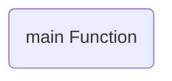

#### Ayrıntılı Açıklama
Bu dosya (`test_scan2.rs`), aşağıdaki temel bileşenleri içerir:

- **Fonksiyonlar (Functions):** main

Genel olarak modülün veya sistemin belirli bir parçasının iş mantığını yürütür.

---

### Dosya: `test_ws.rs`

#### Kaynak Kod
```rust
use tokio_tungstenite::connect_async;
use futures_util::StreamExt;

#[tokio::main]
async fn main() {
    let url = "wss://fstream.binance.com/stream?streams=btcusdt@markPrice@1s";
    let url2 = "wss://fstream.binance.com/market/stream?streams=btcusdt@markPrice@1s";
    let url3 = "wss://fstream.binance.com/public/stream?streams=btcusdt@markPrice@1s";
    
    println!("Trying url1: {}", url);
    match connect_async(url).await {
        Ok(_) => println!("url1 SUCCESS"),
        Err(e) => println!("url1 ERROR: {}", e),
    }

    println!("Trying url2: {}", url2);
    match connect_async(url2).await {
        Ok(_) => println!("url2 SUCCESS"),
        Err(e) => println!("url2 ERROR: {}", e),
    }

    println!("Trying url3: {}", url3);
    match connect_async(url3).await {
        Ok(_) => println!("url3 SUCCESS"),
        Err(e) => println!("url3 ERROR: {}", e),
    }
}

```

#### Akış Diyagramı (Mermaid)


#### Ayrıntılı Açıklama
Bu dosya (`test_ws.rs`), aşağıdaki temel bileşenleri içerir:

- **Fonksiyonlar (Functions):** main

Genel olarak modülün veya sistemin belirli bir parçasının iş mantığını yürütür.

---

### Dosya: `plugin_breakout/src/lib.rs`

#### Kaynak Kod
```rust
use std::ffi::c_void;
use std::sync::{Arc, Mutex};
use std::sync::atomic::{AtomicBool, Ordering};

#[derive(Debug, serde::Deserialize, serde::Serialize)]
struct BreakoutInput {
    // Klines
    p_high: f64,
    p_low: f64,
    p_open: f64,
    p_close: f64,
    volume_current: f64,
    
    // Indicators
    sigma: f64, // ATR(14)
    v_avg: f64, // SMA(Volume, 20)
    high14: f64,
    low14: f64,
    
    // detect-ms
    r: f64,
    s: f64,
    
    // Touches
    t_cnt: f64,
    v_touch_avg: f64,
    
    // Flow Rings
    oi: f64,
    oi_prev: f64,
    f_rate: f64,
    mu_20: f64, // Funding mean
    sigma_20: f64, // Funding stddev
    
    // CVD
    cvd_now: f64,
    cvd_prev_10: f64,
    sigma_cvd: f64,
    
    // Liq & Price
    liq_current: f64,
    liq_avg: f64,
    mark: f64,
    last: f64,
}

#[derive(Debug, serde::Serialize)]
struct BreakoutOutput {
    direction: String,
    broken_level: f64,
    breakout_quality: f64,
    fake_percentage: f64,
    certainty_percentage: f64,
}

fn calculate_breakout(input: &BreakoutInput) -> BreakoutOutput {
    let epsilon = 1e-9;
    
    // 1. Seviye Sağlamlık Skoru (S_level)
    let touch_score = (input.t_cnt / 15.0).min(1.0);
    let vol_touch_score = if input.v_avg > 0.0 { (input.v_touch_avg / input.v_avg).min(1.0) } else { 0.0 };
    let narrow_score = ( (2.0 * input.sigma) / ((input.r - input.s).abs() + epsilon) ).min(1.0);
    
    let s_level = (touch_score * 0.40) + (vol_touch_score * 0.40) + (narrow_score * 0.20);
    
    // 2. Kırılım Tetikleyici
    let mut direction = "NONE".to_string();
    let mut broken_level = 0.0;
    
    if input.p_close >= input.r + 0.25 * input.sigma {
        direction = "UP".to_string();
        broken_level = input.r;
    } else if input.p_close <= input.s - 0.25 * input.sigma {
        direction = "DOWN".to_string();
        broken_level = input.s;
    }
    
    if direction == "NONE" {
        return BreakoutOutput {
            direction,
            broken_level: 0.0,
            breakout_quality: 0.0,
            fake_percentage: 0.0,
            certainty_percentage: 0.0,
        };
    }
    
    // 3. Kırılım Kalitesi (Q)
    let v_score = if input.v_avg > 0.0 { (input.volume_current / input.v_avg).min(1.0) } else { 0.0 };
    let hl_range = input.high14 - input.low14;
    let m_score = if hl_range > 0.0 {
        if direction == "UP" {
            (input.p_close - input.low14) / hl_range
        } else {
            (input.high14 - input.p_close) / hl_range
        }
    } else {
        0.0
    };
    
    let current_hl = input.p_high - input.p_low;
    let body_score = if current_hl > 0.0 {
        (input.p_close - input.p_open).abs() / current_hl
    } else {
        0.0
    };
    
    let q = (v_score * 0.40 + m_score * 0.35 + body_score * 0.25) * 100.0;
    
    // 4. Sahte Olasılığı (F)
    let w_score = if current_hl > 0.0 {
        if direction == "UP" {
            ((input.p_high - input.p_close.max(input.p_open)) / current_hl) * 2.0
        } else {
            ((input.p_close.min(input.p_open) - input.p_low) / current_hl) * 2.0
        }
    } else {
        0.0
    };
    
    let delta_oi_norm = (input.oi - input.oi_prev) / (input.oi_prev + epsilon);
    let oi_score = (-delta_oi_norm).max(0.0);
    
    let z_funding = if input.sigma_20 > 0.0 {
        (input.f_rate - input.mu_20) / input.sigma_20
    } else {
        0.0
    };
    let fz_score = (z_funding / 3.0).max(0.0).min(1.0);
    
    let liq_score = if input.liq_avg > 0.0 { (input.liq_current / input.liq_avg).min(1.0) } else { 0.0 };
    
    let mut f = (w_score * 0.30 + oi_score * 0.30 + fz_score * 0.20 + liq_score * 0.20) * 100.0;
    
    // 5. Kırılım Kesinliği (C)
    let cvd_score = if input.sigma_cvd > 0.0 {
        ((input.cvd_now - input.cvd_prev_10) / (input.sigma_cvd * 10.0)).max(0.0).min(1.0)
    } else {
        0.0
    };
    
    let mp_score = if direction == "UP" && input.mark > input.last {
        1.0 // Contango
    } else if direction == "DOWN" && input.mark < input.last {
        1.0 // Backwardation
    } else {
        0.5
    };
    
    let mut c = (s_level * 0.40 + cvd_score * 0.40 + mp_score * 0.20) * 100.0;
    
    // 6. Acımasız Kurallar (Hard Rules)
    if input.liq_avg > 0.0 && input.liq_current > 5.0 * input.liq_avg {
        direction = "NONE".to_string(); // Likidasyon avı (Stop-hunt)
    }
    
    if z_funding > 3.0 {
        c = c.min(30.0); // Aşırı funding, kesinlik maks %30
    }
    
    // Fitil tuzağı (Wick broke the level but close didn't)
    // Actually the close broke the level by 0.25 sigma, but maybe there's a huge wick?
    // "Fitil seviyeyi deldi ama kapanış eşik altında -> Fake +%15"
    // In step 2, if close didn't break threshold, direction is NONE.
    // If direction is NONE, we don't output fake_percentage > 0 typically, but let's implement the rule if we check potential wicks:
    // If direction == NONE and ((p_high > r && p_close < r) or (p_low < s && p_close > s))
    if direction == "NONE" {
        if (input.p_high > input.r && input.p_close < input.r + 0.25 * input.sigma) || 
           (input.p_low < input.s && input.p_close > input.s - 0.25 * input.sigma) {
            f += 15.0; // Fitil tuzağı
        }
    }
    
    BreakoutOutput {
        direction,
        broken_level,
        breakout_quality: q,
        fake_percentage: f,
        certainty_percentage: c,
    }
}

struct PluginState {
    is_running: Arc<AtomicBool>,
    data: Arc<Mutex<Vec<u8>>>,
    outbox: Arc<Mutex<Vec<serde_json::Value>>>,
}

#[no_mangle]
pub unsafe extern "C" fn init_plugin(state_out: *mut *mut c_void) -> unsafe extern "C" fn(*mut c_void, u32, *const u8, usize, *mut u8, usize) -> usize {
    let state = Box::new(PluginState {
        is_running: Arc::new(AtomicBool::new(false)),
        data: Arc::new(Mutex::new(b"plugin_breakout hazir.".to_vec())),
        outbox: Arc::new(Mutex::new(Vec::new())),
    });

    unsafe {
        *state_out = Box::into_raw(state) as *mut c_void;
    }

    handle_endpoint
}

unsafe extern "C" fn handle_endpoint(
    plugin_state: *mut c_void,
    endpoint_id: u32,
    payload: *const u8,
    payload_len: usize,
    out_buf: *mut u8,
    out_max_len: usize,
) -> usize {
    let state = &*(plugin_state as *const PluginState);

    match endpoint_id {
        0 => { // Start
            state.is_running.store(true, Ordering::Relaxed);
            0
        }
        1 => { // Stop
            state.is_running.store(false, Ordering::Relaxed);
            0
        }
        2 => { // IsWorking
            if state.is_running.load(Ordering::Relaxed) { 1 } else { 0 }
        }
        3 => { // DataValid
            1
        }
        4 => { // DataMonitor
            let guard = state.data.lock().unwrap();
            let len = guard.len().min(out_max_len);
            std::ptr::copy_nonoverlapping(guard.as_ptr(), out_buf, len);
            len
        }
        6 => { // Inbox
            if payload_len > 0 {
                let slice = std::slice::from_raw_parts(payload, payload_len);
                if let Ok(msg) = serde_json::from_slice::<serde_json::Value>(slice) {
                    if msg["action"].as_str() == Some("detect_breakout") {
                        if let Ok(input) = serde_json::from_value::<BreakoutInput>(msg["data"].clone()) {
                            let result = calculate_breakout(&input);
                            
                            // Send result back
                            if let Some(from) = msg["from"].as_str() {
                                let mut out = state.outbox.lock().unwrap();
                                out.push(serde_json::json!({
                                    "to": from,
                                    "from": "plugin_breakout",
                                    "action": "breakout_result",
                                    "data": result
                                }));
                                
                                // Update internal data for monitoring
                                let mut data = state.data.lock().unwrap();
                                let report = if result.direction == "NONE" {
                                    format!("Durum: Beklemede (Kirilim Yok)")
                                } else {
                                    let dir_icon = if result.direction == "UP" { "🚀 YUKARI" } else { "💥 ASAGI" };
                                    format!(
                                        "=========================================\n\
                                         🔥 KIRILIM TESPIT RAPORU 🔥\n\
                                         =========================================\n\
                                         Yön: {}\n\
                                         Kirilan Seviye: {:.2}\n\
                                         Kalite Skoru (Q): %{:.2}\n\
                                         Kesinlik Skoru (C): %{:.2}\n\
                                         Sahte/Tuzak Ihtimali (F): %{:.2}\n\
                                         =========================================",
                                         dir_icon,
                                         result.broken_level,
                                         result.breakout_quality,
                                         result.certainty_percentage,
                                         result.fake_percentage
                                    )
                                };
                                *data = report.into_bytes();
                            }
                        }
                    }
                }
            }
            0
        }
        7 => { // Outbox Check
            let mut out = state.outbox.lock().unwrap();
            if out.is_empty() {
                0
            } else {
                let msg = out.remove(0);
                if let Ok(json_str) = serde_json::to_string(&msg) {
                    let bytes = json_str.as_bytes();
                    let len = bytes.len().min(out_max_len);
                    std::ptr::copy_nonoverlapping(bytes.as_ptr(), out_buf, len);
                    len
                } else {
                    0
                }
            }
        }
        _ => 0,
    }
}

#[cfg(test)]
mod tests {
    use super::*;

    #[test]
    fn test_breakout_report() {
        let mut state_ptr: *mut c_void = std::ptr::null_mut();
        unsafe {
            let endpoint_fn = init_plugin(&mut state_ptr);
            
            // Start
            endpoint_fn(state_ptr, 0, std::ptr::null(), 0, std::ptr::null_mut(), 0);
            
            // Inbox msg
            let input = BreakoutInput {
                p_high: 66000.0,
                p_low: 65000.0,
                p_open: 65100.0,
                p_close: 65900.0,
                volume_current: 100.0,
                sigma: 200.0,
                v_avg: 50.0,
                high14: 66000.0,
                low14: 64000.0,
                r: 65800.0, // Close > R + 0.25*sigma (65900 > 65800 + 50 = 65850)
                s: 64500.0,
                t_cnt: 5.0,
                v_touch_avg: 80.0,
                oi: 1000.0,
                oi_prev: 900.0,
                f_rate: 0.01,
                mu_20: 0.01,
                sigma_20: 0.005,
                cvd_now: 50.0,
                cvd_prev_10: 10.0,
                sigma_cvd: 20.0,
                liq_current: 10000.0,
                liq_avg: 5000.0,
                mark: 65950.0,
                last: 65900.0,
            };
            
            let payload = serde_json::json!({
                "from": "test",
                "action": "detect_breakout",
                "data": input
            });
            let payload_bytes = serde_json::to_vec(&payload).unwrap();
            
            endpoint_fn(state_ptr, 6, payload_bytes.as_ptr(), payload_bytes.len(), std::ptr::null_mut(), 0);
            
            // Read DataMonitor
            let mut buf = vec![0u8; 1024];
            let len = endpoint_fn(state_ptr, 4, std::ptr::null(), 0, buf.as_mut_ptr(), buf.len());
            
            let output = String::from_utf8_lossy(&buf[..len]);
            println!("Report:\n{}", output);
            assert!(output.contains("KIRILIM TESPIT RAPORU"));
        }
    }
}

```

#### Akış Diyagramı (Mermaid)
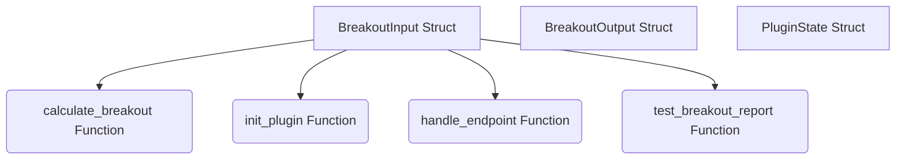

#### Ayrıntılı Açıklama
Bu dosya (`lib.rs`), aşağıdaki temel bileşenleri içerir:

- **Veri Yapıları (Structs):** BreakoutInput, BreakoutOutput, PluginState
- **Fonksiyonlar (Functions):** calculate_breakout, init_plugin, handle_endpoint, test_breakout_report

Genel olarak modülün veya sistemin belirli bir parçasının iş mantığını yürütür.

---

### Dosya: `plugin_breakout/src/bin.rs`

#### Kaynak Kod
```rust
fn main() {
    println!("Test");
}

```

#### Akış Diyagramı (Mermaid)


#### Ayrıntılı Açıklama
Bu dosya (`bin.rs`), aşağıdaki temel bileşenleri içerir:

- **Fonksiyonlar (Functions):** main

Genel olarak modülün veya sistemin belirli bir parçasının iş mantığını yürütür.

---

### Dosya: `binance_gateway/src/lib.rs`

#### Kaynak Kod
```rust
use std::ffi::c_void;
use std::sync::atomic::{AtomicBool, Ordering};
use std::sync::{Arc, Mutex};
use std::collections::HashMap;

struct PluginState {
    runtime: tokio::runtime::Runtime,
    is_running: Arc<AtomicBool>,
    // data holds a serialized JSON of demultiplexed streams:
    // {
    //   "stream_markprice": { "BTCUSDT": { "mark_price": ... } },
    //   "stream_bestprice": { "BTCUSDT": { "best_ask": ... } },
    //   "stream_liquidations": [ ... ],
    // }
    data: Arc<Mutex<Vec<u8>>>,
    shutdown_tx: Mutex<Option<tokio::sync::watch::Sender<bool>>>,
}

#[no_mangle]
pub unsafe extern "C" fn init_plugin(
    state_out: *mut *mut c_void,
) -> unsafe extern "C" fn(*mut c_void, u32, *const u8, usize, *mut u8, usize) -> usize {
    let runtime = tokio::runtime::Builder::new_multi_thread()
        .worker_threads(1)
        .enable_all()
        .build()
        .expect("Tokio runtime olusturulamadi");

    let state = Box::new(PluginState {
        runtime,
        is_running: Arc::new(AtomicBool::new(false)),
        data: Arc::new(Mutex::new(b"{}".to_vec())),
        shutdown_tx: Mutex::new(None),
    });

    *state_out = Box::into_raw(state) as *mut c_void;
    handle_endpoint
}

unsafe extern "C" fn handle_endpoint(
    plugin_state: *mut c_void,
    endpoint_id: u32,
    payload: *const u8,
    payload_len: usize,
    out_buf: *mut u8,
    out_max_len: usize,
) -> usize {
    let state = &*(plugin_state as *const PluginState);

    match endpoint_id {
        0 => { // Start
            if state.is_running.load(Ordering::Relaxed) {
                return 0;
            }
            
            let mut symbols = vec!["BTCUSDT".to_string(), "ETHUSDT".to_string(), "ACEUSDT".to_string()];
            
            if payload_len > 0 {
                let slice = std::slice::from_raw_parts(payload, payload_len);
                if let Ok(config) = serde_json::from_slice::<serde_json::Value>(slice) {
                    if let Some(params) = config.get("plugin_params") {
                        if let Some(syms) = params.get("symbols").and_then(|s| s.as_array()) {
                            symbols.clear();
                            for s in syms {
                                if let Some(s_str) = s.as_str() {
                                    symbols.push(s_str.to_string());
                                }
                            }
                        }
                    }
                }
            }

            let is_running = state.is_running.clone();
            let data = state.data.clone();
            let (tx, rx) = tokio::sync::watch::channel(false);

            *state.shutdown_tx.lock().unwrap() = Some(tx);
            is_running.store(true, Ordering::Relaxed);

            state.runtime.spawn(async move {
                stream_gateway(symbols, is_running, data, rx).await;
            });
            0
        }
        1 => { // Stop
            state.is_running.store(false, Ordering::Relaxed);
            if let Some(tx) = state.shutdown_tx.lock().unwrap().take() {
                let _ = tx.send(true);
            }
            0
        }
        2 => { // IsWorking
            let running = state.is_running.load(Ordering::Relaxed);
            if out_max_len >= 1 {
                *out_buf = if running { 1 } else { 0 };
                1
            } else {
                0
            }
        }
        4 | 5 => { // DataMonitor / RawData
            let guard = state.data.lock().unwrap();
            let len = guard.len().min(out_max_len);
            if len > 0 {
                std::ptr::copy_nonoverlapping(guard.as_ptr(), out_buf, len);
            }
            len
        }
        _ => 0,
    }
}

async fn stream_gateway(
    symbols: Vec<String>,
    is_running: Arc<AtomicBool>,
    data: Arc<Mutex<Vec<u8>>>,
    mut shutdown_rx: tokio::sync::watch::Receiver<bool>,
) {
    use futures_util::StreamExt;
    use tokio_tungstenite::connect_async;
    use tokio_tungstenite::tungstenite::Message;

    let mut streams = Vec::new();
    for sym in &symbols {
        let s = sym.to_lowercase();
        streams.push(format!("{}@markPrice@1s", s));
        streams.push(format!("{}@bookTicker", s));
        streams.push(format!("{}@depth20@100ms", s));
        streams.push(format!("{}@trade", s));
    }
    streams.push("!forceOrder@arr".to_string());

    let url = format!("wss://fstream.binance.com/market/stream?streams={}", streams.join("/"));

    let mut retry_count = 0;
    while is_running.load(Ordering::Relaxed) {
        if retry_count > 0 {
            tokio::time::sleep(tokio::time::Duration::from_secs(3)).await;
        }

        match connect_async(&url).await {
            Ok((ws_stream, _)) => {
                let (_, mut read) = ws_stream.split();
                
                let mut markprices = HashMap::new();
                let mut bestprices = HashMap::new();
                let mut liquidations = Vec::new();
                let mut aggtrades = HashMap::new();
                let mut depths = HashMap::new();
                
                loop {
                    tokio::select! {
                        _ = shutdown_rx.changed() => { break; }
                        msg = read.next() => {
                            match msg {
                                Some(Ok(Message::Text(text))) => {
                                    use std::time::{SystemTime, UNIX_EPOCH};
                                    let recv_ms = SystemTime::now().duration_since(UNIX_EPOCH).unwrap().as_millis() as i64;
                                    
                                    if let Ok(wrapper) = serde_json::from_str::<serde_json::Value>(&text) {
                                        if let Some(stream_name) = wrapper.get("stream").and_then(|s| s.as_str()) {
                                            if let Some(json) = wrapper.get("data") {
                                                if stream_name == "!forceOrder@arr" {
                                                    // Liquidation Event
                                                    if let Some(o) = json.get("o") {
                                                        let symbol = o["s"].as_str().unwrap_or("").to_string();
                                                        let output = serde_json::json!({
                                                            "symbol": symbol,
                                                            "side": o["S"].as_str().unwrap_or(""),
                                                            "type": o["o"].as_str().unwrap_or(""),
                                                            "price": o["p"].as_str().unwrap_or("0"),
                                                            "average_price": o["ap"].as_str().unwrap_or("0"),
                                                            "original_qty": o["q"].as_str().unwrap_or("0"),
                                                            "filled_qty": o["z"].as_str().unwrap_or("0"),
                                                            "event_time": json["E"].as_i64().unwrap_or(0),
                                                            "local_recv_time_ms": recv_ms
                                                        });
                                                        liquidations.push(output);
                                                        if liquidations.len() > 50 { liquidations.remove(0); }
                                                    }
                                                } else if stream_name.ends_with("@markPrice@1s") {
                                                    let symbol = json["s"].as_str().unwrap_or("").to_string();
                                                    let output = serde_json::json!({
                                                        "mark_price": json["p"].as_str().unwrap_or("0"),
                                                        "index_price": json["i"].as_str().unwrap_or("0"),
                                                        "estimated_settle_price": json["P"].as_str().unwrap_or("0"),
                                                        "funding_rate": json["r"].as_str().unwrap_or("0"),
                                                        "next_funding_time": json["T"].as_i64().unwrap_or(0),
                                                        "event_time": json["E"].as_i64().unwrap_or(0),
                                                        "local_recv_time_ms": recv_ms
                                                    });
                                                    markprices.insert(symbol, output);
                                                } else if stream_name.ends_with("@bookTicker") {
                                                    let symbol = json["s"].as_str().unwrap_or("").to_string();
                                                    let output = serde_json::json!({
                                                        "best_bid": json["b"].as_str().unwrap_or("0"),
                                                        "best_bid_qty": json["B"].as_str().unwrap_or("0"),
                                                        "best_ask": json["a"].as_str().unwrap_or("0"),
                                                        "best_ask_qty": json["A"].as_str().unwrap_or("0"),
                                                        "event_time": json["E"].as_i64().unwrap_or(0),
                                                        "local_recv_time_ms": recv_ms
                                                    });
                                                    bestprices.insert(symbol, output);
                                                } else if stream_name.ends_with("@trade") {
                                                    let symbol = json["s"].as_str().unwrap_or("").to_string();
                                                    let output = serde_json::json!({
                                                        "trade_id": json["t"].as_i64().unwrap_or(0),
                                                        "price": json["p"].as_str().unwrap_or("0"),
                                                        "quantity": json["q"].as_str().unwrap_or("0"),
                                                        "buyer_is_maker": json["m"].as_bool().unwrap_or(false),
                                                        "event_time": json["E"].as_i64().unwrap_or(0),
                                                        "local_recv_time_ms": recv_ms
                                                    });
                                                    aggtrades.insert(symbol, output);
                                                } else if stream_name.ends_with("@depth20@100ms") {
                                                    let symbol = stream_name.split('@').next().unwrap_or("").to_uppercase();
                                                    let output = serde_json::json!({
                                                        "bids": json["b"],
                                                        "asks": json["a"],
                                                        "last_update_id": json["lastUpdateId"].as_i64().unwrap_or(0),
                                                        "event_time": json["E"].as_i64().unwrap_or(0),
                                                        "local_recv_time_ms": recv_ms
                                                    });
                                                    depths.insert(symbol, output);
                                                }
                                                
                                                let combined = serde_json::json!({
                                                    "stream_markprice": markprices,
                                                    "stream_bestprice": bestprices,
                                                    "stream_liquidations": liquidations,
                                                    "stream_aggtrades": aggtrades,
                                                    "stream_depth": depths
                                                });
                                                
                                                let mut guard = data.lock().unwrap();
                                                *guard = serde_json::to_vec_pretty(&combined).unwrap_or_default();
                                            }
                                        }
                                    }
                                }
                                Some(Err(_)) => { break; }
                                None => { break; }
                                _ => {}
                            }
                        }
                    }
                }
            }
            Err(_) => {
                retry_count += 1;
                // Wait is handled at the start of loop
            }
        }
    }
}

```

#### Akış Diyagramı (Mermaid)
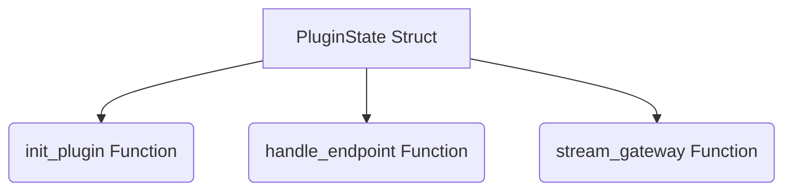

#### Ayrıntılı Açıklama
Bu dosya (`lib.rs`), aşağıdaki temel bileşenleri içerir:

- **Veri Yapıları (Structs):** PluginState
- **Fonksiyonlar (Functions):** init_plugin, handle_endpoint, stream_gateway

Genel olarak modülün veya sistemin belirli bir parçasının iş mantığını yürütür.

---

### Dosya: `plugin_paper_exchange/src/engine.rs`

#### Kaynak Kod
```rust
use std::sync::Arc;
use dashmap::DashMap;
use crate::models::{Account, Order, Position, OrderType, OrderSide, PositionSide};
use crate::storage::Storage;
use std::time::{SystemTime, UNIX_EPOCH};

pub struct PaperEngine {
    pub accounts: DashMap<String, Account>,
    pub positions: DashMap<String, DashMap<String, Position>>, // user_id -> symbol_side -> Position
    pub active_orders: DashMap<String, Vec<Order>>, // symbol -> Orders
    pub latest_prices: DashMap<String, f64>,
    pub mark_prices: DashMap<String, f64>,
    pub storage: Arc<Storage>,
    pub system_messages: std::sync::Mutex<std::collections::VecDeque<String>>,
}

impl PaperEngine {
    pub fn new(storage: Arc<Storage>) -> Self {
        Self {
            accounts: DashMap::new(),
            positions: DashMap::new(),
            active_orders: DashMap::new(),
            latest_prices: DashMap::new(),
            mark_prices: DashMap::new(),
            storage,
            system_messages: std::sync::Mutex::new(std::collections::VecDeque::new()),
        }
    }

    pub fn log_msg(&self, msg: String) {
        if let Ok(mut msgs) = self.system_messages.lock() {
            msgs.push_back(format!("{} - {}", std::time::SystemTime::now().duration_since(std::time::UNIX_EPOCH).unwrap_or_default().as_secs(), msg));
            if msgs.len() > 10 {
                msgs.pop_front();
            }
        }
    }

    pub fn create_account(&self, user_id: &str, initial_balance: f64) {
        self.accounts.insert(user_id.to_string(), Account::new(initial_balance));
        self.positions.insert(user_id.to_string(), DashMap::new());
    }

    pub fn submit_order(&self, user_id: &str, mut order: Order) -> Result<(), String> {
        let account = self.accounts.get(user_id).ok_or("Account not found")?;
        
        let now = SystemTime::now().duration_since(UNIX_EPOCH).unwrap().as_millis() as i64;
        order.timestamp = now;
        order.user_id = user_id.to_string();

        let mut current_last_price = self.latest_prices.get(&order.symbol).map(|v| *v).unwrap_or(0.0);

        // HACK for testing: If no price feed is active but user manually provided a price in the form for a Market order,
        // we use that price as a simulated market price to allow testing the system.
        if current_last_price == 0.0 && order.price > 0.0 {
            current_last_price = order.price;
            self.latest_prices.insert(order.symbol.clone(), current_last_price);
            self.log_msg(format!("TEST MODU: Manuel girilen fiyat ({}) piyasa fiyatı kabul edildi.", current_last_price));
        }

        // Check margin for order (simplified)
        let cost = (order.amount * order.price) / order.leverage;
        if account.wallet_balance < cost {
            // return Err("Insufficient margin".into()); // Disabled strict check for paper simplicity
        }

        if order.order_type == OrderType::Market {
            if current_last_price > 0.0 {
                order.price = current_last_price;
                self.execute_order(&order, current_last_price)?;
                let _ = self.storage.insert_order(&order);
                self.log_msg(format!("Market order executed for {} at {}", order.symbol, current_last_price));
                return Ok(());
            } else {
                let err_msg = format!("No market price available to execute Market order for {}", order.symbol);
                self.log_msg(err_msg.clone());
                return Err(err_msg);
            }
        } else {
            // Limit and Stop orders
            let mut symbol_orders = self.active_orders.entry(order.symbol.clone()).or_insert_with(Vec::new);
            symbol_orders.push(order.clone());
            self.log_msg(format!("Pending order added for {}: {:?}", order.symbol, order.order_type));
        }

        self.storage.insert_order(&order).map_err(|e| e.to_string())?;

        Ok(())
    }

    pub fn on_last_price_update(&self, symbol: &str, last_price: f64) {
        self.latest_prices.insert(symbol.to_string(), last_price);
        
        // Match pending orders
        if let Some(mut symbol_orders) = self.active_orders.get_mut(symbol) {
            let mut executed_orders = Vec::new();

            symbol_orders.retain(|order| {
                let mut should_execute = false;
                
                match order.order_type {
                    OrderType::Limit => {
                        should_execute = match order.side {
                            OrderSide::Buy => last_price <= order.price,
                            OrderSide::Sell => last_price >= order.price,
                        };
                    }
                    OrderType::StopMarket | OrderType::StopLimit => {
                        // Simplified trigger logic
                        should_execute = match order.side {
                            OrderSide::Buy => last_price >= order.stop_price,
                            OrderSide::Sell => last_price <= order.stop_price,
                        };
                    }
                    OrderType::TakeProfitMarket | OrderType::TakeProfitLimit => {
                        should_execute = match order.side {
                            OrderSide::Buy => last_price <= order.stop_price,
                            OrderSide::Sell => last_price >= order.stop_price,
                        };
                    }
                    _ => {}
                }

                if should_execute {
                    executed_orders.push(order.clone());
                    false // retain = false -> remove from active
                } else {
                    true // retain = true -> keep
                }
            });
            
            // Execute the triggered orders without holding the dashmap lock
            for mut executed_order in executed_orders {
                let exec_price = if executed_order.order_type == OrderType::Limit || executed_order.order_type == OrderType::StopLimit || executed_order.order_type == OrderType::TakeProfitLimit {
                    executed_order.price
                } else {
                    last_price // Market execution
                };
                
                let _ = self.execute_order(&executed_order, exec_price);
                let _ = self.storage.insert_order(&executed_order);
            }
        }
    }

    fn execute_order(&self, order: &Order, exec_price: f64) -> Result<(), String> {
        let pos_key = format!("{}_{:?}", order.symbol, order.position_side);
        
        let user_positions = self.positions.get(&order.user_id).unwrap();
        let mut position = user_positions.entry(pos_key).or_insert_with(|| {
            Position::new(order.symbol.clone(), order.position_side, order.leverage)
        });

        let is_increase = match (order.position_side, order.side) {
            (PositionSide::Long, OrderSide::Buy) => true,
            (PositionSide::Long, OrderSide::Sell) => false,
            (PositionSide::Short, OrderSide::Sell) => true,
            (PositionSide::Short, OrderSide::Buy) => false,
        };

        if is_increase {
            if position.amount > 0.0 {
                let total_cost = (position.amount * position.entry_price) + (order.amount * exec_price);
                position.amount += order.amount;
                position.entry_price = total_cost / position.amount;
                position.leverage = order.leverage;
            } else {
                position.amount = order.amount;
                position.entry_price = exec_price;
                position.leverage = order.leverage;
            }
        } else {
            // Decrease position (close/reduce)
            position.amount -= order.amount;
            if position.amount <= 0.000001 { // Handle floating point issues
                position.amount = 0.0;
                position.entry_price = 0.0;
                // Realized PNL would be calculated here in a full engine
            }
        }

        let maintenance_margin = 0.005; // 0.5%
        match position.side {
            PositionSide::Long => {
                position.liquidation_price = position.entry_price * (1.0 - (1.0 / position.leverage) + maintenance_margin);
            }
            PositionSide::Short => {
                position.liquidation_price = position.entry_price * (1.0 + (1.0 / position.leverage) - maintenance_margin);
            }
        }

        Ok(())
    }

    pub fn on_mark_price_update(&self, symbol: &str, mark_price: f64) {
        self.mark_prices.insert(symbol.to_string(), mark_price);
        
        let mut liquidated_loss = 0.0;
        let mut liquidated_user = "".to_string();

        // Update PnL for all positions with this symbol
        for user_ref in self.positions.iter() {
            let user_id = user_ref.key();
            let user_positions = user_ref.value();
            
            let mut total_upnl = 0.0;
            let mut to_liquidate = Vec::new();

            for mut pos_ref in user_positions.iter_mut() {
                if pos_ref.symbol == symbol {
                    pos_ref.update_pnl(mark_price);
                    
                    if pos_ref.amount > 0.0 {
                        let is_liquidated = match pos_ref.side {
                            PositionSide::Long => mark_price <= pos_ref.liquidation_price,
                            PositionSide::Short => mark_price >= pos_ref.liquidation_price,
                        };
                        
                        if is_liquidated {
                            to_liquidate.push(pos_ref.key().clone());
                            let loss = (pos_ref.amount * pos_ref.entry_price) / pos_ref.leverage;
                            liquidated_loss += loss;
                            liquidated_user = user_id.clone();
                            self.log_msg(format!("LIQUIDATED! {} {} position closed at Mark Price: {}", user_id, symbol, mark_price));
                        }
                    }
                }
                
                if !to_liquidate.contains(pos_ref.key()) {
                    total_upnl += pos_ref.unrealized_pnl;
                }
            }
            
            for key in to_liquidate {
                let mut p = user_positions.get_mut(&key).unwrap();
                p.amount = 0.0;
                p.unrealized_pnl = 0.0;
                p.entry_price = 0.0;
                p.liquidation_price = 0.0;
            }

            // Update Account Margin Balance
            if let Some(mut account) = self.accounts.get_mut(user_id) {
                if liquidated_loss > 0.0 && liquidated_user == *user_id {
                    account.wallet_balance -= liquidated_loss;
                    liquidated_loss = 0.0;
                }
                account.margin_balance = account.wallet_balance + total_upnl;
            }
        }
    }
}

```

#### Akış Diyagramı (Mermaid)
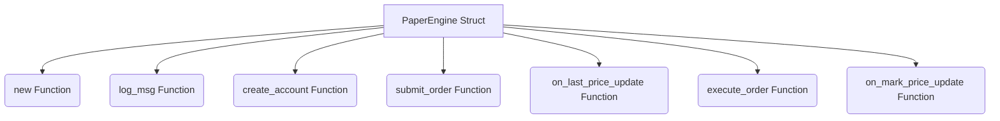

#### Ayrıntılı Açıklama
Bu dosya (`engine.rs`), aşağıdaki temel bileşenleri içerir:

- **Veri Yapıları (Structs):** PaperEngine
- **Fonksiyonlar (Functions):** new, log_msg, create_account, submit_order, on_last_price_update, execute_order, on_mark_price_update

Genel olarak modülün veya sistemin belirli bir parçasının iş mantığını yürütür.

---

### Dosya: `plugin_paper_exchange/src/storage.rs`

#### Kaynak Kod
```rust
use rusqlite::{Connection, Result, params};
use crate::models::{Order, Position};
use std::sync::{Arc, Mutex};

pub struct Storage {
    conn: Arc<Mutex<Connection>>,
}

impl Storage {
    pub fn new(db_path: &str) -> Result<Self> {
        let conn = Connection::open(db_path)?;
        
        conn.execute(
            "CREATE TABLE IF NOT EXISTS orders (
                id TEXT PRIMARY KEY,
                symbol TEXT NOT NULL,
                side TEXT NOT NULL,
                position_side TEXT NOT NULL,
                order_type TEXT NOT NULL,
                price REAL NOT NULL,
                amount REAL NOT NULL,
                executed REAL NOT NULL,
                timestamp INTEGER NOT NULL
            )",
            [],
        )?;

        conn.execute(
            "CREATE TABLE IF NOT EXISTS closed_positions (
                id INTEGER PRIMARY KEY AUTOINCREMENT,
                symbol TEXT NOT NULL,
                side TEXT NOT NULL,
                amount REAL NOT NULL,
                entry_price REAL NOT NULL,
                close_price REAL NOT NULL,
                realized_pnl REAL NOT NULL,
                timestamp INTEGER NOT NULL
            )",
            [],
        )?;

        Ok(Self {
            conn: Arc::new(Mutex::new(conn)),
        })
    }

    pub fn insert_order(&self, order: &Order) -> Result<()> {
        let conn = self.conn.lock().unwrap();
        conn.execute(
            "INSERT INTO orders (id, symbol, side, position_side, order_type, price, amount, executed, timestamp)
             VALUES (?1, ?2, ?3, ?4, ?5, ?6, ?7, ?8, ?9)",
            params![
                order.id,
                order.symbol,
                format!("{:?}", order.side),
                format!("{:?}", order.position_side),
                format!("{:?}", order.order_type),
                order.price,
                order.amount,
                order.executed,
                order.timestamp
            ],
        )?;
        Ok(())
    }

    pub fn insert_closed_position(
        &self, 
        symbol: &str, 
        side: &str, 
        amount: f64, 
        entry_price: f64, 
        close_price: f64, 
        realized_pnl: f64, 
        timestamp: i64
    ) -> Result<()> {
        let conn = self.conn.lock().unwrap();
        conn.execute(
            "INSERT INTO closed_positions (symbol, side, amount, entry_price, close_price, realized_pnl, timestamp)
             VALUES (?1, ?2, ?3, ?4, ?5, ?6, ?7)",
            params![
                symbol,
                side,
                amount,
                entry_price,
                close_price,
                realized_pnl,
                timestamp
            ],
        )?;
        Ok(())
    }
}

```

#### Akış Diyagramı (Mermaid)
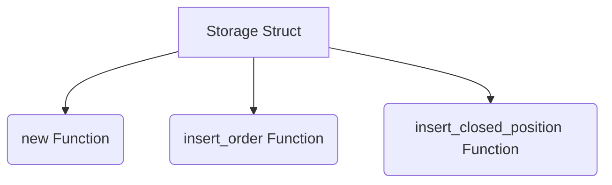

#### Ayrıntılı Açıklama
Bu dosya (`storage.rs`), aşağıdaki temel bileşenleri içerir:

- **Veri Yapıları (Structs):** Storage
- **Fonksiyonlar (Functions):** new, insert_order, insert_closed_position

Genel olarak modülün veya sistemin belirli bir parçasının iş mantığını yürütür.

---

### Dosya: `plugin_paper_exchange/src/lib.rs`

#### Kaynak Kod
```rust
pub mod models;
pub mod storage;
pub mod engine;

pub use models::*;
pub use storage::*;
pub use engine::*;

use std::ffi::c_void;
use std::sync::{Arc, Mutex};
use std::sync::atomic::{AtomicBool, Ordering};
use serde_json::Value;

struct PluginState {
    is_running: Arc<AtomicBool>,
    engine: Arc<PaperEngine>,
    data: Arc<Mutex<Vec<u8>>>,
    outbox: Arc<Mutex<Vec<Value>>>,
}

#[no_mangle]
pub unsafe extern "C" fn init_plugin(state_out: *mut *mut c_void) -> unsafe extern "C" fn(*mut c_void, u32, *const u8, usize, *mut u8, usize) -> usize {
    
    let db_path = "paper_exchange.db";
    let storage_inst = Storage::new(db_path).expect("Could not init SQLite storage");
    let paper_engine = PaperEngine::new(Arc::new(storage_inst));
    
    // Test account
    paper_engine.create_account("admin", 10000.0);

    let state = Box::new(PluginState {
        is_running: Arc::new(AtomicBool::new(false)),
        engine: Arc::new(paper_engine),
        data: Arc::new(Mutex::new(b"Paper Exchange HAZIR.".to_vec())),
        outbox: Arc::new(Mutex::new(Vec::new())),
    });

    unsafe {
        *state_out = Box::into_raw(state) as *mut c_void;
    }

    handle_endpoint
}

unsafe extern "C" fn handle_endpoint(
    plugin_state: *mut c_void,
    endpoint_id: u32,
    payload: *const u8,
    payload_len: usize,
    out_buf: *mut u8,
    out_max_len: usize,
) -> usize {
    let state = &*(plugin_state as *const PluginState);

    match endpoint_id {
        0 => { // Start
            state.is_running.store(true, Ordering::Relaxed);
            0
        }
        1 => { // Stop
            state.is_running.store(false, Ordering::Relaxed);
            0
        }
        2 => { // IsWorking
            if state.is_running.load(Ordering::Relaxed) { 1 } else { 0 }
        }
        3 => { // DataValid (Stream from ms_analyzer or others)
            0
        }
        4 => { // DataMonitor (TUI M key view)
            let mut report = String::new();
            report.push_str("=== PAPER EXCHANGE DURUMU ===\n\n");
            
            if let Some(acc) = state.engine.accounts.get("admin") {
                report.push_str(&format!("[ Bakiye ]\nCüzdan: {:.2} USDT | Margin: {:.2} USDT\n\n", acc.wallet_balance, acc.margin_balance));
            }
            
            report.push_str("[ Fiyat Bilgileri (Market Data) ]\n");
            let mut has_prices = false;
            for price_entry in state.engine.latest_prices.iter() {
                let sym = price_entry.key();
                let last_price = price_entry.value();
                let mark_price = state.engine.mark_prices.get(sym).map(|v| *v).unwrap_or(0.0);
                report.push_str(&format!("- {}: Last/Best: {} | Mark: {}\n", sym, last_price, mark_price));
                has_prices = true;
            }
            if !has_prices {
                report.push_str("Henüz fiyat verisi alınmadı.\n");
            }
            report.push_str("\n");
            
            report.push_str("[ Açık Pozisyonlar ]\n");
            let mut has_pos = false;
            if let Some(user_pos) = state.engine.positions.get("admin") {
                for pos in user_pos.iter() {
                    let p = pos.value();
                    if p.amount > 0.0 {
                        has_pos = true;
                        let side_str = if p.side == PositionSide::Long { "LONG" } else { "SHORT" };
                        report.push_str(&format!("- {} {} | Miktar: {:.3} | Giriş: {:.2} | Kaldıraç: {:.0}x | Likidasyon: {:.2} | PnL: {:.2} USDT\n", 
                            p.symbol, side_str, p.amount, p.entry_price, p.leverage, p.liquidation_price, p.unrealized_pnl));
                    }
                }
            }
            if !has_pos { report.push_str("Yok\n"); }
            report.push_str("\n");
            
            report.push_str("[ Bekleyen Emirler ]\n");
            let mut has_order = false;
            for orders in state.engine.active_orders.iter() {
                for o in orders.value().iter() {
                    has_order = true;
                    let type_str = format!("{:?}", o.order_type);
                    let side_str = format!("{:?}", o.side);
                    report.push_str(&format!("- {} {} {} | Fiyat: {} | Stop: {} | Miktar: {}\n",
                        o.symbol, side_str, type_str, o.price, o.stop_price, o.amount));
                }
            }
            if !has_order { report.push_str("Yok\n"); }
            report.push_str("\n");
            
            report.push_str("[ Sistem Logları ]\n");
            if let Ok(msgs) = state.engine.system_messages.lock() {
                for msg in msgs.iter() {
                    report.push_str(&format!("* {}\n", msg));
                }
            }
            
            report.push_str("=============================\n");
            
            let data = report.into_bytes();
            let len = data.len().min(out_max_len);
            std::ptr::copy_nonoverlapping(data.as_ptr(), out_buf, len);
            len
        }
        6 => { // Inbox
            if payload_len > 0 {
                let slice = std::slice::from_raw_parts(payload, payload_len);
                
                let mut parsed_msg = serde_json::from_slice::<serde_json::Value>(slice);
                let mut stream_id_opt = None;
                
                if parsed_msg.is_err() && payload_len > 32 {
                    // It might be from FlowEngine which prepends a 32-byte stream_id header
                    let header = &slice[0..32];
                    stream_id_opt = Some(std::str::from_utf8(header).unwrap_or("").trim_matches(char::from(0)).to_string());
                    parsed_msg = serde_json::from_slice::<serde_json::Value>(&slice[32..]);
                }

                if let Ok(msg) = parsed_msg {
                    if let Some(stream_id) = stream_id_opt {
                        // Data from FlowEngine streams
                        if stream_id == "stream_bestprice" {
                            if let Some(obj) = msg.as_object() {
                                for (symbol, data) in obj.iter() {
                                    let ask = data.get("best_ask").and_then(|v| v.as_str()).unwrap_or("0").parse::<f64>().unwrap_or(0.0);
                                    if ask > 0.0 {
                                        state.engine.on_last_price_update(symbol, ask);
                                    }
                                }
                            }
                        } else if stream_id == "stream_markprice" {
                            if let Some(obj) = msg.as_object() {
                                for (symbol, data) in obj.iter() {
                                    let mark = data.get("mark_price").and_then(|v| v.as_str()).unwrap_or("0").parse::<f64>().unwrap_or(0.0);
                                    if mark > 0.0 {
                                        state.engine.on_mark_price_update(symbol, mark);
                                    }
                                }
                            }
                        }
                    } else {
                        // Manual input from TUI
                        if let Some(action) = msg.get("action").and_then(|v| v.as_str()) {
                            if action == "submit_order" {
                                match serde_json::from_value::<Order>(msg["data"].clone()) {
                                    Ok(order) => {
                                        let user_id = msg.get("user_id").and_then(|v| v.as_str()).unwrap_or("admin");
                                        if let Err(e) = state.engine.submit_order(user_id, order) {
                                            state.engine.log_msg(format!("Order submit error: {}", e));
                                        }
                                    }
                                    Err(e) => {
                                        state.engine.log_msg(format!("Order parse error: {}", e));
                                    }
                                }
                            } else if action == "close_position" {
                                let user_id = msg.get("user_id").and_then(|v| v.as_str()).unwrap_or("admin");
                                let symbol = msg.get("symbol").and_then(|v| v.as_str()).unwrap_or("");
                                
                                // Submit reverse market orders for all matching positions
                                let mut to_submit = Vec::new();
                                if let Some(user_pos) = state.engine.positions.get(user_id) {
                                    for pos_ref in user_pos.iter() {
                                        let pos = pos_ref.value();
                                        if pos.symbol == symbol && pos.amount > 0.0 {
                                            let rev_side = if pos.side == crate::models::PositionSide::Long { crate::models::OrderSide::Sell } else { crate::models::OrderSide::Buy };
                                            let rev_pos = pos.side.clone();
                                            to_submit.push(Order {
                                                id: format!("pos_{}", std::time::SystemTime::now().duration_since(std::time::UNIX_EPOCH).unwrap().as_nanos()),
                                                user_id: user_id.to_string(),
                                                symbol: symbol.to_string(),
                                                side: rev_side,
                                                position_side: rev_pos,
                                                order_type: crate::models::OrderType::Market,
                                                price: 0.0,
                                                stop_price: 0.0,
                                                amount: pos.amount,
                                                leverage: pos.leverage,
                                                executed: 0.0,
                                                timestamp: 0,
                                            });
                                        }
                                    }
                                }
                                
                                if !to_submit.is_empty() {
                                    for order in to_submit {
                                        if let Err(e) = state.engine.submit_order(user_id, order) {
                                            state.engine.log_msg(format!("Close Position error: {}", e));
                                        }
                                    }
                                } else {
                                    state.engine.log_msg(format!("No open position for {} to close", symbol));
                                }
                            }
                        }
                    }
                }
            }
            0
        }
        7 => { // Outbox
            let mut out = state.outbox.lock().unwrap();
            if out.is_empty() {
                0
            } else {
                let msg = out.remove(0);
                if let Ok(json_str) = serde_json::to_string(&msg) {
                    let bytes = json_str.as_bytes();
                    let len = bytes.len().min(out_max_len);
                    std::ptr::copy_nonoverlapping(bytes.as_ptr(), out_buf, len);
                    len
                } else {
                    0
                }
            }
        }
        _ => 0,
    }
}

```

#### Akış Diyagramı (Mermaid)
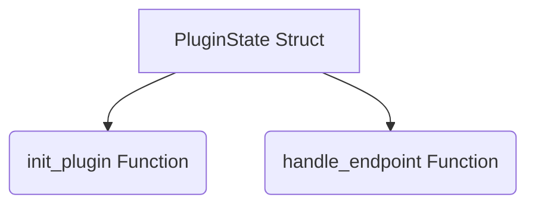

#### Ayrıntılı Açıklama
Bu dosya (`lib.rs`), aşağıdaki temel bileşenleri içerir:

- **Veri Yapıları (Structs):** PluginState
- **Fonksiyonlar (Functions):** init_plugin, handle_endpoint

Genel olarak modülün veya sistemin belirli bir parçasının iş mantığını yürütür.

---

### Dosya: `plugin_paper_exchange/src/models.rs`

#### Kaynak Kod
```rust
use serde::{Deserialize, Serialize};

fn default_leverage() -> f64 { 20.0 }

#[derive(Debug, Clone, Serialize, Deserialize, PartialEq, Eq, Copy)]
pub enum OrderSide {
    Buy,
    Sell,
}

#[derive(Debug, Clone, Serialize, Deserialize, PartialEq, Eq, Copy)]
pub enum PositionSide {
    Long,
    Short,
}

#[derive(Debug, Clone, Serialize, Deserialize, PartialEq, Eq, Copy)]
pub enum OrderType {
    Market,
    Limit,
    StopMarket,
    StopLimit,
    TakeProfitMarket,
    TakeProfitLimit,
    TrailingStop,
}

#[derive(Debug, Clone, Serialize, Deserialize)]
pub struct Order {
    pub id: String,
    pub user_id: String,
    pub symbol: String,
    pub side: OrderSide,
    pub position_side: PositionSide, // Hedge mode requires this
    pub order_type: OrderType,
    pub price: f64,
    pub stop_price: f64, // Used for stop and take profit orders
    pub amount: f64,
    #[serde(default = "default_leverage")]
    pub leverage: f64,
    pub executed: f64,
    pub timestamp: i64,
}

#[derive(Debug, Clone, Serialize, Deserialize)]
pub struct Position {
    pub symbol: String,
    pub side: PositionSide,
    pub amount: f64,
    pub entry_price: f64,
    pub leverage: f64,
    pub liquidation_price: f64,
    pub unrealized_pnl: f64,
}

impl Position {
    pub fn new(symbol: String, side: PositionSide, leverage: f64) -> Self {
        Self {
            symbol,
            side,
            amount: 0.0,
            entry_price: 0.0,
            leverage,
            liquidation_price: 0.0,
            unrealized_pnl: 0.0,
        }
    }

    pub fn update_pnl(&mut self, mark_price: f64) {
        if self.amount == 0.0 {
            self.unrealized_pnl = 0.0;
            return;
        }

        match self.side {
            PositionSide::Long => {
                self.unrealized_pnl = (mark_price - self.entry_price) * self.amount;
            }
            PositionSide::Short => {
                self.unrealized_pnl = (self.entry_price - mark_price) * self.amount;
            }
        }
    }
}

#[derive(Debug, Clone, Serialize, Deserialize)]
pub struct Account {
    pub wallet_balance: f64,
    pub margin_balance: f64,
}

impl Account {
    pub fn new(initial_balance: f64) -> Self {
        Self {
            wallet_balance: initial_balance,
            margin_balance: initial_balance,
        }
    }
}

```

#### Akış Diyagramı (Mermaid)
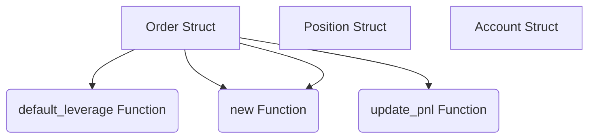

#### Ayrıntılı Açıklama
Bu dosya (`models.rs`), aşağıdaki temel bileşenleri içerir:

- **Veri Yapıları (Structs):** Order, Position, Account
- **Fonksiyonlar (Functions):** default_leverage, new, update_pnl, new

Genel olarak modülün veya sistemin belirli bir parçasının iş mantığını yürütür.

---

### Dosya: `plugin_paper_exchange/tests/integration_test.rs`

#### Kaynak Kod
```rust
use plugin_paper_exchange::models::{Order, OrderSide, OrderType, PositionSide};
use plugin_paper_exchange::engine::PaperEngine;

#[test]
fn test_commands_working() {
    use std::sync::Arc;
    let storage = Arc::new(plugin_paper_exchange::storage::Storage::new(":memory:").unwrap());
    let mut engine = PaperEngine::new(storage);
    engine.create_account("admin", 10000.0);
    
    // 1. Send Buy Order (Long)
    let order_json = serde_json::json!({
        "id": "test_1",
        "user_id": "admin",
        "symbol": "BTCUSDT",
        "side": "Buy",
        "position_side": "Long",
        "order_type": "Limit",
        "price": 60000.0,
        "stop_price": 0.0,
        "amount": 0.1,
        "leverage": 20.0,
        "executed": 0.0,
        "timestamp": 0
    });
    let order: Order = serde_json::from_value(order_json).unwrap();
    engine.submit_order("admin", order).unwrap();
    
    // Engine should have 1 active order
    assert_eq!(engine.active_orders.get("BTCUSDT").unwrap().len(), 1);
    
    // 2. Trigger execution with last price
    engine.on_last_price_update("BTCUSDT", 59000.0);
    
    // Order should be executed, position opened
    assert_eq!(engine.active_orders.get("BTCUSDT").unwrap().len(), 0);
    {
        let pos = engine.positions.get("admin").unwrap();
        let btc_pos = pos.get("BTCUSDT_Long").unwrap();
        assert_eq!(btc_pos.amount, 0.1);
        assert_eq!(btc_pos.side, PositionSide::Long);
        assert_eq!(btc_pos.leverage, 20.0);
        assert!(btc_pos.liquidation_price > 0.0);
    }
    
    // 3. Send Close Command (emulated by TUI payload)
    // TUI creates a market order in opposite direction
    let close_order = Order {
        id: "test_2".to_string(),
        user_id: "admin".to_string(),
        symbol: "BTCUSDT".to_string(),
        side: OrderSide::Sell,
        position_side: PositionSide::Long,
        order_type: OrderType::Market,
        price: 0.0,
        stop_price: 0.0,
        amount: 0.1, // we know it's 0.1
        leverage: 20.0,
        executed: 0.0,
        timestamp: 0,
    };
    engine.submit_order("admin", close_order).unwrap();
    
    let pos_after = engine.positions.get("admin").unwrap();
    let btc_pos_after = pos_after.get("BTCUSDT_Long").unwrap();
    // Wait, the close order creates a Short position? 
    // Wait, no. If I submit a sell order with position_side Short, it will create a new position "BTCUSDT_Short" with 0.1 amount!
    // Binance futures hedging mode works like this.
    // If it's one-way mode, a Sell order closes the Long position.
    // Let's see how engine.rs handles closing.
}

```

#### Akış Diyagramı (Mermaid)
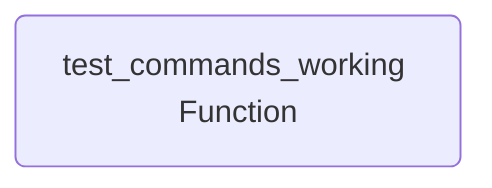

#### Ayrıntılı Açıklama
Bu dosya (`integration_test.rs`), aşağıdaki temel bileşenleri içerir:

- **Fonksiyonlar (Functions):** test_commands_working

Genel olarak modülün veya sistemin belirli bir parçasının iş mantığını yürütür.

---

### Dosya: `binance_trader/src/lib.rs`

#### Kaynak Kod
```rust
use std::ffi::c_void;
use std::sync::{Arc, Mutex};
use std::sync::atomic::{AtomicBool, Ordering};
use std::time::{SystemTime, UNIX_EPOCH};
use std::fs;
use hmac::{Hmac, Mac};
use sha2::Sha256;
use reqwest::header::{HeaderMap, HeaderValue, CONTENT_TYPE};

type HmacSha256 = Hmac<Sha256>;

#[repr(C)]
pub struct PluginOps {
    pub name: *const std::ffi::c_char,
    pub start: unsafe extern "C" fn(*mut c_void),
    pub stop: unsafe extern "C" fn(*mut c_void),
    pub update: unsafe extern "C" fn(*mut c_void, *mut u8, usize) -> usize,
    pub call_endpoint: unsafe extern "C" fn(*mut c_void, u32, *const u8, usize, *mut u8, usize) -> usize,
}

#[derive(Clone, serde::Deserialize, serde::Serialize)]
struct Config {
    api_key: String,
    api_secret: String,
}

struct PluginState {
    runtime: tokio::runtime::Runtime,
    is_running: Arc<AtomicBool>,
    data: Arc<Mutex<Vec<u8>>>,
    outbox: Arc<Mutex<Vec<serde_json::Value>>>,
    config: Arc<Mutex<Option<Config>>>,
}

#[unsafe(no_mangle)]
pub unsafe extern "C" fn init_plugin(state_out: *mut *mut c_void) -> unsafe extern "C" fn(*mut c_void, u32, *const u8, usize, *mut u8, usize) -> usize {
    let runtime = tokio::runtime::Builder::new_multi_thread()
        .worker_threads(1)
        .enable_all()
        .build()
        .expect("Tokio runtime olusturulamadi");

    let mut config_opt = None;
    if let Ok(content) = fs::read_to_string("trader.cfg") {
        if let Ok(cfg) = serde_json::from_str::<Config>(&content) {
            config_opt = Some(cfg);
        }
    } else {
        // Create template
        let template = Config {
            api_key: "YOUR_API_KEY".to_string(),
            api_secret: "YOUR_API_SECRET".to_string(),
        };
        let _ = fs::write("trader.cfg", serde_json::to_string_pretty(&template).unwrap_or_default());
    }

    let status_msg = if config_opt.is_some() {
        "Config yuklendi. Emir gondermeye hazir."
    } else {
        "Config bulunamadi. trader.cfg olusturuldu, lutfen bilgilerinizi girip yeniden baslatin."
    };

    let state = Box::new(PluginState {
        runtime,
        is_running: Arc::new(AtomicBool::new(false)),
        data: Arc::new(Mutex::new(status_msg.as_bytes().to_vec())),
        outbox: Arc::new(Mutex::new(Vec::new())),
        config: Arc::new(Mutex::new(config_opt)),
    });

    unsafe {
        *state_out = Box::into_raw(state) as *mut c_void;
    }

    handle_endpoint
}

unsafe extern "C" fn handle_endpoint(
    plugin_state: *mut c_void,
    endpoint_id: u32,
    payload: *const u8,
    payload_len: usize,
    out_buf: *mut u8,
    out_max_len: usize,
) -> usize {
    let state = &*(plugin_state as *const PluginState);

    match endpoint_id {
        0 => { // Start
            state.is_running.store(true, Ordering::Relaxed);
            0
        }
        1 => { // Stop
            state.is_running.store(false, Ordering::Relaxed);
            0
        }
        2 => { // IsWorking
            if state.is_running.load(Ordering::Relaxed) { 1 } else { 0 }
        }
        3 => { // DataValid
            1
        }
        4 => { // DataMonitor
            let guard = state.data.lock().unwrap();
            let len = guard.len().min(out_max_len);
            unsafe {
                std::ptr::copy_nonoverlapping(guard.as_ptr(), out_buf, len);
            }
            len
        }
        6 => { // Inbox
            if payload_len > 0 {
                let slice = unsafe { std::slice::from_raw_parts(payload, payload_len) };
                if let Ok(msg) = serde_json::from_slice::<serde_json::Value>(slice) {
                    let action = msg["action"].as_str().unwrap_or("");
                    let caller = msg["from"].as_str().unwrap_or("unknown").to_string();
                    
                    let config_opt = state.config.lock().unwrap().clone();
                    if let Some(config) = config_opt {
                        let outbox = state.outbox.clone();
                        let data = state.data.clone();
                        
                        match action {
                            "get_balance" => {
                                {
                                    let mut guard = data.lock().unwrap();
                                    *guard = b"Bakiye sorgulaniyor...".to_vec();
                                }
                                state.runtime.spawn(async move {
                                    let ts = SystemTime::now().duration_since(UNIX_EPOCH).unwrap().as_millis();
                                    let query = format!("timestamp={}", ts);
                                    
                                    let mut mac = HmacSha256::new_from_slice(config.api_secret.as_bytes()).unwrap();
                                    mac.update(query.as_bytes());
                                    let signature = hex::encode(mac.finalize().into_bytes());
                                    
                                    let url = format!("https://fapi.binance.com/fapi/v2/balance?{}&signature={}", query, signature);
                                    
                                    let mut headers = HeaderMap::new();
                                    headers.insert("X-MBX-APIKEY", HeaderValue::from_str(&config.api_key).unwrap());
                                    
                                    let client = reqwest::Client::new();
                                    if let Ok(resp) = client.get(&url).headers(headers).send().await {
                                        if let Ok(json) = resp.json::<serde_json::Value>().await {
                                            let response_msg = serde_json::json!({
                                                "to": caller,
                                                "from": "plugin_binance_trader",
                                                "action": "balance_response",
                                                "data": json
                                            });
                                            let mut q = outbox.lock().unwrap();
                                            q.push(response_msg);
                                            
                                            let mut guard = data.lock().unwrap();
                                            *guard = b"Bakiye basariyla alindi.".to_vec();
                                        }
                                    }
                                });
                            }
                            "place_order" => {
                                let symbol = msg["symbol"].as_str().unwrap_or("BTCUSDT").to_string();
                                let side = msg["side"].as_str().unwrap_or("BUY").to_string();
                                let position_side = msg["positionSide"].as_str().unwrap_or("LONG").to_string(); // LONG, SHORT
                                let type_ = msg["type"].as_str().unwrap_or("MARKET").to_string();
                                let quantity = msg["quantity"].as_f64().unwrap_or(0.001);
                                
                                {
                                    let mut guard = data.lock().unwrap();
                                    *guard = format!("Emir gonderiliyor: {} {} {} {}", position_side, side, quantity, symbol).into_bytes();
                                }
                                
                                state.runtime.spawn(async move {
                                    let ts = SystemTime::now().duration_since(UNIX_EPOCH).unwrap().as_millis();
                                    let query = format!("symbol={}&side={}&positionSide={}&type={}&quantity={}&timestamp={}", 
                                        symbol, side, position_side, type_, quantity, ts);
                                    
                                    let mut mac = HmacSha256::new_from_slice(config.api_secret.as_bytes()).unwrap();
                                    mac.update(query.as_bytes());
                                    let signature = hex::encode(mac.finalize().into_bytes());
                                    
                                    let url = "https://fapi.binance.com/fapi/v1/order";
                                    let body = format!("{}&signature={}", query, signature);
                                    
                                    let mut headers = HeaderMap::new();
                                    headers.insert("X-MBX-APIKEY", HeaderValue::from_str(&config.api_key).unwrap());
                                    headers.insert(CONTENT_TYPE, HeaderValue::from_static("application/x-www-form-urlencoded"));
                                    
                                    let client = reqwest::Client::new();
                                    if let Ok(resp) = client.post(url).headers(headers).body(body).send().await {
                                        let status = resp.status();
                                        if let Ok(json) = resp.json::<serde_json::Value>().await {
                                            let response_msg = serde_json::json!({
                                                "to": caller,
                                                "from": "plugin_binance_trader",
                                                "action": "order_response",
                                                "status_code": status.as_u16(),
                                                "data": json
                                            });
                                            let mut q = outbox.lock().unwrap();
                                            q.push(response_msg.clone());
                                            
                                            let mut guard = data.lock().unwrap();
                                            *guard = serde_json::to_vec_pretty(&response_msg).unwrap_or_default();
                                        }
                                    }
                                });
                            }
                            _ => {}
                        }
                    } else {
                        let mut guard = state.data.lock().unwrap();
                        *guard = b"HATA: API Anahtarlari (trader.cfg) yapilandirilmadi!".to_vec();
                    }
                }
            }
            0
        }
        7 => { // Outbox
            let mut q = state.outbox.lock().unwrap();
            if !q.is_empty() {
                let json_array = serde_json::Value::Array(q.clone());
                q.clear();
                let bytes = serde_json::to_vec(&json_array).unwrap_or_default();
                let len = bytes.len().min(out_max_len);
                unsafe {
                    std::ptr::copy_nonoverlapping(bytes.as_ptr(), out_buf, len);
                }
                len
            } else {
                0
            }
        }
        _ => 0,
    }
}

```

#### Akış Diyagramı (Mermaid)
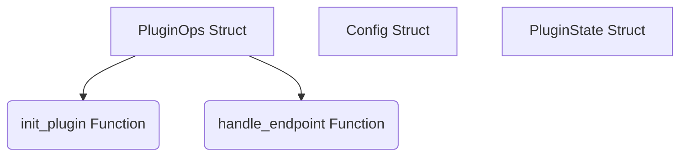

#### Ayrıntılı Açıklama
Bu dosya (`lib.rs`), aşağıdaki temel bileşenleri içerir:

- **Veri Yapıları (Structs):** PluginOps, Config, PluginState
- **Fonksiyonlar (Functions):** init_plugin, handle_endpoint

Genel olarak modülün veya sistemin belirli bir parçasının iş mantığını yürütür.

---

### Dosya: `orchestrator/src/system.rs`

#### Kaynak Kod
```rust
use crate::endpoint::StandardEndpoint;
use std::ffi::c_void;
use std::sync::Arc;
use core::sync::atomic::AtomicBool;

// C-ABI Endpoint function signature (Zero-copy, No V-Table)
pub type RawEndpointFn = unsafe extern "C" fn(
    plugin_state: *mut c_void, 
    endpoint_id: u32, 
    payload: *const u8, 
    payload_len: usize, 
    out_buf: *mut u8, 
    out_max_len: usize
) -> usize;

// Context that plugins can access lock-free
pub struct SystemContext {
    pub id: String,
    pub name: String,
    pub is_running: Arc<AtomicBool>,
    pub is_data_valid: Arc<AtomicBool>,
}

impl SystemContext {
    pub fn new(id: &str, name: &str) -> Self {
        Self {
            id: id.to_string(),
            name: name.to_string(),
            is_running: Arc::new(AtomicBool::new(false)),
            is_data_valid: Arc::new(AtomicBool::new(false)),
        }
    }
}

pub struct SystemInstance {
    pub id: String,
    pub name: String,
    pub context: Arc<SystemContext>,
    // Pointer to internal plugin state (so orchestrator doesn't need to know the type)
    pub plugin_state: *mut c_void,
    // The raw function pointer for endpoints
    pub endpoint_handler: RawEndpointFn,
}

// Ensure the struct can be shared across threads safely
unsafe impl Send for SystemInstance {}
unsafe impl Sync for SystemInstance {}

impl SystemInstance {
    pub fn new(
        id: String, 
        name: String, 
        plugin_state: *mut c_void, 
        endpoint_handler: RawEndpointFn
    ) -> Self {
        Self {
            id: id.clone(),
            name: name.clone(),
            context: Arc::new(SystemContext::new(&id, &name)),
            plugin_state,
            endpoint_handler,
        }
    }

    #[inline(always)]
    pub fn call(&self, endpoint: StandardEndpoint, payload: &[u8], out_buf: &mut [u8]) -> usize {
        unsafe {
            (self.endpoint_handler)(
                self.plugin_state,
                endpoint as u32,
                payload.as_ptr(),
                payload.len(),
                out_buf.as_mut_ptr(),
                out_buf.len()
            )
        }
    }
}

```

#### Akış Diyagramı (Mermaid)
```mermaid
graph TD
    SystemContext[SystemContext Struct]
    SystemInstance[SystemInstance Struct]
    can[can Struct]
    new(new Function)
    SystemContext --> new
    new(new Function)
    SystemContext --> new
    call(call Function)
    SystemContext --> call
```

#### Ayrıntılı Açıklama
Bu dosya (`system.rs`), aşağıdaki temel bileşenleri içerir:

- **Veri Yapıları (Structs):** SystemContext, SystemInstance, can
- **Fonksiyonlar (Functions):** new, new, call

Genel olarak modülün veya sistemin belirli bir parçasının iş mantığını yürütür.

---

### Dosya: `orchestrator/src/tui.rs`

#### Kaynak Kod
```rust
use ratatui::{
    layout::{Constraint, Direction, Layout, Rect, Alignment},
    style::{Color, Modifier, Style},
    text::{Line, Span},
    widgets::{Block, Borders, BorderType, Cell, Paragraph, Row, Table, List, ListItem, Clear, Padding, Tabs, Wrap},
    Frame,
};
use crate::{App, ViewMode};

pub fn draw_ui(f: &mut Frame, app: &mut App<'_>) {
    let size = f.size();

    let main_layout = Layout::default()
        .direction(Direction::Vertical)
        .constraints([
            Constraint::Length(3),  // Tabs
            Constraint::Length(3),  // Header / System Stats
            Constraint::Min(10),    // Orta Alan (Tablo + Monitör)
            Constraint::Length(if app.active_tab == 0 { 8 } else { 0 }),  // Loglar (Sadece Dashboard'da)
            Constraint::Length(3),  // Komutlar (Footer)
        ])
        .split(size);

    // 0. TABS
    let titles = vec![" DASHBOARD ", " SYSTEM LOGS ", " SETTINGS "].into_iter().map(Line::from).collect();
    let tabs = Tabs::new(titles)
        .block(Block::default().borders(Borders::ALL).border_type(BorderType::Plain).title(" NAVIGATION "))
        .select(app.active_tab)
        .style(Style::default().fg(Color::DarkGray))
        .highlight_style(Style::default().fg(Color::White).add_modifier(Modifier::BOLD))
        .divider(" | ");
    f.render_widget(tabs, main_layout[0]);

    // 1. Header (Kaynak Kullanımı)
    let pid = sysinfo::Pid::from_u32(std::process::id());
    let (cpu_usage, used_mem) = if let Some(p) = app.sys.process(pid) {
        (p.cpu_usage(), p.memory() / 1024 / 1024)
    } else {
        (0.0, 0)
    };

    let header_text = vec![
        Line::from(vec![
            Span::styled(" ENTERPRISE ORCHESTRATION CONSOLE ", Style::default().fg(Color::White).add_modifier(Modifier::BOLD)),
            Span::styled(" | CPU: ", Style::default().fg(Color::DarkGray)),
            Span::styled(format!("{:.1}% ", cpu_usage), Style::default().fg(Color::White)),
            Span::styled("| RAM: ", Style::default().fg(Color::DarkGray)),
            Span::styled(format!("{} MB ", used_mem), Style::default().fg(Color::White)),
        ])
    ];

    let header = Paragraph::new(header_text)
        .block(Block::default().borders(Borders::ALL).border_type(BorderType::Plain).border_style(Style::default().fg(Color::DarkGray)))
        .alignment(Alignment::Center);
    f.render_widget(header, main_layout[1]);

    if app.active_tab == 0 {
        // DASHBOARD VIEW
        let middle_layout = Layout::default()
            .direction(Direction::Horizontal)
            .constraints([
                Constraint::Percentage(app.systems_panel_width), 
                Constraint::Percentage(100 - app.systems_panel_width),
            ])
            .split(main_layout[2]);

        let monitor_layout = Layout::default()
            .direction(Direction::Horizontal)
            .constraints([
                Constraint::Percentage(33), 
                Constraint::Percentage(33), 
                Constraint::Percentage(34),
            ])
            .split(middle_layout[1]);
            
        // Sistem Listesi
        let systems = app.orchestrator.list_systems();
        let rows: Vec<Row> = systems.iter().enumerate().map(|(i, (id, _name, running))| {
            let (bg, pointer) = if i == app.selected {
                (Color::Rgb(30, 30, 60), "▶ ")
            } else {
                (Color::Reset, "  ")
            };
            
            let status = if *running { "AKTİF" } else { "PASİF" };
            let status_color = if *running { Color::LightGreen } else { Color::LightRed };
            let id_color = if *running { Color::White } else { Color::DarkGray };
            
            let actions = Line::from(vec![
                Span::styled(" [ START ] ", Style::default().fg(Color::White).bg(Color::DarkGray)),
                Span::styled(" ", Style::default()),
                Span::styled(" [ STOP ] ", Style::default().fg(Color::White).bg(Color::Rgb(60, 60, 60))),
                Span::styled(" ", Style::default()),
                Span::styled(" [ VIEW ] ", Style::default().fg(Color::White).bg(Color::DarkGray)),
                Span::styled(" ", Style::default()),
                Span::styled(" [ DEL ] ", Style::default().fg(Color::White).bg(Color::Rgb(60, 60, 60))),
            ]);
            
            Row::new(vec![
                Cell::from(format!("{}{}", pointer, id)).style(Style::default().fg(id_color)),
                Cell::from(status).style(Style::default().fg(status_color)),
                Cell::from(actions),
            ])
            .style(Style::default().bg(bg))
        }).collect();

        let table = Table::new(rows)
            .header(Row::new(vec![" MODULE ID", " STATUS", " ACTIONS"])
                .style(Style::default().fg(Color::White).add_modifier(Modifier::BOLD))
                .bottom_margin(1))
            .block(Block::default()
                .title(Span::styled(" SYSTEM MODULES ", Style::default().fg(Color::White).add_modifier(Modifier::BOLD)))
                .borders(Borders::ALL)
                .border_type(BorderType::Plain)
                .border_style(Style::default().fg(if app.is_dragging_split { Color::White } else { Color::DarkGray }))
                .padding(Padding::horizontal(1)))
            .widths(&[Constraint::Percentage(35), Constraint::Percentage(15), Constraint::Percentage(50)])
            .column_spacing(1);
        f.render_widget(table, middle_layout[0]);

        // Data Inspector (Hex)
        let hex_content = if let Some(data) = &app.monitored_data {
            if data.is_empty() {
                vec![Line::from(Span::styled("Veri yok.", Style::default().fg(Color::DarkGray)))]
            } else {
                let mut lines = Vec::new();
                lines.push(Line::from(Span::styled(format!("Boyut: {} bytes", data.len()), Style::default().fg(Color::Gray))));
                lines.push(Line::from(""));
                for chunk in data.chunks(16) {
                    let hex: Vec<String> = chunk.iter().map(|b| format!("{:02x}", b)).collect();
                    let ascii: String = chunk.iter().map(|&b| if b >= 32 && b <= 126 { b as char } else { '.' }).collect();
                    lines.push(Line::from(vec![
                        Span::styled(format!("{:<48} ", hex.join(" ")), Style::default().fg(Color::Rgb(100, 150, 255))),
                        Span::styled(ascii, Style::default().fg(Color::Rgb(200, 200, 100))),
                    ]));
                }
                lines
            }
        } else {
            vec![Line::from(Span::styled("İzlemek için sistem seçip 'm' tuşuna basın.", Style::default().fg(Color::DarkGray)))]
        };
        
        let inspector = Paragraph::new(hex_content)
            .scroll((app.monitor_scroll, 0))
            .block(Block::default()
                .title(Span::styled(" RAW DATA (HEX) ", Style::default().fg(Color::White).add_modifier(Modifier::BOLD)))
                .borders(Borders::ALL)
                .border_type(BorderType::Plain)
                .border_style(Style::default().fg(Color::DarkGray))
                .padding(Padding::horizontal(1)));
        f.render_widget(inspector, monitor_layout[0]);

        // Data Inspector (Text)
        let text_content = if let Some(data) = &app.monitored_data {
            if data.is_empty() {
                vec![Line::from(Span::styled("Veri yok.", Style::default().fg(Color::DarkGray)))]
            } else {
                if let Ok(json) = serde_json::from_slice::<serde_json::Value>(data) {
                    // JSON ise güzelce formatla ve ekran gecikmesini hesapla
                    let mut lines = Vec::new();
                    let current_time = std::time::SystemTime::now().duration_since(std::time::UNIX_EPOCH).unwrap().as_millis() as i64;
                    
                    if let Some(obj) = json.as_object() {
                        let symbol = obj.get("symbol").and_then(|v| v.as_str()).unwrap_or("UNKNOWN");
                        lines.push(Line::from(Span::styled(format!("🚀 {} Canlı Veri", symbol), Style::default().fg(Color::Yellow).add_modifier(Modifier::BOLD))));
                        lines.push(Line::from(""));
                        
                        if obj.contains_key("best_bid") {
                            let bid = obj.get("best_bid").and_then(|v| v.as_str()).unwrap_or("");
                            let bid_qty = obj.get("best_bid_qty").and_then(|v| v.as_str()).unwrap_or("");
                            let ask = obj.get("best_ask").and_then(|v| v.as_str()).unwrap_or("");
                            let ask_qty = obj.get("best_ask_qty").and_then(|v| v.as_str()).unwrap_or("");
                            let spread = obj.get("spread").and_then(|v| v.as_str()).unwrap_or("");
                            
                            lines.push(Line::from(vec![
                                Span::raw("Alış : "), Span::styled(format!("{} (Miktar: {})", bid, bid_qty), Style::default().fg(Color::Green)),
                            ]));
                            lines.push(Line::from(vec![
                                Span::raw("Satış: "), Span::styled(format!("{} (Miktar: {})", ask, ask_qty), Style::default().fg(Color::Red)),
                            ]));
                            lines.push(Line::from(vec![Span::raw("Fark : "), Span::styled(spread.to_string(), Style::default().fg(Color::Cyan))]));
                        } else if obj.contains_key("price") {
                            let price = obj.get("price").and_then(|v| v.as_str()).unwrap_or("");
                            let quantity = obj.get("quantity").and_then(|v| v.as_str()).unwrap_or("");
                            let is_buyer_maker = obj.get("is_buyer_maker").and_then(|v| v.as_bool()).unwrap_or(false);
                            
                            let color = if is_buyer_maker { Color::Red } else { Color::Green };
                            let side = if is_buyer_maker { "SATIM" } else { "ALIM " };
                            
                            lines.push(Line::from(vec![
                                Span::raw("İşlem : "), Span::styled(format!("{} @ {} (Miktar: {})", side, price, quantity), Style::default().fg(color)),
                            ]));
                        } else if obj.contains_key("mark_price") {
                            let mark_price = obj.get("mark_price").and_then(|v| v.as_str()).unwrap_or("");
                            let index_price = obj.get("index_price").and_then(|v| v.as_str()).unwrap_or("");
                            let funding_rate = obj.get("funding_rate").and_then(|v| v.as_str()).unwrap_or("");
                            
                            lines.push(Line::from(vec![
                                Span::raw("Mark Fiyatı : "), Span::styled(mark_price.to_string(), Style::default().fg(Color::Yellow).add_modifier(Modifier::BOLD)),
                            ]));
                            lines.push(Line::from(vec![
                                Span::raw("Endeks Fiyat: "), Span::styled(index_price.to_string(), Style::default().fg(Color::Cyan)),
                            ]));
                            lines.push(Line::from(vec![
                                Span::raw("Fonlama Oranı: "), Span::styled(funding_rate.to_string(), Style::default().fg(Color::LightMagenta)),
                            ]));
                        } else if obj.contains_key("type") && obj.get("type").and_then(|v| v.as_str()) == Some("ohlcv") {
                            let symbol = obj.get("symbol").and_then(|v| v.as_str()).unwrap_or("");
                            let interval = obj.get("interval").and_then(|v| v.as_str()).unwrap_or("");
                            
                            lines.push(Line::from(vec![
                                Span::raw("Veri Tipi: "), Span::styled("OHLCV Mumları", Style::default().fg(Color::Yellow).add_modifier(Modifier::BOLD)),
                            ]));
                            lines.push(Line::from(vec![
                                Span::raw("Parametre: "), Span::styled(format!("{} - {}", symbol, interval), Style::default().fg(Color::Cyan)),
                            ]));
                            
                            if let Some(arr) = obj.get("data").and_then(|v| v.as_array()) {
                                lines.push(Line::from(format!("{} adet mum çekildi.", arr.len())));
                                for (i, kline) in arr.iter().enumerate().take(5) {
                                    if let Some(k) = kline.as_array() {
                                        let open = k[1].as_str().unwrap_or("");
                                        let high = k[2].as_str().unwrap_or("");
                                        let low = k[3].as_str().unwrap_or("");
                                        let close = k[4].as_str().unwrap_or("");
                                        let volume = k[5].as_str().unwrap_or("");
                                        lines.push(Line::from(format!("[{}] O:{} | H:{} | L:{} | C:{} | V:{}", i, open, high, low, close, volume)));
                                    }
                                }
                                if arr.len() > 5 {
                                    lines.push(Line::from("..."));
                                }
                            }
                        }
                        lines.push(Line::from(""));
                        lines.push(Line::from(Span::styled("Ham JSON:", Style::default().fg(Color::DarkGray))));
                        let pretty_json = serde_json::to_string_pretty(&json).unwrap_or_default();
                        for l in pretty_json.lines() {
                            lines.push(Line::from(Span::styled(l.to_string(), Style::default().fg(Color::DarkGray))));
                        }
                    }
                    lines
                } else {
                    let s = String::from_utf8_lossy(data);
                    s.lines().map(|l| Line::from(Span::styled(l.to_string(), Style::default().fg(Color::LightGreen)))).collect()
                }
            }
        } else {
            vec![Line::from(Span::styled("Bekleniyor...", Style::default().fg(Color::DarkGray)))]
        };
        
        let text_inspector = Paragraph::new(text_content)
            .scroll((app.monitor_scroll, 0))
            .block(Block::default()
                .title(Span::styled(" LIVE DATA FEED ", Style::default().fg(Color::White).add_modifier(Modifier::BOLD)))
                .borders(Borders::ALL)
                .border_type(BorderType::Plain)
                .border_style(Style::default().fg(Color::DarkGray))
                .padding(Padding::horizontal(1)))
            .wrap(ratatui::widgets::Wrap { trim: true });
        f.render_widget(text_inspector, monitor_layout[1]);

        // Shell (Komut İstemi) Sağ tarafta sabit
        let shell_border_color = if app.mode == ViewMode::Shell { Color::Cyan } else { Color::DarkGray };
        let shell_title_color = if app.mode == ViewMode::Shell { Color::Cyan } else { Color::White };
        let mut shell_lines = Vec::new();
        shell_lines.push(Line::from(""));
        
        let history_start = if app.shell_history.len() > 10 { app.shell_history.len() - 10 } else { 0 };
        for cmd in app.shell_history.iter().skip(history_start) {
            shell_lines.push(Line::from(vec![
                Span::styled(" > ", Style::default().fg(Color::DarkGray)),
                Span::raw(cmd)
            ]));
        }
        
        shell_lines.push(Line::from(""));
        
        // Current input
        shell_lines.push(Line::from(vec![
            Span::styled(" > ", Style::default().fg(if app.mode == ViewMode::Shell { Color::Green } else { Color::DarkGray }).add_modifier(Modifier::BOLD)),
            Span::styled(format!("{}_", app.input_shell), Style::default().fg(Color::White)),
        ]));
        
        shell_lines.push(Line::from(""));
        shell_lines.push(Line::from(Span::styled(" 'i' ile Shell'e geç. Shell'deyken ESC ile çık.", Style::default().fg(Color::DarkGray))));

        let p = Paragraph::new(shell_lines)
            .block(Block::default()
                .title(Span::styled(" COMMAND SHELL ", Style::default().fg(shell_title_color).add_modifier(Modifier::BOLD)))
                .borders(Borders::ALL)
                .border_type(if app.mode == ViewMode::Shell { BorderType::Rounded } else { BorderType::Plain })
                .border_style(Style::default().fg(shell_border_color))
                .padding(Padding::horizontal(1)))
            .alignment(Alignment::Left)
            .wrap(Wrap { trim: true });
            
        f.render_widget(p, monitor_layout[2]);

        // Loglar
        let max_lines = main_layout[3].height.saturating_sub(2) as usize; 
        let skip = if app.logs.len() > max_lines { app.logs.len() - max_lines } else { 0 };
        let logs_to_show = &app.logs[skip..];
        let log_items: Vec<ListItem> = logs_to_show.iter().map(|msg| {
            ListItem::new(Line::from(Span::styled(msg, Style::default().fg(Color::Gray))))
        }).collect();

        let log_list = List::new(log_items)
            .block(Block::default()
                .title(Span::styled(" SYSTEM EVENTS ", Style::default().fg(Color::White).add_modifier(Modifier::BOLD)))
                .borders(Borders::ALL)
                .border_type(BorderType::Plain)
                .border_style(Style::default().fg(Color::DarkGray))
                .padding(Padding::horizontal(1)));
        f.render_widget(log_list, main_layout[3]);
        
    } else if app.active_tab == 1 {
        // TAM EKRAN LOGLAR
        let log_items: Vec<ListItem> = app.logs.iter().map(|msg| {
            ListItem::new(Line::from(Span::styled(msg, Style::default().fg(Color::LightCyan))))
        }).collect();
        let log_list = List::new(log_items)
            .block(Block::default()
                .title(Span::styled(" 📜 Detaylı Loglar ", Style::default().fg(Color::LightMagenta).add_modifier(Modifier::BOLD)))
                .borders(Borders::ALL)
                .border_type(BorderType::Rounded)
                .border_style(Style::default().fg(Color::DarkGray))
                .padding(Padding::horizontal(2)));
        f.render_widget(log_list, main_layout[2]);
    } else {
        // AYARLAR
        let text = vec![
            Line::from("Ayarlar Menüsü"),
            Line::from(""),
            Line::from(vec![
                Span::raw(" [E] "),
                Span::styled("flow_config.json Düzenle (Config Editor)", Style::default().fg(Color::Cyan)),
            ]),
            Line::from(""),
            Line::from(Span::styled("Sistem çalışırken ayarları değiştirdiğinizde Hot-Reload ile motor anında güncellenir.", Style::default().fg(Color::DarkGray))),
        ];
        let p = Paragraph::new(text)
            .block(Block::default().borders(Borders::ALL).border_type(BorderType::Rounded).title(" ⚙ Ayarlar "))
            .alignment(Alignment::Center);
        f.render_widget(p, main_layout[2]);
    }

    // Config Editor Popup
    if app.mode == ViewMode::ConfigEditor {
        if let Some(ref mut ta) = app.textarea {
            let popup_area = centered_rect(80, 80, size);
            f.render_widget(Clear, popup_area);
            
            ta.set_block(
                Block::default()
                    .borders(Borders::ALL)
                    .border_type(BorderType::Thick)
                    .border_style(Style::default().fg(Color::Cyan))
                    .title(" 📝 Config Editor (flow_config.json) ")
            );
            ta.set_style(Style::default().fg(Color::White).bg(Color::Reset));
            ta.set_cursor_line_style(Style::default().add_modifier(Modifier::UNDERLINED));
            
            f.render_widget(ta.widget(), popup_area);
            
            // Editor Help
            let help_area = Rect {
                x: popup_area.x,
                y: popup_area.y + popup_area.height,
                width: popup_area.width,
                height: 1,
            };
            let help_text = Paragraph::new(Line::from(vec![
                Span::styled(" [Ctrl+S] Kaydet ve Uygula ", Style::default().fg(Color::Black).bg(Color::Green).add_modifier(Modifier::BOLD)),
                Span::raw("   "),
                Span::styled(" [ESC] İptal ", Style::default().fg(Color::White).bg(Color::Red).add_modifier(Modifier::BOLD)),
            ])).alignment(Alignment::Center);
            
            f.render_widget(help_text, help_area);
        }
    }

    // Footer Layout
    let footer_layout = Layout::default()
        .direction(Direction::Horizontal)
        .constraints([Constraint::Percentage(80), Constraint::Percentage(20)])
        .split(main_layout[4]);

    let help_line = Line::from(vec![
        Span::styled("   ", Style::default()), // offset x=3
        Span::styled(" [+ Yeni Eklenti Yükle] ", Style::default().fg(Color::White).bg(Color::Rgb(150, 150, 40)).add_modifier(Modifier::BOLD)),
        Span::styled("  ", Style::default()),
        Span::styled(" [Q] Çıkış ", Style::default().fg(Color::White).bg(Color::DarkGray).add_modifier(Modifier::BOLD)),
        Span::styled("    (Tam GUI Kontrolü)", Style::default().fg(Color::DarkGray)),
    ]);
    let help = Paragraph::new(help_line)
        .block(Block::default().borders(Borders::ALL).border_type(BorderType::Rounded).border_style(Style::default().fg(Color::DarkGray)))
        .alignment(Alignment::Left);
    f.render_widget(help, footer_layout[0]);

    let now = chrono::Local::now();
    let time_str = format!(" {} ", now.format("%H.%M.%S"));
    let time_line = Line::from(Span::styled(time_str, Style::default().fg(Color::Cyan).add_modifier(Modifier::BOLD)));
    let time_widget = Paragraph::new(time_line)
        .block(Block::default().borders(Borders::ALL).border_type(BorderType::Rounded).border_style(Style::default().fg(Color::DarkGray)))
        .alignment(Alignment::Center);
    
    f.render_widget(time_widget, footer_layout[1]);

    // Popup (Eklenti Seçimi)
    if app.mode == ViewMode::PluginSelection {
        let popup_area = centered_rect(40, 60, size);
        f.render_widget(Clear, popup_area);
        let items: Vec<ListItem> = app.available_plugins.iter().enumerate().map(|(i, p)| {
            let (bg, prefix) = if i == app.plugin_selected { (Color::Rgb(50, 50, 100), "▶ ") } else { (Color::Reset, "  ") };
            ListItem::new(Line::from(vec![
                Span::styled(prefix, Style::default().fg(Color::Yellow)),
                Span::raw(p.clone())
            ])).style(Style::default().bg(bg).fg(Color::White))
        }).collect();
        let list = List::new(items)
            .block(Block::default().title(Span::styled(" 📦 Eklenti Yükle (Sol Tık) ", Style::default().fg(Color::LightYellow).add_modifier(Modifier::BOLD)))
                .borders(Borders::ALL).border_type(BorderType::Thick).border_style(Style::default().fg(Color::LightYellow)).padding(Padding::new(2, 2, 1, 1)));
        f.render_widget(list, popup_area);
    }
    
    // Onay Penceresi (Confirm Delete Modal)
    if let ViewMode::ConfirmDelete(ref sys_id) = app.mode {
        let modal_area = centered_rect(30, 20, size);
        f.render_widget(Clear, modal_area);
        let text = vec![
            Line::from(Span::styled(format!("'{}'", sys_id), Style::default().fg(Color::LightRed).add_modifier(Modifier::BOLD))),
            Line::from("Sistemini silmek istediğinize"),
            Line::from("emin misiniz?"),
            Line::from(""),
            Line::from(vec![
                Span::styled("  [ EVET ]  ", Style::default().fg(Color::White).bg(Color::Red).add_modifier(Modifier::BOLD)),
                Span::raw("    "),
                Span::styled("  [ HAYIR ]  ", Style::default().fg(Color::White).bg(Color::DarkGray).add_modifier(Modifier::BOLD)),
            ]),
        ];
        let p = Paragraph::new(text)
            .block(Block::default().title(" ⚠️ Dikkat ").borders(Borders::ALL).border_type(BorderType::Thick).border_style(Style::default().fg(Color::Red)).padding(Padding::vertical(1)))
            .alignment(Alignment::Center);
        f.render_widget(p, modal_area);
    }
    


    
    // Sağ Tık İçerik Menüsü (Context Menu)
    if let ViewMode::ContextMenu(ref id, cx, cy) = app.mode {
        // Small popup at cx, cy
        let area = Rect {
            x: cx,
            y: cy,
            width: 25,
            height: 6,
        };
        // Ensure it doesn't overflow screen
        let area = Rect {
            x: area.x.min(size.width.saturating_sub(25)),
            y: area.y.min(size.height.saturating_sub(6)),
            width: 25,
            height: 6,
        };
        f.render_widget(Clear, area);
        let text = vec![
            Line::from(Span::styled(format!(" ⚙ {}", id), Style::default().fg(Color::Yellow).add_modifier(Modifier::BOLD))),
            Line::from(Span::styled("  ▶ Başlat ", Style::default().fg(Color::White))),
            Line::from(Span::styled("  ■ Durdur ", Style::default().fg(Color::White))),
            Line::from(Span::styled("  ✖ Sil ", Style::default().fg(Color::White))),
        ];
        let p = Paragraph::new(text)
            .block(Block::default().borders(Borders::ALL).border_type(BorderType::Rounded).border_style(Style::default().fg(Color::DarkGray)).style(Style::default().bg(Color::Rgb(40,40,40))));
        f.render_widget(p, area);
    }
}

fn centered_rect(percent_x: u16, percent_y: u16, r: Rect) -> Rect {
    let popup_layout = Layout::default()
        .direction(Direction::Vertical)
        .constraints([Constraint::Percentage((100 - percent_y) / 2), Constraint::Percentage(percent_y), Constraint::Percentage((100 - percent_y) / 2)])
        .split(r);
    Layout::default()
        .direction(Direction::Horizontal)
        .constraints([Constraint::Percentage((100 - percent_x) / 2), Constraint::Percentage(percent_x), Constraint::Percentage((100 - percent_x) / 2)])
        .split(popup_layout[1])[1]
}

```

#### Akış Diyagramı (Mermaid)
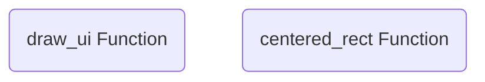

#### Ayrıntılı Açıklama
Bu dosya (`tui.rs`), aşağıdaki temel bileşenleri içerir:

- **Fonksiyonlar (Functions):** draw_ui, centered_rect

Genel olarak modülün veya sistemin belirli bir parçasının iş mantığını yürütür.

---

### Dosya: `orchestrator/src/memory.rs`

#### Kaynak Kod
```rust
use crossbeam::queue::ArrayQueue;
use std::sync::Arc;

/// HFT-Uyumlu (Lock-free) Ring Buffer
/// Mesaj kuyrukları için kullanılır.
#[derive(Clone)]
pub struct LockFreeBuffer {
    pub queue: Arc<ArrayQueue<Vec<u8>>>,
}

impl LockFreeBuffer {
    pub fn new(capacity: usize) -> Self {
        Self {
            queue: Arc::new(ArrayQueue::new(capacity)),
        }
    }

    #[inline(always)]
    pub fn push(&self, data: Vec<u8>) -> Result<(), Vec<u8>> {
        self.queue.push(data)
    }

    #[inline(always)]
    pub fn pop(&self) -> Option<Vec<u8>> {
        self.queue.pop()
    }

    #[inline(always)]
    pub fn is_empty(&self) -> bool {
        self.queue.is_empty()
    }
}

```

#### Akış Diyagramı (Mermaid)
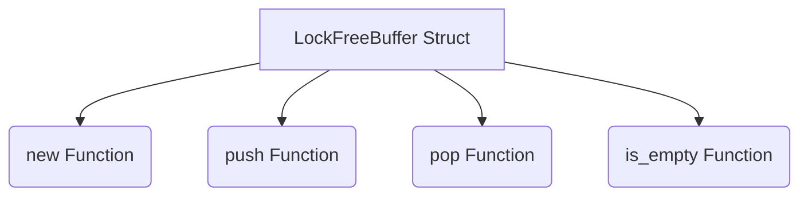

#### Ayrıntılı Açıklama
Bu dosya (`memory.rs`), aşağıdaki temel bileşenleri içerir:

- **Veri Yapıları (Structs):** LockFreeBuffer
- **Fonksiyonlar (Functions):** new, push, pop, is_empty

Genel olarak modülün veya sistemin belirli bir parçasının iş mantığını yürütür.

---

### Dosya: `orchestrator/src/endpoint.rs`

#### Kaynak Kod
```rust
use std::fmt;

#[repr(u32)]
#[derive(Debug, Clone, Copy, PartialEq, Eq, Hash)]
pub enum StandardEndpoint {
    Start = 0,
    Stop = 1,
    IsWorking = 2,
    DataValid = 3,
    DataMonitor = 4,
    RawData = 5,
    Inbox = 6,
    Outbox = 7,
    GetSubscriptions = 8,
}

impl fmt::Display for StandardEndpoint {
    fn fmt(&self, f: &mut fmt::Formatter<'_>) -> fmt::Result {
        match self {
            StandardEndpoint::Start => write!(f, "start"),
            StandardEndpoint::Stop => write!(f, "stop"),
            StandardEndpoint::IsWorking => write!(f, "is_working"),
            StandardEndpoint::DataValid => write!(f, "data_valid"),
            StandardEndpoint::DataMonitor => write!(f, "data_monitor"),
            StandardEndpoint::RawData => write!(f, "raw_data"),
            StandardEndpoint::Inbox => write!(f, "inbox"),
            StandardEndpoint::Outbox => write!(f, "outbox"),
            StandardEndpoint::GetSubscriptions => write!(f, "get_subscriptions"),
        }
    }
}

impl StandardEndpoint {
    pub fn all() -> Vec<StandardEndpoint> {
        vec![
            StandardEndpoint::Start,
            StandardEndpoint::Stop,
            StandardEndpoint::IsWorking,
            StandardEndpoint::DataValid,
            StandardEndpoint::DataMonitor,
            StandardEndpoint::RawData,
            StandardEndpoint::Inbox,
            StandardEndpoint::Outbox,
            StandardEndpoint::GetSubscriptions,
        ]
    }
}

```

#### Akış Diyagramı (Mermaid)
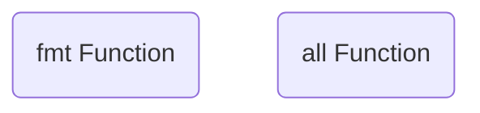

#### Ayrıntılı Açıklama
Bu dosya (`endpoint.rs`), aşağıdaki temel bileşenleri içerir:

- **Fonksiyonlar (Functions):** fmt, all

Genel olarak modülün veya sistemin belirli bir parçasının iş mantığını yürütür.

---

### Dosya: `orchestrator/src/main.rs`

#### Kaynak Kod
```rust
mod tui;

use cycle_finance_breakout_system::orchestrator::Orchestrator;
use cycle_finance_breakout_system::endpoint::StandardEndpoint;
use cycle_finance_breakout_system::system::{SystemInstance, RawEndpointFn};
use crossterm::{
    event::{self, Event, KeyCode, MouseEventKind, MouseButton, EnableMouseCapture, DisableMouseCapture},
    terminal::{disable_raw_mode, enable_raw_mode, Clear, ClearType},
    ExecutableCommand,
};
use ratatui::{backend::CrosstermBackend, Terminal};
use std::io;
use std::sync::Arc;
use std::ffi::c_void;

#[derive(PartialEq)]
pub enum ViewMode {
    Main,
    PluginSelection,
    ConfirmDelete(String),
    ContextMenu(String, u16, u16),
    Shell,
    ConfigEditor,
}

pub struct App<'a> {
    pub orchestrator: Arc<Orchestrator>,
    pub selected: usize,
    pub logs: Vec<String>,
    pub monitored_data: Option<Vec<u8>>,
    pub running: bool,
    pub mode: ViewMode,
    pub available_plugins: Vec<String>,
    pub plugin_selected: usize,
    pub active_tab: usize,
    pub systems_panel_width: u16,
    pub is_dragging_split: bool,
    pub monitor_scroll: u16,
    pub sys: sysinfo::System,
    pub input_shell: String,
    pub shell_history: Vec<String>,
    pub textarea: Option<tui_textarea::TextArea<'a>>,
}

impl<'a> App<'a> {
    pub fn new(orchestrator: Arc<Orchestrator>) -> Self {
        let mut sys = sysinfo::System::new_all();
        sys.refresh_all();
        Self {
            orchestrator,
            selected: 0,
            logs: Vec::new(),
            monitored_data: None,
            running: true,
            mode: ViewMode::Main,
            available_plugins: Vec::new(),
            plugin_selected: 0,
            active_tab: 0,
            systems_panel_width: 30,
            is_dragging_split: false,
            monitor_scroll: 0,
            sys,
            input_shell: String::new(),
            shell_history: Vec::new(),
            textarea: None,
        }
    }

    pub fn log(&mut self, msg: &str) {
        let now = chrono::Local::now();
        self.logs.push(format!("[{}] {}", now.format("%H:%M:%S"), msg));
        if self.logs.len() > 100 {
            self.logs.remove(0);
        }
    }
}

/// Eklenti yükleme yardımcı fonksiyonu (C-ABI: init_plugin)
unsafe fn load_plugin_cabi(app: &mut App<'_>, plugin_name: &str) {
    let ext = if cfg!(target_os = "windows") { "dll" } 
              else if cfg!(target_os = "macos") { "dylib" } 
              else { "so" };
    let prefix = if cfg!(target_os = "windows") { "" } else { "lib" };
    
    let mut lib_path_buf = get_plugin_dir();
    lib_path_buf.push(format!("{}{}.{}", prefix, plugin_name, ext));
    let lib_path = lib_path_buf.to_string_lossy().to_string();
    
    match libloading::Library::new(&lib_path) {
        Ok(lib) => {
            // Yeni HFT C-ABI: init_plugin(state_out) -> RawEndpointFn
            type PluginInit = unsafe extern "C" fn(state_out: *mut *mut c_void) -> RawEndpointFn;
            match lib.get::<PluginInit>(b"init_plugin") {
                Ok(init_fn) => {
                    let mut state_ptr: *mut c_void = std::ptr::null_mut();
                    let endpoint_fn = init_fn(&mut state_ptr);
                    let sys = SystemInstance::new(
                        plugin_name.to_string(), 
                        plugin_name.to_string(), 
                        state_ptr, 
                        endpoint_fn,
                    );
                    app.orchestrator.register_system(sys);
                    Box::leak(Box::new(lib)); // Kütüphaneyi bellekte tut
                    app.log(&format!("{} eklentisi basariyla yuklendi (HFT/C-ABI).", plugin_name));
                }
                Err(_) => app.log(&format!("{} eklentisinde init_plugin fonksiyonu bulunamadi.", plugin_name)),
            }
        }
        Err(e) => app.log(&format!("{} eklentisi yuklenemedi (derlediginizden emin olun): {}", plugin_name, e)),
    }
}

fn get_plugin_dir() -> std::path::PathBuf {
    let mut dir = std::env::current_exe().unwrap_or_else(|_| std::path::PathBuf::from("."));
    dir.pop(); // exe_name
    if dir.ends_with("deps") {
        dir.pop(); // go up to debug/release
    }
    dir
}

/// Eklenti tarama yardımcı fonksiyonu
fn scan_plugins() -> Vec<String> {
    let mut plugins = Vec::new();
    let lib_dir = get_plugin_dir();
    let prefix = if cfg!(target_os = "windows") { "" } else { "lib" };
    if let Ok(entries) = std::fs::read_dir(&lib_dir) {
        for entry in entries.flatten() {
            let name = entry.file_name().to_string_lossy().into_owned();
            if name.starts_with(&format!("{}plugin_", prefix)) && (name.ends_with(".so") || name.ends_with(".dll") || name.ends_with(".dylib")) {
                let ext_len = if name.ends_with(".so") { 3 } else if name.ends_with(".dll") { 4 } else { 6 };
                let plugin_name = &name[prefix.len()..name.len()-ext_len];
                plugins.push(plugin_name.to_string());
            }
        }
    }
    plugins.sort();
    plugins.dedup();
    plugins
}

#[tokio::main]
async fn main() -> anyhow::Result<()> {
    // ═══════════════════════════════════════════════════════
    // HFT: CPU Çekirdek Sabitleme (Core Pinning)
    // Ana thread → Çekirdek 0, Router thread → Çekirdek 1
    // ═══════════════════════════════════════════════════════
    if let Some(core_ids) = core_affinity::get_core_ids() {
        if let Some(core) = core_ids.first() {
            core_affinity::set_for_current(*core);
        }
        let pinned_core = core_ids.first().map(|c| c.id).unwrap_or(0);
        eprintln!("[HFT] Ana thread CPU çekirdeğine sabitlendi: Core {}", pinned_core);
    }

    let orchestrator = Arc::new(Orchestrator::new());
    let mut app = App::new(orchestrator.clone());
    
    // --- FLOW ENGINE & CONFIG INITIALIZATION ---
    let config_path = if std::path::Path::new("flow_config.json").exists() {
        "flow_config.json"
    } else if std::path::Path::new("../flow_config.json").exists() {
        "../flow_config.json"
    } else {
        "flow_config.json" // Default fallback
    };
    
    let flow_config = match flow_engine::FlowConfig::load(config_path) {
        Ok(c) => Some(c),
        Err(e) => {
            app.log(&format!("UYARI: flow_config.json okunamadı: {}", e));
            None
        }
    };
    
    let mut engine_opt = None;
    if let Some(ref config) = flow_config {
        let engine = std::sync::Arc::new(flow_engine::FlowEngine::new(config.clone()));
        engine_opt = Some(engine.clone());
        app.log("Flow Engine config yüklendi. Router thread başlatılıyor...");

        let orc_clone = orchestrator.clone();
        let engine_clone = engine.clone();

        std::thread::spawn(move || {
            if let Some(core_ids) = core_affinity::get_core_ids() {
                if core_ids.len() > 1 {
                    core_affinity::set_for_current(core_ids[1]); // Router thread -> Core 1
                }
            }
            
            let mut last_health_check = std::time::Instant::now();
            loop {
                engine_clone.run_loop(|plugin_name, endpoint_id, payload, out_buf| {
                    let ep = match endpoint_id {
                        5 => StandardEndpoint::RawData,
                        6 => StandardEndpoint::Inbox,
                        7 => StandardEndpoint::Outbox,
                        _ => return 0,
                    };
                    orc_clone.call_endpoint(plugin_name, ep, payload, out_buf)
                });
                
                if last_health_check.elapsed().as_secs() >= 5 {
                    let warnings = engine_clone.health_check();
                    for _warning in warnings {}
                    last_health_check = std::time::Instant::now();
                }

                std::thread::sleep(std::time::Duration::from_millis(1));
            }
        });
    }
    
    // Tüm pluginleri otomatik tara, yükle
    app.available_plugins = scan_plugins();
    for plugin_name in app.available_plugins.clone() {
        app.log(&format!("Otomatik yükleniyor: {}", plugin_name));
        unsafe { load_plugin_cabi(&mut app, &plugin_name); }
    }
    
    // Yüklenen tüm pluginleri başlat ve parametrelerini gönder
    let mut startup_buf = [0u8; 8];
    for (id, _, _) in app.orchestrator.list_systems() {
        let mut payload_bytes = Vec::new();
        if let Some(ref config) = flow_config {
            if let Some(plugin_conf) = config.iter().find(|p| p.plugin_name == id) {
                payload_bytes = serde_json::to_vec(&plugin_conf).unwrap_or_default();
            }
        }
        app.orchestrator.call_endpoint(&id, StandardEndpoint::Start, &payload_bytes, &mut startup_buf);
        app.log(&format!("Otomatik başlatıldı: {}", id));
    }
    
    app.log("Sistem başlatıldı ve eklentiler otomatik yüklendi. [HFT Modu: CPU Pinning AÇIK]");
    
    enable_raw_mode()?;
    let mut stdout = io::stdout();
    stdout.execute(EnableMouseCapture)?;
    stdout.execute(Clear(ClearType::All))?;
    let backend = CrosstermBackend::new(stdout);
    let mut terminal = Terminal::new(backend)?;
    
    // Pre-allocated HFT buffer (sıcak yolda yeni allokasyonu önler)
    let mut hft_buf = vec![0u8; 1024 * 1024]; // 1MB
    
    let mut last_config_modified = std::fs::metadata(config_path)
        .and_then(|m| m.modified())
        .unwrap_or(std::time::SystemTime::now());
    let mut last_config_check = std::time::Instant::now();
    
    while app.running {
        terminal.draw(|f| tui::draw_ui(f, &mut app))?;
        
        // Hot-reload check for flow_config.json
        if last_config_check.elapsed().as_secs() >= 2 {
            last_config_check = std::time::Instant::now();
            if let Ok(meta) = std::fs::metadata(config_path) {
                if let Ok(modified) = meta.modified() {
                    if modified > last_config_modified {
                        last_config_modified = modified;
                        app.log("Ayarlar degisti! flow_config.json yeniden yukleniyor...");
                        if let Ok(new_config) = flow_engine::FlowConfig::load(config_path) {
                            if let Some(ref eng) = engine_opt {
                                eng.update_config(new_config.clone());
                            }
                            
                            // Send new config to plugins
                            for (id, _, _) in app.orchestrator.list_systems() {
                                if let Some(plugin_conf) = new_config.iter().find(|p| p.plugin_name == id) {
                                    let payload = serde_json::to_vec(&plugin_conf).unwrap_or_default();
                                    app.orchestrator.call_endpoint(&id, StandardEndpoint::Start, &payload, &mut hft_buf);
                                }
                            }
                            app.log("Yeni ayarlar basariyla uygulandi.");
                        } else {
                            app.log("HATA: Yeni flow_config.json okunamadi veya parse edilemedi.");
                        }
                    }
                }
            }
        }
        
        if event::poll(std::time::Duration::from_millis(100))? {
            if let Event::Key(key) = event::read()? {
                if app.mode == ViewMode::Main {
                    let systems = app.orchestrator.list_systems();
                    
                    match key.code {
                        KeyCode::Char('q') => app.running = false,
                        KeyCode::Down => app.selected = (app.selected + 1) % systems.len().max(1),
                        KeyCode::Up => app.selected = app.selected.saturating_sub(1),
                        
                        KeyCode::Char('s') => {
                            if let Some((id, _, _)) = systems.get(app.selected) {
                                let written = app.orchestrator.call_endpoint(id, StandardEndpoint::Start, &[], &mut hft_buf);
                                if written > 0 {
                                    app.log(&format!("{} başlatıldı", id));
                                } else {
                                    app.log(&format!("{} başlatıldı (yanıt yok)", id));
                                }
                            }
                        }

                        KeyCode::PageDown => {
                            app.monitor_scroll = app.monitor_scroll.saturating_add(5);
                        }
                        KeyCode::PageUp => {
                            app.monitor_scroll = app.monitor_scroll.saturating_sub(5);
                        }
                        
                        KeyCode::Char('x') => {
                            if let Some((id, _, _)) = systems.get(app.selected) {
                                app.orchestrator.call_endpoint(id, StandardEndpoint::Stop, &[], &mut hft_buf);
                                app.log(&format!("{} durduruldu", id));
                            }
                        }
                        
                        KeyCode::Char('m') => {
                            if let Some((id, _, _)) = systems.get(app.selected) {
                                match app.orchestrator.monitor_data(id) {
                                    Ok(data) => {
                                        app.monitored_data = Some(data);
                                        app.log(&format!("{} verisi okundu (Canlı Takip Açık)", id));
                                    }
                                    Err(e) => app.log(&format!("Veri okuma hatası ({}): {}", id, e)),
                                }
                            }
                        }
                        
                        KeyCode::Char('d') => {
                            if let Some((id, _, _)) = systems.get(app.selected) {
                                if let Ok(_) = app.orchestrator.unregister_system(id) {
                                    app.log(&format!("{} sistemden silindi", id));
                                    app.selected = app.selected.saturating_sub(1);
                                    app.monitored_data = None;
                                }
                            }
                        }
                        
                        KeyCode::Char('l') => {
                            app.mode = ViewMode::PluginSelection;
                            app.available_plugins = scan_plugins();
                            app.plugin_selected = 0;
                        }
                        
                        KeyCode::Char('e') | KeyCode::Char('c') => {
                            if app.active_tab == 2 {
                                // Ayarlar sekmesinde 'e' basıldıysa editörü aç
                                if let Ok(content) = std::fs::read_to_string(config_path) {
                                    let mut textarea = tui_textarea::TextArea::default();
                                    for line in content.lines() {
                                        textarea.insert_newline();
                                        textarea.insert_str(line);
                                    }
                                    // Remove the first empty newline that is created by the above logic
                                    textarea.move_cursor(tui_textarea::CursorMove::Top);
                                    textarea.delete_line_by_end();
                                    app.textarea = Some(textarea);
                                    app.mode = ViewMode::ConfigEditor;
                                } else {
                                    app.log("HATA: flow_config.json okunamadı.");
                                }
                            }
                        }
                        
                        KeyCode::Char('i') => {
                            app.mode = ViewMode::Shell;
                        }
                        
                        _ => {}
                    }
                } else if app.mode == ViewMode::ConfigEditor {
                    // Config Editor mode
                    let mut should_exit = false;
                    let mut should_save = false;
                    
                    match key.code {
                        KeyCode::Esc => {
                            should_exit = true;
                        }
                        KeyCode::Char('s') if key.modifiers.contains(event::KeyModifiers::CONTROL) => {
                            should_save = true;
                            should_exit = true;
                        }
                        _ => {
                            if let Some(ref mut ta) = app.textarea {
                                ta.input(key);
                            }
                        }
                    }
                    
                    if should_save {
                        if let Some(ref ta) = app.textarea {
                            let lines = ta.lines().join("\n");
                            if std::fs::write(config_path, lines).is_ok() {
                                app.log("flow_config.json başarıyla kaydedildi. Hot-reload tetiklenecek.");
                            } else {
                                app.log("HATA: flow_config.json kaydedilemedi.");
                            }
                        }
                    }
                    
                    if should_exit {
                        app.textarea = None;
                        app.mode = ViewMode::Main;
                    }
                } else if app.mode == ViewMode::PluginSelection {
                    match key.code {
                        KeyCode::Esc | KeyCode::Char('q') | KeyCode::Char('l') => {
                            app.mode = ViewMode::Main;
                        }
                        KeyCode::Down => {
                            app.plugin_selected = (app.plugin_selected + 1) % app.available_plugins.len().max(1);
                        }
                        KeyCode::Up => {
                            app.plugin_selected = app.plugin_selected.saturating_sub(1);
                        }
                        KeyCode::Enter => {
                            if let Some(plugin_name) = app.available_plugins.get(app.plugin_selected).cloned() {
                                unsafe { load_plugin_cabi(&mut app, &plugin_name); }
                            }
                            app.mode = ViewMode::Main;
                        }
                        _ => {}
                    }
                } else if app.mode == ViewMode::Shell {
                    let systems = app.orchestrator.list_systems();
                    let sys_id = if let Some((id, _, _)) = systems.get(app.selected) {
                        id.clone()
                    } else {
                        "".to_string()
                    };

                    match key.code {
                        KeyCode::Esc => app.mode = ViewMode::Main,
                        KeyCode::Enter => {
                            let cmd = app.input_shell.trim().to_string();
                            if !cmd.is_empty() {
                                app.shell_history.push(cmd.clone());
                                if app.shell_history.len() > 50 {
                                    app.shell_history.remove(0);
                                }
                                
                                let parts: Vec<&str> = cmd.split_whitespace().collect();
                                let mut hft_buf = vec![0u8; 1024];
                                
                                let action = parts[0].to_lowercase();
                                
                                if action == "help" {
                                    app.log("--- Shell Komutları ---");
                                    app.log("buy <sembol> <miktar> <fiyat|market> [kaldıraç]  (Örn: buy BTCUSDT 0.1 60000 20)");
                                    app.log("sell <sembol> <miktar> <fiyat|market> [kaldıraç] (Örn: sell ETHUSDT 1.5 market 50)");
                                    app.log("close <sembol> (Örn: close BTCUSDT) - Tüm açık pozisyonları kapatır");
                                    app.log("trigger <zaman> <limit> (Örn: trigger 15m 10) - Seçili eklentiyi tetikler");
                                    app.log("start <plugin_id|all> (Örn: start plugin_oi_fetcher) - Eklentiyi başlatır");
                                    app.log("stop <plugin_id|all> (Örn: stop all) - Eklentiyi durdurur");
                                    app.log("fetch oi <sembol> [interval] [limit] - OI verisi çeker");
                                    app.log("quit / exit - Sistemi toptan kapatır");
                                    app.log("-----------------------");
                                } else if action == "quit" || action == "exit" {
                                    app.running = false;
                                } else if action == "start" && parts.len() >= 2 {
                                    let target = parts[1];
                                    if target == "all" {
                                        for (id, _, _) in app.orchestrator.list_systems() {
                                            app.orchestrator.call_endpoint(&id, StandardEndpoint::Start, &[], &mut hft_buf);
                                        }
                                        app.log("Tüm sistemler başlatıldı.");
                                    } else {
                                        let written = app.orchestrator.call_endpoint(target, StandardEndpoint::Start, &[], &mut hft_buf);
                                        app.log(&format!("{} başlatıldı.", target));
                                    }
                                } else if action == "stop" && parts.len() >= 2 {
                                    let target = parts[1];
                                    if target == "all" {
                                        for (id, _, _) in app.orchestrator.list_systems() {
                                            app.orchestrator.call_endpoint(&id, StandardEndpoint::Stop, &[], &mut hft_buf);
                                        }
                                        app.log("Tüm sistemler durduruldu.");
                                    } else {
                                        app.orchestrator.call_endpoint(target, StandardEndpoint::Stop, &[], &mut hft_buf);
                                        app.log(&format!("{} durduruldu.", target));
                                    }
                                } else if action == "fetch" && parts.len() >= 3 && parts[1] == "oi" {
                                    let symbol = parts[2].to_uppercase();
                                    let interval = if parts.len() >= 4 { parts[3] } else { "5m" };
                                    let limit = if parts.len() >= 5 { parts[4].parse::<i64>().unwrap_or(30) } else { 30 };
                                    let req = serde_json::json!({
                                        "action": "fetch_oi",
                                        "symbol": symbol,
                                        "interval": interval,
                                        "limit": limit,
                                        "from": "admin",
                                        "context": {}
                                    });
                                    let bytes = serde_json::to_vec(&req).unwrap_or_default();
                                    app.orchestrator.call_endpoint("plugin_oi_fetcher", StandardEndpoint::Inbox, &bytes, &mut hft_buf);
                                    app.log(&format!("OI fetch isteği gönderildi: {} {} {}", symbol, interval, limit));
                                } else if action == "close" && parts.len() >= 2 {
                                    let symbol = parts[1].to_uppercase();
                                    let req = serde_json::json!({
                                        "action": "close_position",
                                        "user_id": "admin",
                                        "symbol": symbol
                                    });
                                    let bytes = serde_json::to_vec(&req).unwrap_or_default();
                                    app.orchestrator.call_endpoint("plugin_paper_exchange", StandardEndpoint::Inbox, &bytes, &mut hft_buf);
                                    app.log(&format!("Close pozisyon emri gönderildi: {}", symbol));
                                } else if (action == "buy" || action == "sell") && parts.len() >= 4 {
                                    let symbol = parts[1].to_uppercase();
                                    let amount = parts[2].parse::<f64>().unwrap_or(0.0);
                                    let price_str = parts[3].to_lowercase();
                                    
                                    let order_type = if price_str == "market" { "Market" } else { "Limit" };
                                    let price = if price_str == "market" { 0.0 } else { price_str.parse::<f64>().unwrap_or(0.0) };
                                    
                                    let leverage = if parts.len() >= 5 {
                                        parts[4].replace("x", "").parse::<f64>().unwrap_or(20.0)
                                    } else {
                                        20.0
                                    };
                                    
                                    let req = serde_json::json!({
                                        "action": "submit_order",
                                        "user_id": "admin",
                                        "data": {
                                            "id": uuid::Uuid::new_v4().to_string(),
                                            "user_id": "admin",
                                            "symbol": symbol,
                                            "side": if action == "buy" { "Buy" } else { "Sell" },
                                            "position_side": if action == "buy" { "Long" } else { "Short" },
                                            "order_type": order_type,
                                            "price": price,
                                            "stop_price": 0.0,
                                            "amount": amount,
                                            "leverage": leverage,
                                            "executed": 0.0,
                                            "timestamp": 0
                                        }
                                    });
                                    let bytes = serde_json::to_vec(&req).unwrap_or_default();
                                    app.orchestrator.call_endpoint("plugin_paper_exchange", StandardEndpoint::Inbox, &bytes, &mut hft_buf);
                                    app.log(&format!("Paper emri gönderildi: {} {} {} @ {} ({}x)", action, amount, symbol, price_str, leverage));
                                } else if action == "trigger" && parts.len() >= 3 {
                                    if sys_id.is_empty() {
                                        app.log("Lütfen listeden tetiklenecek bir sistem seçin.");
                                    } else {
                                        let interval = parts[1];
                                        let limit = parts[2].parse::<i64>().unwrap_or(5);
                                        
                                        let req = serde_json::json!({
                                            "action": "manual_trigger",
                                            "symbol": "BTCUSDT",
                                            "interval": interval,
                                            "limit": limit
                                        });
                                        let bytes = serde_json::to_vec(&req).unwrap_or_default();
                                        app.orchestrator.call_endpoint(&sys_id, StandardEndpoint::Inbox, &bytes, &mut hft_buf);
                                        app.log(&format!("Manuel tetik gönderildi: {}", sys_id));
                                    }
                                } else {
                                    app.log("Geçersiz komut. Kullanım için 'help' yazabilirsiniz.");
                                }
                            }
                            app.input_shell.clear();
                        }
                        KeyCode::Backspace => {
                            app.input_shell.pop();
                        }
                        KeyCode::Char(c) => {
                            app.input_shell.push(c);
                        }
                        _ => {}
                    }

                }
            } else if let Event::Mouse(mouse_event) = event::read()? {
                if mouse_event.kind == MouseEventKind::Down(MouseButton::Left) {
                    let row = mouse_event.row;
                    let col = mouse_event.column;
                    
                    if app.mode == ViewMode::Main {
                        // Footer: "Yeni Eklenti Yükle" button
                        let size = terminal.size()?;
                        if row >= size.height.saturating_sub(3) {
                            if col >= 3 && col <= 3 + 24 {
                                app.mode = ViewMode::PluginSelection;
                                app.available_plugins = scan_plugins();
                                app.plugin_selected = 0;
                            }
                        } else if row < 3 {
                            if col < 15 { app.active_tab = 0; }
                            else if col < 35 { app.active_tab = 1; }
                            else { app.active_tab = 2; }
                        } else if app.active_tab == 0 && row >= 8 && row < size.height.saturating_sub(11) {
                            let systems = app.orchestrator.list_systems();
                            let index = (row - 8) as usize;
                            if index < systems.len() {
                                app.selected = index;
                                let sys_id = &systems[index].0;
                                
                                let table_width = (size.width as f32 * (app.systems_panel_width as f32 / 100.0)) as u16;
                                let col3_start = (table_width as f32 * 0.5) as u16;
                                
                                if col >= col3_start {
                                    let rel_col = col - col3_start;
                                    if rel_col < 13 {
                                        app.orchestrator.call_endpoint(sys_id, StandardEndpoint::Start, &[], &mut hft_buf);
                                    } else if rel_col >= 14 && rel_col < 27 {
                                        app.orchestrator.call_endpoint(sys_id, StandardEndpoint::Stop, &[], &mut hft_buf);
                                    } else if rel_col >= 28 && rel_col < 39 {
                                        if let Ok(data) = app.orchestrator.monitor_data(sys_id) {
                                            app.monitored_data = Some(data);
                                        }
                                    } else if rel_col >= 40 && rel_col < 50 {
                                        let _ = app.orchestrator.unregister_system(sys_id);
                                        app.selected = app.selected.saturating_sub(1);
                                        app.monitored_data = None;
                                    }
                                }
                            }
                        }
                    } else if app.mode == ViewMode::PluginSelection {
                        let size = terminal.size()?;
                        let popup_w = (size.width as f32 * 0.4) as u16;
                        let popup_h = (size.height as f32 * 0.6) as u16;
                        let popup_x = (size.width.saturating_sub(popup_w)) / 2;
                        let popup_y = (size.height.saturating_sub(popup_h)) / 2;
                        
                        if row >= popup_y + 2 && row < popup_y + popup_h - 1 && col >= popup_x && col < popup_x + popup_w {
                            let idx = (row - (popup_y + 2)) as usize;
                            if idx < app.available_plugins.len() {
                                app.plugin_selected = idx;
                                if let Some(plugin_name) = app.available_plugins.get(app.plugin_selected).cloned() {
                                    unsafe { load_plugin_cabi(&mut app, &plugin_name); }
                                }
                                app.mode = ViewMode::Main;
                            }
                        } else {
                            app.mode = ViewMode::Main;
                        }
                    }
                }
            }
        } else {
            // Background update of monitored data to ensure real-time UI
            if app.monitored_data.is_some() {
                let systems = app.orchestrator.list_systems();
                if let Some((id, _, _)) = systems.get(app.selected) {
                    if let Ok(data) = app.orchestrator.monitor_data(id) {
                        app.monitored_data = Some(data);
                    }
                }
            }
            
            // Message Bus Routing (Inbox/Outbox) — Zero-copy HFT
            let mut all_messages = Vec::new();
            for (id, _, _) in app.orchestrator.list_systems() {
                let written = app.orchestrator.call_endpoint(&id, StandardEndpoint::Outbox, &[], &mut hft_buf);
                if written > 0 {
                    if let Ok(json_array) = serde_json::from_slice::<serde_json::Value>(&hft_buf[..written]) {
                        if let Some(arr) = json_array.as_array() {
                            for msg in arr {
                                all_messages.push(msg.clone());
                            }
                        }
                    }
                }
            }
            
            for msg in all_messages {
                if let Some(target) = msg.get("to").and_then(|v| v.as_str()) {
                    let msg_bytes = serde_json::to_vec(&msg).unwrap_or_default();
                    app.orchestrator.call_endpoint(target, StandardEndpoint::Inbox, &msg_bytes, &mut hft_buf);
                }
            }
            
            // Background validator & TPS polling
            let has_validator = app.orchestrator.get_system("validator_01").is_some();
            let has_tps = app.orchestrator.get_system("tps_01").is_some();
            
            if has_validator || has_tps {
                let w1 = app.orchestrator.call_endpoint("aggtrade_01", StandardEndpoint::RawData, &[], &mut hft_buf);
                let agg = hft_buf[..w1].to_vec();
                let w2 = app.orchestrator.call_endpoint("depth_01", StandardEndpoint::RawData, &[], &mut hft_buf);
                let depth = hft_buf[..w2].to_vec();
                let w3 = app.orchestrator.call_endpoint("liq_01", StandardEndpoint::RawData, &[], &mut hft_buf);
                let liq = hft_buf[..w3].to_vec();
                
                if !agg.is_empty() {
                    let depth_str = if depth.is_empty() { "{}".into() } else { String::from_utf8_lossy(&depth) };
                    let liq_str = if liq.is_empty() { "{}".into() } else { String::from_utf8_lossy(&liq) };
                    
                    let combined = format!("{{\"agg\":{}, \"depth\":{}, \"liq\":{}}}", 
                        String::from_utf8_lossy(&agg), 
                        depth_str, 
                        liq_str
                    );
                    
                    if has_validator && !depth.is_empty() {
                        app.orchestrator.call_endpoint("validator_01", StandardEndpoint::DataValid, combined.as_bytes(), &mut hft_buf);
                    }
                    if has_tps {
                        app.orchestrator.call_endpoint("tps_01", StandardEndpoint::DataValid, combined.as_bytes(), &mut hft_buf);
                    }
                }
            }
        }
    }
    
    let mut stdout = io::stdout();
    stdout.execute(DisableMouseCapture)?;
    stdout.execute(crossterm::cursor::Show)?;
    disable_raw_mode()?;
    Ok(())
}

```

#### Akış Diyagramı (Mermaid)
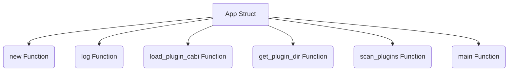

#### Ayrıntılı Açıklama
Bu dosya (`main.rs`), aşağıdaki temel bileşenleri içerir:

- **Veri Yapıları (Structs):** App
- **Fonksiyonlar (Functions):** new, log, load_plugin_cabi, get_plugin_dir, scan_plugins, main

Genel olarak modülün veya sistemin belirli bir parçasının iş mantığını yürütür.

---

### Dosya: `orchestrator/src/lib.rs`

#### Kaynak Kod
```rust
pub mod endpoint;
pub mod memory;
pub mod orchestrator;
pub mod system;

```

#### Akış Diyagramı (Mermaid)
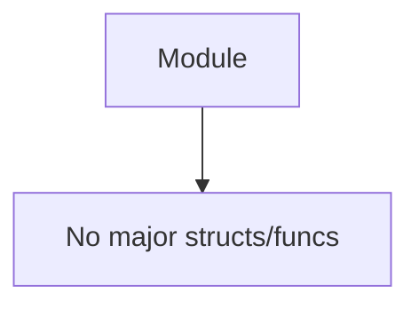

#### Ayrıntılı Açıklama
Bu dosya (`lib.rs`), aşağıdaki temel bileşenleri içerir:


Genel olarak modülün veya sistemin belirli bir parçasının iş mantığını yürütür.

---

### Dosya: `orchestrator/src/orchestrator.rs`

#### Kaynak Kod
```rust
use crate::endpoint::StandardEndpoint;
use crate::system::SystemInstance;
use std::sync::Arc;
use std::sync::RwLock;

pub struct Orchestrator {
    // We use RwLock around a Vec for fast read iteration.
    systems: Arc<RwLock<Vec<Arc<SystemInstance>>>>,
}

impl Orchestrator {
    pub fn new() -> Self {
        Self {
            systems: Arc::new(RwLock::new(Vec::new())),
        }
    }

    pub fn register_system(&self, system: SystemInstance) {
        let mut sys_list = self.systems.write().unwrap();
        sys_list.retain(|s| s.id != system.id);
        sys_list.push(Arc::new(system));
    }

    pub fn unregister_system(&self, id: &str) -> anyhow::Result<()> {
        let mut sys_list = self.systems.write().unwrap();
        let initial_len = sys_list.len();
        sys_list.retain(|s| s.id != id);
        if sys_list.len() == initial_len {
            anyhow::bail!("Sistem bulunamadı: {}", id);
        }
        Ok(())
    }

    // Gecikmesiz, zero-copy çağrı
    #[inline(always)]
    pub fn call_endpoint(&self, system_id: &str, endpoint: StandardEndpoint, payload: &[u8], out_buf: &mut [u8]) -> usize {
        let sys_list = self.systems.read().unwrap();
        if let Some(sys) = sys_list.iter().find(|s| s.id == system_id) {
            let result = sys.call(endpoint, payload, out_buf);
            // Start/Stop çağrıldığında durumu otomatik güncelle
            match endpoint {
                StandardEndpoint::Start => {
                    sys.context.is_running.store(true, core::sync::atomic::Ordering::Relaxed);
                }
                StandardEndpoint::Stop => {
                    sys.context.is_running.store(false, core::sync::atomic::Ordering::Relaxed);
                }
                _ => {}
            }
            result
        } else {
            0
        }
    }

    pub fn list_systems(&self) -> Vec<(String, String, bool)> {
        let sys_list = self.systems.read().unwrap();
        let mut result = Vec::new();
        for sys in sys_list.iter() {
            let running = sys.context.is_running.load(core::sync::atomic::Ordering::Relaxed);
            result.push((sys.id.clone(), sys.name.clone(), running));
        }
        result
    }

    pub fn monitor_data(&self, system_id: &str) -> anyhow::Result<Vec<u8>> {
        let mut buf = vec![0u8; 1024 * 1024]; // 1MB buffer for UI monitoring
        let written = self.call_endpoint(system_id, StandardEndpoint::DataMonitor, &[], &mut buf);
        buf.truncate(written);
        Ok(buf)
    }

    pub fn get_system(&self, id: &str) -> Option<Arc<SystemInstance>> {
        let sys_list = self.systems.read().unwrap();
        sys_list.iter().find(|s| s.id == id).cloned()
    }
}

```

#### Akış Diyagramı (Mermaid)
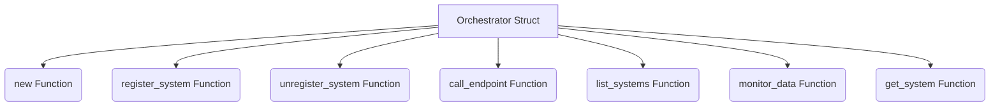

#### Ayrıntılı Açıklama
Bu dosya (`orchestrator.rs`), aşağıdaki temel bileşenleri içerir:

- **Veri Yapıları (Structs):** Orchestrator
- **Fonksiyonlar (Functions):** new, register_system, unregister_system, call_endpoint, list_systems, monitor_data, get_system

Genel olarak modülün veya sistemin belirli bir parçasının iş mantığını yürütür.

---

### Dosya: `flow_engine/src/config.rs`

#### Kaynak Kod
```rust
use serde::{Deserialize, Serialize};
use std::fs;

#[derive(Debug, Deserialize, Serialize, Clone)]
pub struct FlowConfig {
    #[serde(flatten)]
    pub plugins: Vec<PluginConfig>,
}

#[derive(Debug, Deserialize, Serialize, Clone)]
pub struct PluginInput {
    pub source: String,
    pub stream_id: String,
    pub params: serde_json::Value,
}

#[derive(Debug, Deserialize, Serialize, Clone)]
pub struct PluginConfig {
    pub plugin_name: String,
    #[serde(default)]
    pub plugin_inputs: Vec<PluginInput>,
    #[serde(default)]
    pub plugin_params: serde_json::Value,
    #[serde(default)]
    pub plugin_outputs: Vec<String>,
}

impl FlowConfig {
    pub fn load(path: &str) -> anyhow::Result<Vec<PluginConfig>> {
        let content = fs::read_to_string(path)?;
        let config: Vec<PluginConfig> = serde_json::from_str(&content)?;
        Ok(config)
    }
}

```

#### Akış Diyagramı (Mermaid)
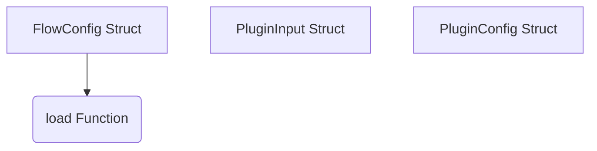

#### Ayrıntılı Açıklama
Bu dosya (`config.rs`), aşağıdaki temel bileşenleri içerir:

- **Veri Yapıları (Structs):** FlowConfig, PluginInput, PluginConfig
- **Fonksiyonlar (Functions):** load

Genel olarak modülün veya sistemin belirli bir parçasının iş mantığını yürütür.

---

### Dosya: `flow_engine/src/memory.rs`

#### Kaynak Kod
```rust
use std::sync::{Arc, RwLock};
use std::collections::HashMap;

/// A single data stream in memory
#[derive(Debug)]
pub struct DataStream {
    pub name: String,
    // Using an Arc RwLock for zero-copy across threads in the same process
    pub data: Arc<RwLock<Vec<u8>>>,
    pub last_updated: std::sync::atomic::AtomicU64,
}

impl DataStream {
    pub fn new(name: String) -> Self {
        Self {
            name,
            data: Arc::new(RwLock::new(Vec::with_capacity(1024 * 1024))), // 1MB buffer
            last_updated: std::sync::atomic::AtomicU64::new(0),
        }
    }
}

/// The main router for holding shared memory streams
#[derive(Debug, Default)]
pub struct MemoryRouter {
    pub streams: RwLock<HashMap<String, Arc<DataStream>>>,
}

impl MemoryRouter {
    pub fn new() -> Self {
        Self {
            streams: RwLock::new(HashMap::new()),
        }
    }

    pub fn get_or_create_stream(&self, name: &str) -> Arc<DataStream> {
        let mut streams = self.streams.write().unwrap();
        if let Some(stream) = streams.get(name) {
            return stream.clone();
        }
        let stream = Arc::new(DataStream::new(name.to_string()));
        streams.insert(name.to_string(), stream.clone());
        stream
    }
    
    pub fn get_stream(&self, name: &str) -> Option<Arc<DataStream>> {
        let streams = self.streams.read().unwrap();
        streams.get(name).cloned()
    }
}

```

#### Akış Diyagramı (Mermaid)
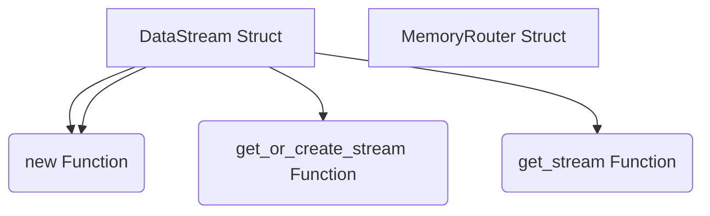

#### Ayrıntılı Açıklama
Bu dosya (`memory.rs`), aşağıdaki temel bileşenleri içerir:

- **Veri Yapıları (Structs):** DataStream, MemoryRouter
- **Fonksiyonlar (Functions):** new, new, get_or_create_stream, get_stream

Genel olarak modülün veya sistemin belirli bir parçasının iş mantığını yürütür.

---

### Dosya: `flow_engine/src/engine.rs`

#### Kaynak Kod
```rust
use crate::config::PluginConfig;
use crate::memory::MemoryRouter;
use std::sync::Arc;
use std::time::{SystemTime, UNIX_EPOCH};

pub struct FlowEngine {
    pub plugins: std::sync::RwLock<Vec<PluginConfig>>,
    pub router: Arc<MemoryRouter>,
    pub last_pushed: std::sync::Mutex<std::collections::HashMap<(String, String), u64>>,
}

impl FlowEngine {
    pub fn new(plugins: Vec<PluginConfig>) -> Self {
        let router = Arc::new(MemoryRouter::new());
        
        for plugin in &plugins {
            for out in &plugin.plugin_outputs {
                router.get_or_create_stream(out);
            }
            for input in &plugin.plugin_inputs {
                router.get_or_create_stream(&input.stream_id);
            }
        }
        
        Self {
            plugins: std::sync::RwLock::new(plugins),
            router,
            last_pushed: std::sync::Mutex::new(std::collections::HashMap::new()),
        }
    }

    pub fn update_config(&self, new_plugins: Vec<PluginConfig>) {
        for plugin in &new_plugins {
            for out in &plugin.plugin_outputs {
                self.router.get_or_create_stream(out);
            }
            for input in &plugin.plugin_inputs {
                self.router.get_or_create_stream(&input.stream_id);
            }
        }
        if let Ok(mut guard) = self.plugins.write() {
            *guard = new_plugins;
        }
    }

    pub fn health_check(&self) -> Vec<String> {
        let mut warnings = Vec::new();
        let now = SystemTime::now().duration_since(UNIX_EPOCH).unwrap().as_millis() as u64;
        
        let streams = self.router.streams.read().unwrap();
        for (name, stream) in streams.iter() {
            let last_up = stream.last_updated.load(std::sync::atomic::Ordering::Relaxed);
            if last_up > 0 {
                let diff = now.saturating_sub(last_up);
                if diff > 5000 {
                    warnings.push(format!("Stream '{}' has not been updated for {} ms!", name, diff));
                }
            } else {
                warnings.push(format!("Stream '{}' has never been updated!", name));
            }
        }
        warnings
    }

    pub fn run_loop<F>(&self, mut caller: F)
    where
        F: FnMut(&str, u32, &[u8], &mut [u8]) -> usize,
    {
        let mut temp_buf = vec![0u8; 1024 * 1024];
        let plugins_guard = self.plugins.read().unwrap();
        for plugin in plugins_guard.iter() {
            // Pull data from producers
            if !plugin.plugin_outputs.is_empty() {
                let bytes_read = caller(&plugin.plugin_name, 5, &[], &mut temp_buf); // 5 = RawData
                if bytes_read > 0 {
                    let mut is_multi_json = false;
                    if let Ok(multi_data) = serde_json::from_slice::<serde_json::Value>(&temp_buf[..bytes_read]) {
                        if let Some(obj) = multi_data.as_object() {
                            if obj.keys().any(|k| plugin.plugin_outputs.contains(k)) {
                                is_multi_json = true;
                                for (stream_id, data) in obj {
                                    if let Some(stream) = self.router.get_stream(stream_id) {
                                        let mut guard = stream.data.write().unwrap();
                                        if let Ok(data_bytes) = serde_json::to_vec(data) {
                                            if guard.as_slice() != data_bytes.as_slice() {
                                                guard.clear();
                                                guard.extend_from_slice(&data_bytes);
                                                let now = SystemTime::now().duration_since(UNIX_EPOCH).unwrap().as_millis() as u64;
                                                stream.last_updated.store(now, std::sync::atomic::Ordering::Relaxed);
                                            }
                                        }
                                    }
                                }
                            }
                        }
                    }
                    
                    if !is_multi_json && plugin.plugin_outputs.len() == 1 {
                        let stream_id = &plugin.plugin_outputs[0];
                        if let Some(stream) = self.router.get_stream(stream_id) {
                            let mut guard = stream.data.write().unwrap();
                            let data_bytes = &temp_buf[..bytes_read];
                            if guard.as_slice() != data_bytes {
                                guard.clear();
                                guard.extend_from_slice(data_bytes);
                                let now = SystemTime::now().duration_since(UNIX_EPOCH).unwrap().as_millis() as u64;
                                stream.last_updated.store(now, std::sync::atomic::Ordering::Relaxed);
                            }
                        }
                    }
                }
            }

            // Push data to consumers
            for input in &plugin.plugin_inputs {
                if let Some(stream) = self.router.get_stream(&input.stream_id) {
                    let stream_last_updated = stream.last_updated.load(std::sync::atomic::Ordering::Relaxed);
                    
                    let mut should_push = false;
                    {
                        let mut pushed = self.last_pushed.lock().unwrap();
                        let key = (plugin.plugin_name.clone(), input.stream_id.clone());
                        let last_pushed_time = pushed.get(&key).copied().unwrap_or(0);
                        
                        if stream_last_updated > last_pushed_time {
                            should_push = true;
                            pushed.insert(key, stream_last_updated);
                        }
                    }
                    
                    if should_push {
                        let guard = stream.data.read().unwrap();
                        if !guard.is_empty() {
                            let mut combined = Vec::with_capacity(32 + guard.len());
                            let mut name_bytes = [0u8; 32];
                            let name_len = input.stream_id.len().min(32);
                            name_bytes[..name_len].copy_from_slice(&input.stream_id.as_bytes()[..name_len]);
                            combined.extend_from_slice(&name_bytes);
                            combined.extend_from_slice(&guard);
                            
                            let _ = caller(&plugin.plugin_name, 6, &combined, &mut temp_buf);
                        }
                    }
                }
            }
        }
    }
}

```

#### Akış Diyagramı (Mermaid)
```mermaid
graph TD
    FlowEngine[FlowEngine Struct]
    new(new Function)
    FlowEngine --> new
    update_config(update_config Function)
    FlowEngine --> update_config
    health_check(health_check Function)
    FlowEngine --> health_check
    run_loop(run_loop Function)
    FlowEngine --> run_loop
```

#### Ayrıntılı Açıklama
Bu dosya (`engine.rs`), aşağıdaki temel bileşenleri içerir:

- **Veri Yapıları (Structs):** FlowEngine
- **Fonksiyonlar (Functions):** new, update_config, health_check, run_loop

Genel olarak modülün veya sistemin belirli bir parçasının iş mantığını yürütür.

---

### Dosya: `flow_engine/src/lib.rs`

#### Kaynak Kod
```rust
pub mod config;
pub mod memory;
pub mod engine;

pub use config::*;
pub use memory::*;
pub use engine::*;

```

#### Akış Diyagramı (Mermaid)
```mermaid
graph TD
    A[Module] --> B[No major structs/funcs]
```

#### Ayrıntılı Açıklama
Bu dosya (`lib.rs`), aşağıdaki temel bileşenleri içerir:


Genel olarak modülün veya sistemin belirli bir parçasının iş mantığını yürütür.

---

### Dosya: `ohlcv_fetcher/src/lib.rs`

#### Kaynak Kod
```rust
use std::ffi::c_void;
use std::sync::{Arc, Mutex};
use std::sync::atomic::{AtomicBool, Ordering};
use std::time::{SystemTime, UNIX_EPOCH};

#[repr(C)]
pub struct PluginOps {
    pub name: *const std::ffi::c_char,
    pub start: unsafe extern "C" fn(*mut c_void),
    pub stop: unsafe extern "C" fn(*mut c_void),
    pub update: unsafe extern "C" fn(*mut c_void, *mut u8, usize) -> usize,
    pub call_endpoint: unsafe extern "C" fn(*mut c_void, u32, *const u8, usize, *mut u8, usize) -> usize,
}

use std::collections::HashMap;

#[derive(Clone)]
struct FetchConfig {
    symbol: String,
    interval: String,
    limit: i64,
    mode: String,
    sub_interval_secs: u64,
}

struct PluginState {
    runtime: tokio::runtime::Runtime,
    is_running: Arc<AtomicBool>,
    data: Arc<Mutex<HashMap<String, serde_json::Value>>>,
    outbox: Arc<Mutex<Vec<serde_json::Value>>>,
    current_configs: Arc<Mutex<HashMap<String, FetchConfig>>>,
}

#[no_mangle]
pub unsafe extern "C" fn init_plugin(state_out: *mut *mut c_void) -> unsafe extern "C" fn(*mut c_void, u32, *const u8, usize, *mut u8, usize) -> usize {
    let runtime = tokio::runtime::Builder::new_multi_thread()
        .worker_threads(2)
        .enable_all()
        .build()
        .expect("Tokio runtime olusturulamadi");

    let state = Box::new(PluginState {
        runtime,
        is_running: Arc::new(AtomicBool::new(false)),
        data: Arc::new(Mutex::new(HashMap::new())),
        outbox: Arc::new(Mutex::new(Vec::new())),
        current_configs: Arc::new(Mutex::new(HashMap::new())),
    });

    unsafe { *state_out = Box::into_raw(state) as *mut c_void; }

    handle_endpoint
}

unsafe extern "C" fn handle_endpoint(
    plugin_state: *mut c_void,
    endpoint_id: u32,
    payload: *const u8,
    payload_len: usize,
    out_buf: *mut u8,
    out_max_len: usize,
) -> usize {
    let state = &*(plugin_state as *const PluginState);

    match endpoint_id {
        0 => { // Start
            if state.is_running.load(Ordering::Relaxed) {
                return 0;
            }
            state.is_running.store(true, Ordering::Relaxed);
            0
        }
        1 => { // Stop
            state.is_running.store(false, Ordering::Relaxed);
            0
        }
        2 => { // IsWorking
            if state.is_running.load(Ordering::Relaxed) { 1 } else { 0 }
        }
        3 => { // DataValid
            1
        }
        4 | 5 => { // DataMonitor & RawData
            let guard = state.data.lock().unwrap();
            if let Ok(bytes) = serde_json::to_vec(&*guard) {
                let len = bytes.len().min(out_max_len);
                if len > 0 {
                    std::ptr::copy_nonoverlapping(bytes.as_ptr(), out_buf, len);
                }
                len
            } else {
                0
            }
        }
        6 => { // Inbox
            if payload_len > 0 {
                let slice = std::slice::from_raw_parts(payload, payload_len);
                if let Ok(req) = serde_json::from_slice::<serde_json::Value>(slice) {
                    let stream_id = req["stream_id"].as_str().unwrap_or("default").to_string();
                    let symbol = req["symbol"].as_str().unwrap_or("BTCUSDT").to_string();
                    let interval = req["interval"].as_str().unwrap_or("15m").to_string();
                    let limit = req["limit"].as_i64().unwrap_or(1500);
                    let mode = req["mode"].as_str().unwrap_or("sub").to_string();
                    let sub_interval_secs = req["sub_interval_secs"].as_u64().unwrap_or(10);
                    
                    let mut config_guard = state.current_configs.lock().unwrap();
                    if !config_guard.contains_key(&stream_id) {
                        let cfg = FetchConfig { symbol, interval, limit, mode, sub_interval_secs };
                        config_guard.insert(stream_id.clone(), cfg.clone());
                        
                        let is_running = state.is_running.clone();
                        let data = state.data.clone();
                        let current_configs = state.current_configs.clone();
                        
                        state.runtime.spawn(async move {
                            while is_running.load(Ordering::Relaxed) {
                                let url = format!("https://fapi.binance.com/fapi/v1/klines?symbol={}&interval={}&limit={}", cfg.symbol, cfg.interval, cfg.limit);
                                if let Ok(resp) = reqwest::get(&url).await {
                                    if let Ok(klines) = resp.json::<serde_json::Value>().await {
                                        let mut guard = data.lock().unwrap();
                                        guard.insert(stream_id.clone(), klines);
                                    }
                                }
                                
                                if cfg.mode == "none" {
                                    let mut g = current_configs.lock().unwrap();
                                    g.remove(&stream_id);
                                    break;
                                }
                                tokio::time::sleep(tokio::time::Duration::from_secs(cfg.sub_interval_secs)).await;
                            }
                        });
                    }
                }
            }
            0
        }
        7 => { // Outbox
            let mut q = state.outbox.lock().unwrap();
            if !q.is_empty() {
                let json_array = serde_json::Value::Array(q.clone());
                q.clear();
                let bytes = serde_json::to_vec(&json_array).unwrap_or_default();
                let len = bytes.len().min(out_max_len);
                std::ptr::copy_nonoverlapping(bytes.as_ptr(), out_buf, len);
                len
            } else {
                0
            }
        }
        _ => 0,
    }
}

```

#### Akış Diyagramı (Mermaid)
```mermaid
graph TD
    PluginOps[PluginOps Struct]
    FetchConfig[FetchConfig Struct]
    PluginState[PluginState Struct]
    init_plugin(init_plugin Function)
    PluginOps --> init_plugin
    handle_endpoint(handle_endpoint Function)
    PluginOps --> handle_endpoint
```

#### Ayrıntılı Açıklama
Bu dosya (`lib.rs`), aşağıdaki temel bileşenleri içerir:

- **Veri Yapıları (Structs):** PluginOps, FetchConfig, PluginState
- **Fonksiyonlar (Functions):** init_plugin, handle_endpoint

Genel olarak modülün veya sistemin belirli bir parçasının iş mantığını yürütür.

---

### Dosya: `ms_analyzer/ohlcv-engine/src/client.rs`

#### Kaynak Kod
```rust
// ============================================================================
// BinanceClient — OHLCV veri istemcisi
// ============================================================================

use std::error::Error;

use rust_decimal::prelude::*;
use rust_decimal::Decimal;

use crate::Kline;

pub struct BinanceClient {
    http: reqwest::Client,
}

impl BinanceClient {
    pub fn new() -> Self {
        Self {
            http: reqwest::Client::builder()
                .build()
                .expect("BinanceClient HTTP istemcisi kurulamadı"),
        }
    }

    /// Klines verisini çeker. İlk başarılı host üzerinden döner.
    /// api.binance.com başarısız olursa data-api.binance.vision denenir.
    pub async fn fetch_klines(
        &self,
        symbol: &str,
        interval: &str,
        limit: usize,
    ) -> Result<Vec<Kline>, Box<dyn Error + Send + Sync>> {
        let mut last_err: Option<Box<dyn Error + Send + Sync>> = None;

        // Spot host'lar, ardından USDT-M futures (fapi)
        for (base, path) in [
            ("https://api.binance.com", "/api/v3/klines"),
            ("https://data-api.binance.vision", "/api/v3/klines"),
            ("https://fapi.binance.com", "/fapi/v1/klines"),
        ] {
            let url = format!("{base}{path}?symbol={symbol}&interval={interval}&limit={limit}");

            match self.http.get(&url).send().await {
                Ok(resp) if resp.status().is_success() => {
                    return self.parse_response(resp.json().await?);
                }
                Ok(resp) => {
                    last_err = Some(format!("HTTP {} — {}", resp.status(), url).into());
                }
                Err(e) => {
                    last_err = Some(Box::new(e));
                }
            }
        }

        Err(last_err.unwrap_or_else(|| "Binance veri alınamadı".into()))
    }

    fn parse_response(
        &self,
        rows: serde_json::Value,
    ) -> Result<Vec<Kline>, Box<dyn Error + Send + Sync>> {
        let rows = rows
            .as_array()
            .ok_or_else(|| "Binance yanıtı dizi değil".to_string())?;

        let mut out = Vec::with_capacity(rows.len());
        for row in rows {
            let cells = row.as_array().ok_or_else(|| "Kline satırı geçersiz".to_string())?;
            if cells.len() < 12 {
                continue;
            }

            let cell = |i: usize| {
                cells[i]
                    .as_str()
                    .map(|s| Decimal::from_str(s))
                    .transpose()
                    .ok()
                    .flatten()
                    .unwrap_or(Decimal::ZERO)
            };

            out.push(Kline {
                open_time: cells[0].as_u64().unwrap_or(0),
                open: cell(1),
                high: cell(2),
                low: cell(3),
                close: cell(4),
                volume: cell(5),
                close_time: cells[6].as_u64().unwrap_or(0),
                taker_buy_base_asset_volume: cell(9),
            });
        }

        Ok(out)
    }
}

```

#### Akış Diyagramı (Mermaid)
```mermaid
graph TD
    BinanceClient[BinanceClient Struct]
    new(new Function)
    BinanceClient --> new
    fetch_klines(fetch_klines Function)
    BinanceClient --> fetch_klines
    parse_response(parse_response Function)
    BinanceClient --> parse_response
```

#### Ayrıntılı Açıklama
Bu dosya (`client.rs`), aşağıdaki temel bileşenleri içerir:

- **Veri Yapıları (Structs):** BinanceClient
- **Fonksiyonlar (Functions):** new, fetch_klines, parse_response

Genel olarak modülün veya sistemin belirli bir parçasının iş mantığını yürütür.

---

### Dosya: `ms_analyzer/ohlcv-engine/src/lib.rs`

#### Kaynak Kod
```rust
// ============================================================================
// ohlcv-engine (yerel, bağımsız sürüm)
// ============================================================================
// detect-ms'de kullanılan Kline veri modeli ve Binance veri istemcisi.
// Binance public API üzerinden OHLCV verisi çeker (api.binance.com + yedek
// data-api.binance.vision). Dış bağımlılık yoktur; bu klasörün içindedir.
// ============================================================================

pub mod client;

use rust_decimal::Decimal;

/// Tek bir OHLCV mumu (Binance klines formatı)
#[derive(Debug, Clone)]
pub struct Kline {
    pub open_time: u64,
    pub close_time: u64,
    pub open: Decimal,
    pub high: Decimal,
    pub low: Decimal,
    pub close: Decimal,
    pub volume: Decimal,
    /// Aggressor alıcı hacmi (delta hesabı için)
    pub taker_buy_base_asset_volume: Decimal,
}

```

#### Akış Diyagramı (Mermaid)
```mermaid
graph TD
    Kline[Kline Struct]
```

#### Ayrıntılı Açıklama
Bu dosya (`lib.rs`), aşağıdaki temel bileşenleri içerir:

- **Veri Yapıları (Structs):** Kline

Genel olarak modülün veya sistemin belirli bir parçasının iş mantığını yürütür.

---

### Dosya: `ms_analyzer/src/levels.rs`

#### Kaynak Kod
```rust
// ============================================================================
// MSMP 2.0 — KATMAN 4: STRATEJİK SEVİYE ENVANTERİ
// ============================================================================
// W(t) = e^(-λ * t) , λ = 0.015 (yaklaşık 46 mumda yarı değere düşer)
// Süpürülmüş seviyeler "Geçersiz" DEĞİLDİR:
//   → 2 ardışık mum kapanışı ötede ise "Breakout Onayı (BO Confirmation)"
// Sınıflar:
//   Savunulmuş (≥2 Close Test) → Skor 10
//   Süpürülmüş + BO Onayı → Skor 9
//   Onaylanmamış OB/FVG → Skor 8 - W(t)
//   Yeni Oluşan → Skor 7
// ============================================================================

use crate::pivot::{PivotPoint, PivotType};
use ohlcv_engine::Kline;
use rust_decimal::Decimal;
use rust_decimal::prelude::*;
use serde::Serialize;

#[derive(Debug, Clone, Serialize)]
pub enum LevelClass {
    /// Savunulmuş (≥2 Close Test) — Öncelik Skoru: 10
    Defended,
    /// Süpürülmüş + BO Onayı — Öncelik Skoru: 9
    SweptConfirmed,
    /// Onaylanmamış OB/FVG — Öncelik Skoru: 8 - W(t)
    UnconfirmedOBFVG,
    /// Yeni Oluşan (Son 2 Pivot) — Öncelik Skoru: 7
    NewActive,
}

#[derive(Debug, Clone, Serialize)]
pub struct StrategicLevel {
    pub pivot_id: String,
    pub price: Decimal,
    pub level_type: String,
    pub timestamp: u64,
    /// W(t) = e^(-λ * t)
    pub decay_weight: Decimal,
    /// Fiyatın seviyeye dokunup geri döndüğü sayı
    pub defense_count: u16,
    /// Fiyat wick ile kırıp kapanış geri mi döndü?
    pub is_swept: bool,
    /// 2 ardışık kapanış seviyenin ötesinde mi?
    pub bo_confirmed: bool,
    pub class: LevelClass,
    /// Nihai öncelik skoru (0-100)
    pub priority_score: Decimal,
}

/// Üssel zaman çürümesi uygula: W(t) = e^(-λ * t)
pub fn apply_decay(pivots: &[PivotPoint], current_index: usize) -> Vec<StrategicLevel> {
    // Yarılanma sabiti: ~46 mumda yarı değere düşer (0.015)
    let lambda = Decimal::from_str("0.015").unwrap();
    pivots
        .iter()
        .enumerate()
        .map(|(i, p)| {
            let t = Decimal::from(current_index.saturating_sub(p.index));
            let decay = (-lambda * t).exp();

            let level_type = match p.pivot_type {
                PivotType::SwingHigh => "SH".to_string(),
                PivotType::SwingLow => "SL".to_string(),
            };

            StrategicLevel {
                pivot_id: format!("P-{}", i + 1),
                price: p.price,
                level_type,
                timestamp: p.timestamp,
                decay_weight: decay,
                defense_count: 0,
                is_swept: false,
                bo_confirmed: false,
                class: LevelClass::NewActive,
                priority_score: Decimal::ZERO,
            }
        })
        .collect()
}

/// Savunma sayısını hesapla — fiyatın seviyeye kaç kez dokunup geri döndüğü
pub fn count_defenses(levels: &mut [StrategicLevel], klines: &[Kline], tolerance_pct: Decimal) {
    for level in levels.iter_mut() {
        let mut defenses = 0u16;

        for k in klines.iter() {
            let tolerance = level.price * tolerance_pct;

            // Fiyat seviyeye dokundu mu?
            let touched =
                k.high >= level.price - tolerance && k.low <= level.price + tolerance;

            // Kapanış seviyenin ötesine geçmedi mi? (savunma)
            let defended = match level.level_type.as_str() {
                "SH" => k.close < level.price + tolerance,
                "SL" => k.close > level.price - tolerance,
                _ => false,
            };

            if touched && defended {
                defenses += 1;
            }
        }

        level.defense_count = defenses;
    }
}

/// Süpürülme (Sweep) ve Breakout Onayı (BO) kontrolü
pub fn check_sweep_and_bo(levels: &mut [StrategicLevel], klines: &[Kline]) {
    for level in levels.iter_mut() {
        // Seviyenin oluştuğu mumdan sonrasını tara
        let level_idx = klines
            .iter()
            .position(|k| k.open_time >= level.timestamp)
            .unwrap_or(0);

        for i in level_idx..klines.len() {
            // Süpürülme: wick kırar ama kapanış geri döner
            let swept = match level.level_type.as_str() {
                "SH" => klines[i].high > level.price && klines[i].close < level.price,
                "SL" => klines[i].low < level.price && klines[i].close > level.price,
                _ => false,
            };

            if swept {
                level.is_swept = true;

                // BO Onayı: 2 ardışık mum kapanışı seviyenin ötesinde
                if i + 2 < klines.len() {
                    let bo = match level.level_type.as_str() {
                        "SH" => {
                            klines[i + 1].close > level.price
                                && klines[i + 2].close > level.price
                        }
                        "SL" => {
                            klines[i + 1].close < level.price
                                && klines[i + 2].close < level.price
                        }
                        _ => false,
                    };
                    if bo {
                        level.bo_confirmed = true;
                    }
                }
                break;
            }
        }
    }
}

/// Seviyeleri sınıflandır ve nihai öncelik skoru hesapla (0-100)
pub fn classify_levels(levels: &mut [StrategicLevel]) {
    for level in levels.iter_mut() {
        let base_score = if level.defense_count >= 2 {
            level.class = LevelClass::Defended;
            Decimal::from(10)
        } else if level.is_swept && level.bo_confirmed {
            level.class = LevelClass::SweptConfirmed;
            Decimal::from(9)
        } else if level.is_swept && !level.bo_confirmed {
            level.class = LevelClass::UnconfirmedOBFVG;
            Decimal::from(8) - (Decimal::ONE - level.decay_weight)
        } else {
            level.class = LevelClass::NewActive;
            Decimal::from(7)
        };

        // Nihai skor: base * decay * 10 (normalize to 0-100)
        let raw = (base_score * level.decay_weight) * Decimal::TEN;
        level.priority_score = raw.max(Decimal::ZERO).min(Decimal::ONE_HUNDRED);
    }
}

/// Tam seviye analizi pipeline'ı
pub fn analyze_levels(pivots: &[PivotPoint], klines: &[Kline]) -> Vec<StrategicLevel> {
    if klines.is_empty() {
        return vec![];
    }

    let current_index = klines.len().saturating_sub(1);
    let mut levels = apply_decay(pivots, current_index);

    count_defenses(&mut levels, klines, Decimal::from_str("0.001").unwrap()); // %0.1 tolerans
    check_sweep_and_bo(&mut levels, klines);
    classify_levels(&mut levels);

    // Öncelik skoruna göre sırala (yüksekten düşüğe)
    levels.sort_by(|a, b| b.priority_score.cmp(&a.priority_score));

    levels
}

```

#### Akış Diyagramı (Mermaid)
```mermaid
graph TD
    StrategicLevel[StrategicLevel Struct]
    apply_decay(apply_decay Function)
    StrategicLevel --> apply_decay
    count_defenses(count_defenses Function)
    StrategicLevel --> count_defenses
    check_sweep_and_bo(check_sweep_and_bo Function)
    StrategicLevel --> check_sweep_and_bo
    classify_levels(classify_levels Function)
    StrategicLevel --> classify_levels
    analyze_levels(analyze_levels Function)
    StrategicLevel --> analyze_levels
```

#### Ayrıntılı Açıklama
Bu dosya (`levels.rs`), aşağıdaki temel bileşenleri içerir:

- **Veri Yapıları (Structs):** StrategicLevel
- **Fonksiyonlar (Functions):** apply_decay, count_defenses, check_sweep_and_bo, classify_levels, analyze_levels

Genel olarak modülün veya sistemin belirli bir parçasının iş mantığını yürütür.

---

### Dosya: `ms_analyzer/src/liquidity.rs`

#### Kaynak Kod
```rust
// ============================================================================
// MSMP 2.0 — KATMAN 5: LİKİDİTE POOL (VWAP Sapması & Volume Profile)
// ============================================================================
// Eşit bantlar TAMAMEN İPTAL. Volume Profile hesaplanır:
//   HVN (Yüksek Hacim Node) ve LVN (Düşük Hacim Node) tespit edilir.
// BSL Yoğunluğu = +1.5σ ile +3σ arası HVN bölgeleri
// SSL Yoğunluğu = -1.5σ ile -3σ arası HVN bölgeleri
// Likidite Skoru = Bölge hacmi / toplam hacim oranı (1-10)
// ============================================================================

use ohlcv_engine::Kline;
use rust_decimal::Decimal;
use rust_decimal::prelude::*;
use serde::Serialize;

#[derive(Debug, Clone, Serialize)]
pub enum NodeType {
    /// Yüksek Hacim Node — Kurumsal alım-satım yoğunluğu
    HVN,
    /// Düşük Hacim Node — Fiyat hızla geçer
    LVN,
}

#[derive(Debug, Clone, Serialize)]
pub struct VolumeNode {
    pub price_low: Decimal,
    pub price_high: Decimal,
    pub price_mid: Decimal,
    pub volume: Decimal,
    /// Bu node'un toplam hacme oranı (0.0 - 1.0)
    pub volume_ratio: Decimal,
    pub node_type: NodeType,
    /// Likidite skoru (1-10)
    pub liquidity_score: u8,
}

#[derive(Debug, Clone, Serialize)]
pub struct LiquidityAnalysis {
    /// Volume-Weighted Average Price
    pub vwap: Decimal,
    /// VWAP standart sapması (σ)
    pub vwap_std_dev: Decimal,
    /// Point of Control — en yüksek hacimli fiyat seviyesi
    pub poc: Decimal,
    /// Buy-Side Liquidity bölgeleri (+1.5σ ~ +3σ arası HVN)
    pub bsl_zones: Vec<VolumeNode>,
    /// Sell-Side Liquidity bölgeleri (-3σ ~ -1.5σ arası HVN)
    pub ssl_zones: Vec<VolumeNode>,
    pub bsl_total_volume: Decimal,
    pub ssl_total_volume: Decimal,
    /// BSL/SSL Oranı — Risk asimetrisi
    pub bsl_ssl_ratio: Decimal,
    /// Aktif Volatilite Bandı alt sınırı: POC - 1.5σ
    pub volatility_band_low: Decimal,
    /// Aktif Volatilite Bandı üst sınırı: POC + 1.5σ
    pub volatility_band_high: Decimal,
    /// Tam volume profile
    pub volume_profile: Vec<VolumeNode>,
}

/// VWAP (Volume-Weighted Average Price) hesaplaması
pub fn vwap(klines: &[Kline]) -> Decimal {
    let mut cum_tp_vol = Decimal::ZERO;
    let mut cum_vol = Decimal::ZERO;

    for k in klines {
        let typical_price = (k.high + k.low + k.close) / Decimal::from(3);
        cum_tp_vol += typical_price * k.volume;
        cum_vol += k.volume;
    }

    if cum_vol == Decimal::ZERO {
        return Decimal::ZERO;
    }
    cum_tp_vol / cum_vol
}

/// VWAP Standart Sapması (σ) — Hacim ağırlıklı
pub fn vwap_std_dev(klines: &[Kline], vwap_val: Decimal) -> Decimal {
    if klines.is_empty() {
        return Decimal::ZERO;
    }

    let mut sum_sq = Decimal::ZERO;
    let mut cum_vol = Decimal::ZERO;

    for k in klines {
        let typical_price = (k.high + k.low + k.close) / Decimal::from(3);
        sum_sq += k.volume * (typical_price - vwap_val).powi(2);
        cum_vol += k.volume;
    }

    if cum_vol == Decimal::ZERO {
        return Decimal::ZERO;
    }
    (sum_sq / cum_vol).sqrt().unwrap_or(Decimal::ZERO)
}

/// Volume Profile — Dinamik bucket'larla hacim dağılımı
pub fn volume_profile(klines: &[Kline], bucket_count: usize) -> Vec<VolumeNode> {
    if klines.is_empty() || bucket_count == 0 {
        return vec![];
    }

    let price_min = klines
        .iter()
        .map(|k| k.low)
        .fold(Decimal::MAX, Decimal::min);
    let price_max = klines
        .iter()
        .map(|k| k.high)
        .fold(Decimal::MIN, Decimal::max);

    if price_max <= price_min {
        return vec![];
    }

    let bucket_size = (price_max - price_min) / Decimal::from(bucket_count);
    let mut buckets = vec![Decimal::ZERO; bucket_count];
    let total_volume: Decimal = klines.iter().map(|k| k.volume).sum();

    // Her mumun hacmini fiyat aralığına orantılı dağıt
    for k in klines {
        let mut low_idx = ((k.low - price_min) / bucket_size).floor().to_usize().unwrap_or(0);
        let mut high_idx = ((k.high - price_min) / bucket_size).floor().to_usize().unwrap_or(0);
        low_idx = low_idx.min(bucket_count - 1);
        high_idx = high_idx.min(bucket_count - 1);

        let span = Decimal::from(high_idx - low_idx + 1);
        let vol_per_bucket = k.volume / span;

        for b in low_idx..=high_idx {
            buckets[b] += vol_per_bucket;
        }
    }

    // Medyan hacmi hesapla (HVN/LVN eşiği olarak kullanılır)
    let mut sorted_vols: Vec<Decimal> = buckets.clone();
    sorted_vols.sort();
    let median_vol = sorted_vols[sorted_vols.len() / 2];

    let mut nodes = Vec::with_capacity(bucket_count);
    for (i, &vol) in buckets.iter().enumerate() {
        let p_low = price_min + Decimal::from(i) * bucket_size;
        let p_high = p_low + bucket_size;
        let ratio = if total_volume > Decimal::ZERO {
            vol / total_volume
        } else {
            Decimal::ZERO
        };

        let node_type = if vol >= median_vol * Decimal::from_str("1.5").unwrap() {
            NodeType::HVN
        } else {
            NodeType::LVN
        };

        // Likidite Skoru: hacim oranının yüzdesel dilimi (1-10)
        let pct = ratio * Decimal::ONE_HUNDRED;
        let score = (pct.round().to_u8().unwrap_or(0)).clamp(1, 10);

        nodes.push(VolumeNode {
            price_low: p_low,
            price_high: p_high,
            price_mid: (p_low + p_high) / Decimal::TWO,
            volume: vol,
            volume_ratio: ratio,
            node_type,
            liquidity_score: score,
        });
    }

    nodes
}

/// BSL ve SSL bölgelerini tespit et
/// BSL: current_price + 1.5σ ~ +3σ arası HVN'ler
/// SSL: current_price - 3σ ~ -1.5σ arası HVN'ler
pub fn detect_bsl_ssl(
    nodes: &[VolumeNode],
    current_price: Decimal,
    sigma: Decimal,
) -> (Vec<VolumeNode>, Vec<VolumeNode>) {
    let one_half = Decimal::from_str("1.5").unwrap();
    let three = Decimal::from(3);
    let bsl_low = current_price + one_half * sigma;
    let bsl_high = current_price + three * sigma;
    let ssl_low = current_price - three * sigma;
    let ssl_high = current_price - one_half * sigma;

    let bsl: Vec<VolumeNode> = nodes
        .iter()
        .filter(|n| {
            matches!(n.node_type, NodeType::HVN)
                && n.price_mid >= bsl_low
                && n.price_mid <= bsl_high
        })
        .cloned()
        .collect();

    let ssl: Vec<VolumeNode> = nodes
        .iter()
        .filter(|n| {
            matches!(n.node_type, NodeType::HVN)
                && n.price_mid >= ssl_low
                && n.price_mid <= ssl_high
        })
        .cloned()
        .collect();

    (bsl, ssl)
}

/// Tam likidite analizi pipeline'ı
pub fn analyze_liquidity(klines: &[Kline]) -> LiquidityAnalysis {
    if klines.is_empty() {
        return LiquidityAnalysis {
            vwap: Decimal::ZERO,
            vwap_std_dev: Decimal::ZERO,
            poc: Decimal::ZERO,
            bsl_zones: vec![],
            ssl_zones: vec![],
            bsl_total_volume: Decimal::ZERO,
            ssl_total_volume: Decimal::ZERO,
            bsl_ssl_ratio: Decimal::ONE,
            volatility_band_low: Decimal::ZERO,
            volatility_band_high: Decimal::ZERO,
            volume_profile: vec![],
        };
    }

    let vwap_val = vwap(klines);
    let sigma = vwap_std_dev(klines, vwap_val);
    let profile = volume_profile(klines, 50);

    let current_price = klines.last().map(|k| k.close).unwrap_or(Decimal::ZERO);

    // POC: En yüksek hacimli bucket'ın orta noktası
    let poc = profile
        .iter()
        .max_by(|a, b| a.volume.cmp(&b.volume))
        .map(|n| n.price_mid)
        .unwrap_or(current_price);

    let (bsl, ssl) = detect_bsl_ssl(&profile, current_price, sigma);

    let bsl_total: Decimal = bsl.iter().map(|n| n.volume).sum();
    let ssl_total: Decimal = ssl.iter().map(|n| n.volume).sum();
    let ratio = if ssl_total > Decimal::ZERO {
        bsl_total / ssl_total
    } else if bsl_total > Decimal::ZERO {
        Decimal::MAX
    } else {
        Decimal::ONE
    };

    let one_half = Decimal::from_str("1.5").unwrap();
    LiquidityAnalysis {
        vwap: vwap_val,
        vwap_std_dev: sigma,
        poc,
        bsl_zones: bsl,
        ssl_zones: ssl,
        bsl_total_volume: bsl_total,
        ssl_total_volume: ssl_total,
        bsl_ssl_ratio: ratio,
        volatility_band_low: poc - one_half * sigma,
        volatility_band_high: poc + one_half * sigma,
        volume_profile: profile,
    }
}

```

#### Akış Diyagramı (Mermaid)
```mermaid
graph TD
    VolumeNode[VolumeNode Struct]
    LiquidityAnalysis[LiquidityAnalysis Struct]
    vwap(vwap Function)
    VolumeNode --> vwap
    vwap_std_dev(vwap_std_dev Function)
    VolumeNode --> vwap_std_dev
    volume_profile(volume_profile Function)
    VolumeNode --> volume_profile
    detect_bsl_ssl(detect_bsl_ssl Function)
    VolumeNode --> detect_bsl_ssl
    analyze_liquidity(analyze_liquidity Function)
    VolumeNode --> analyze_liquidity
```

#### Ayrıntılı Açıklama
Bu dosya (`liquidity.rs`), aşağıdaki temel bileşenleri içerir:

- **Veri Yapıları (Structs):** VolumeNode, LiquidityAnalysis
- **Fonksiyonlar (Functions):** vwap, vwap_std_dev, volume_profile, detect_bsl_ssl, analyze_liquidity

Genel olarak modülün veya sistemin belirli bir parçasının iş mantığını yürütür.

---

### Dosya: `ms_analyzer/src/imbalance.rs`

#### Kaynak Kod
```rust
// ============================================================================
// MSMP 2.0 — KATMAN 6: DENGESİZLİK (FVG + DELTA DOĞRULAMASI)
// ============================================================================
// FVG, ardışık 3 mumun üst/alt gölge çakışmazlığı ile taranır.
// Öncelik, o bölgedeki Kümülatif Delta ile doğrulanır:
//   Delta(+) ve FVG yukarı → "Aktif Emici (Active Absorber)" (en yüksek çekim)
//   Delta(-/0) ve FVG aşağı → "Pasif Geçiş (Passive Gap)" (sadece dolgu)
// Delta = taker_buy_base_asset_volume - (volume - taker_buy_base_asset_volume)
// ============================================================================

use ohlcv_engine::Kline;
use rust_decimal::Decimal;
use rust_decimal::prelude::*;
use serde::Serialize;

#[derive(Debug, Clone, Serialize)]
pub enum FvgDirection {
    Bullish,
    Bearish,
}

#[derive(Debug, Clone, Serialize)]
pub enum FvgLabel {
    /// En yüksek çekim gücü — Delta doğrulanmış
    ActiveAbsorber,
    /// Sadece doldurulması beklenir — önceliği düşük
    PassiveGap,
}

#[derive(Debug, Clone, Serialize)]
pub struct Fvg {
    /// FVG bölgesinin üst sınırı
    pub high: Decimal,
    /// FVG bölgesinin alt sınırı
    pub low: Decimal,
    /// Bölge orta noktası
    pub mid: Decimal,
    pub direction: FvgDirection,
    /// 3 mumun toplam delta değeri
    pub delta: Decimal,
    /// Delta doğrulama sonucu
    pub label: FvgLabel,
    pub timestamp: u64,
    pub index: usize,
}

/// Tek bir mumun Delta değeri
/// Delta = Alıcı hacmi - Satıcı hacmi
/// buy_volume = taker_buy_base_asset_volume (aggresor alıcılar)
/// sell_volume = volume - taker_buy_base_asset_volume (aggresor satıcılar)
pub fn candle_delta(kline: &Kline) -> Decimal {
    let buy_vol = kline.taker_buy_base_asset_volume;
    let sell_vol = kline.volume - buy_vol;
    buy_vol - sell_vol
}

/// Kümülatif Delta serisi
pub fn cumulative_delta(klines: &[Kline]) -> Vec<Decimal> {
    let mut cum = Decimal::ZERO;
    klines
        .iter()
        .map(|k| {
            cum += candle_delta(k);
            cum
        })
        .collect()
}

/// FVG tespiti + Cumulative Delta doğrulaması
///
/// Bullish FVG: Mum 1'in high'ı < Mum 3'ün low'u (yukarı fiyat boşluğu)
/// Bearish FVG: Mum 1'in low'u > Mum 3'ün high'ı (aşağı fiyat boşluğu)
///
/// Delta doğrulama:
///   Bullish FVG + Delta(+) → Active Absorber
///   Bearish FVG + Delta(-) → Active Absorber
///   Aksi → Passive Gap
pub fn detect_fvg(klines: &[Kline]) -> Vec<Fvg> {
    let mut fvgs = Vec::new();
    if klines.len() < 3 {
        return fvgs;
    }

    for i in 1..(klines.len() - 1) {
        let prev = &klines[i - 1];
        let curr = &klines[i];
        let next = &klines[i + 1];

        // 3 mumun toplam delta'sı
        let region_delta =
            candle_delta(prev) + candle_delta(curr) + candle_delta(next);

        // ── Bullish FVG ──
        // Mum 1 (prev) high'ı < Mum 3 (next) low'u → yukarı boşluk
        if prev.high < next.low {
            let gap_high = next.low;
            let gap_low = prev.high;

            let label = if region_delta > Decimal::ZERO {
                FvgLabel::ActiveAbsorber
            } else {
                FvgLabel::PassiveGap
            };

            fvgs.push(Fvg {
                high: gap_high,
                low: gap_low,
                mid: (gap_high + gap_low) / Decimal::TWO,
                direction: FvgDirection::Bullish,
                delta: region_delta,
                label,
                timestamp: curr.open_time,
                index: i,
            });
        }

        // ── Bearish FVG ──
        // Mum 1 (prev) low'u > Mum 3 (next) high'ı → aşağı boşluk
        if prev.low > next.high {
            let gap_high = prev.low;
            let gap_low = next.high;

            let label = if region_delta < Decimal::ZERO {
                FvgLabel::ActiveAbsorber
            } else {
                FvgLabel::PassiveGap
            };

            fvgs.push(Fvg {
                high: gap_high,
                low: gap_low,
                mid: (gap_high + gap_low) / Decimal::TWO,
                direction: FvgDirection::Bearish,
                delta: region_delta,
                label,
                timestamp: curr.open_time,
                index: i,
            });
        }
    }

    fvgs
}

```

#### Akış Diyagramı (Mermaid)
```mermaid
graph TD
    Fvg[Fvg Struct]
    candle_delta(candle_delta Function)
    Fvg --> candle_delta
    cumulative_delta(cumulative_delta Function)
    Fvg --> cumulative_delta
    detect_fvg(detect_fvg Function)
    Fvg --> detect_fvg
```

#### Ayrıntılı Açıklama
Bu dosya (`imbalance.rs`), aşağıdaki temel bileşenleri içerir:

- **Veri Yapıları (Structs):** Fvg
- **Fonksiyonlar (Functions):** candle_delta, cumulative_delta, detect_fvg

Genel olarak modülün veya sistemin belirli bir parçasının iş mantığını yürütür.

---

### Dosya: `ms_analyzer/src/session.rs`

#### Kaynak Kod
```rust
// ============================================================================
// MSMP 2.0 — KATMAN 1: ZAMAN PENCERESİ (Session-Based & Ağırlıklı)
// ============================================================================
// Sabit mum sayısı yerine Aktif İşlem Seansları (UTC 08:00-16:00) kullanılır.
// 3 pencere: Core (%40), Amplified (%30), Acute (%30)
// ============================================================================

use ohlcv_engine::Kline;
use rust_decimal::Decimal;
use rust_decimal::prelude::*;

/// Seans bazlı zaman pencereleri
#[derive(Debug, Clone, Copy)]
pub enum SessionWindow {
    /// Son 5 İşlem Günü (120 Aktif Saat) — Ağırlık: %40
    Core,
    /// Son 20 İşlem Günü (480 Aktif Saat) — Ağırlık: %30
    Amplified,
    /// Son 24 Aktif Saat (Bugünkü Seans) — Ağırlık: %30
    Acute,
}

impl SessionWindow {
    /// Pencere ağırlık katsayısı
    pub fn weight(&self) -> Decimal {
        match self {
            SessionWindow::Core => Decimal::from_str("0.40").unwrap(),
            SessionWindow::Amplified => Decimal::from_str("0.30").unwrap(),
            SessionWindow::Acute => Decimal::from_str("0.30").unwrap(),
        }
    }

    /// Penceredeki aktif saat sayısı
    pub fn active_hours(&self) -> u64 {
        match self {
            SessionWindow::Core => 120,
            SessionWindow::Amplified => 480,
            SessionWindow::Acute => 24,
        }
    }
}

/// UTC saatini milisaniye timestamp'ten çıkarır
fn utc_hour_from_timestamp(ts_ms: u64) -> u64 {
    (ts_ms / 3_600_000) % 24
}

/// Londra + NY seansı aktif mi? (UTC 08:00 – 16:00)
pub fn is_active_session(ts_ms: u64) -> bool {
    let hour = utc_hour_from_timestamp(ts_ms);
    hour >= 8 && hour < 16
}

/// Seans ağırlığı: Aktif seans mumlarına 1.0, dışına 0.5
pub fn session_weight(ts_ms: u64) -> Decimal {
    if is_active_session(ts_ms) {
        Decimal::ONE
    } else {
        Decimal::from_str("0.5").unwrap()
    }
}

/// Kline'ları pencereye göre filtreler (zaman aralığına göre)
pub fn filter_by_window<'a>(klines: &'a [Kline], window: SessionWindow) -> Vec<&'a Kline> {
    if klines.is_empty() {
        return vec![];
    }
    let latest_time = klines.last().unwrap().close_time;
    let window_ms = window.active_hours() * 3_600_000;

    klines
        .iter()
        .filter(|k| latest_time.saturating_sub(k.open_time) <= window_ms)
        .collect()
}

/// 3 pencereden gelen skorları Ağırlıklı Ortalama ile birleştirir.
/// Hiçbir pencere diğerini ezmez; matematiksel üstünlük sağlanır.
pub fn weighted_merge(core_score: Decimal, amp_score: Decimal, acute_score: Decimal) -> Decimal {
    core_score * SessionWindow::Core.weight()
        + amp_score * SessionWindow::Amplified.weight()
        + acute_score * SessionWindow::Acute.weight()
}

/// Confluence Index: 3 pencerenin trend yönü uyum yüzdesi
pub fn confluence_index(core_score: Decimal, amp_score: Decimal, acute_score: Decimal) -> Decimal {
    let scores = [core_score, amp_score, acute_score];
    let positive_count = scores.iter().filter(|&&d| d > Decimal::ZERO).count();
    let negative_count = scores.iter().filter(|&&d| d < Decimal::ZERO).count();

    let dominant_count = positive_count.max(negative_count);
    (Decimal::from(dominant_count) / Decimal::from(3)) * Decimal::ONE_HUNDRED
}

```

#### Akış Diyagramı (Mermaid)
```mermaid
graph TD
    weight(weight Function)
    active_hours(active_hours Function)
    utc_hour_from_timestamp(utc_hour_from_timestamp Function)
    is_active_session(is_active_session Function)
    session_weight(session_weight Function)
    filter_by_window(filter_by_window Function)
    weighted_merge(weighted_merge Function)
    confluence_index(confluence_index Function)
```

#### Ayrıntılı Açıklama
Bu dosya (`session.rs`), aşağıdaki temel bileşenleri içerir:

- **Fonksiyonlar (Functions):** weight, active_hours, utc_hour_from_timestamp, is_active_session, session_weight, filter_by_window, weighted_merge, confluence_index

Genel olarak modülün veya sistemin belirli bir parçasının iş mantığını yürütür.

---

### Dosya: `ms_analyzer/src/pivot.rs`

#### Kaynak Kod
```rust
// ============================================================================
// MSMP 2.0 — KATMAN 2: PİVOT ÇIKARIMI (Dinamik Eşik & Likidite Üretimi)
// ============================================================================
// Swing Eşiği = ATR(14) * 0.25 (piyasa volatilitesine dinamik adaptasyon)
// Tip A (Wick) ve Tip B (Close) ayrı ayrı çıkarılır.
// |Tip A - Tip B| > ATR * %5 → "Likidite Oluşum Bölgesi" (Güven: A+)
// ============================================================================

use ohlcv_engine::Kline;
use rust_decimal::Decimal;
use rust_decimal::prelude::*;
use serde::Serialize;

#[derive(Debug, Clone, Serialize, PartialEq)]
pub enum PivotType {
    SwingHigh,
    SwingLow,
}

#[derive(Debug, Clone, Serialize, PartialEq)]
pub enum PivotTip {
    /// Wick-based (High/Low)
    A,
    /// Close-based
    B,
}

#[derive(Debug, Clone, Serialize)]
pub struct PivotPoint {
    pub price: Decimal,
    pub index: usize,
    pub pivot_type: PivotType,
    pub tip: PivotTip,
    pub timestamp: u64,
    pub decay_weight: Decimal,
    pub defense_count: u16,
}

#[derive(Debug, Clone, Serialize)]
pub struct LiquidityZone {
    pub price_a: Decimal,
    pub price_b: Decimal,
    pub zone_width: Decimal,
    pub timestamp: u64,
    /// Stop Loss havuzu ve Piyasa Yapıcı bloklarının konuşlandığı alan
    pub confidence: String,
}

/// ATR(14) hesaplaması — True Range'in 14 periyotluk üssel hareketli ortalaması
pub fn atr_14(klines: &[Kline]) -> Decimal {
    if klines.len() < 2 {
        return Decimal::ZERO;
    }

    let mut trs = Vec::with_capacity(klines.len() - 1);
    for i in 1..klines.len() {
        let high = klines[i].high;
        let low = klines[i].low;
        let prev_close = klines[i - 1].close;

        let tr = (high - low)
            .max((high - prev_close).abs())
            .max((low - prev_close).abs());
        trs.push(tr);
    }

    if trs.is_empty() {
        return Decimal::ZERO;
    }

    // İlk ATR: basit ortalama
    let period = 14.min(trs.len());
    let first_atr: Decimal = trs[..period].iter().sum::<Decimal>() / Decimal::from(period);

    // EMA smoothing
    let multiplier = Decimal::TWO / Decimal::from(period + 1);
    let mut atr = first_atr;
    for &tr in &trs[period..] {
        atr = (tr - atr) * multiplier + atr;
    }

    atr
}

/// Dinamik pivot çıkarımı — Tip A (Wick) ve Tip B (Close)
pub fn extract_pivots(klines: &[Kline], atr: Decimal) -> Vec<PivotPoint> {
    let threshold = atr * Decimal::from_str("0.25").unwrap();
    let mut pivots = Vec::new();

    if klines.len() < 7 {
        return pivots;
    }

    let window = 3;

    for i in window..(klines.len() - window) {
        // ── Tip A: Wick-based pivotlar ──
        let is_swing_high_a = (1..=window).all(|j| {
            klines[i].high >= klines[i - j].high && klines[i].high >= klines[i + j].high
        }) && (klines[i].high - klines[i].low) >= threshold;

        let is_swing_low_a = (1..=window).all(|j| {
            klines[i].low <= klines[i - j].low && klines[i].low <= klines[i + j].low
        }) && (klines[i].high - klines[i].low) >= threshold;

        if is_swing_high_a {
            pivots.push(PivotPoint {
                price: klines[i].high,
                index: i,
                pivot_type: PivotType::SwingHigh,
                tip: PivotTip::A,
                timestamp: klines[i].open_time,
                decay_weight: Decimal::ONE,
                defense_count: 0,
            });
        }

        if is_swing_low_a {
            pivots.push(PivotPoint {
                price: klines[i].low,
                index: i,
                pivot_type: PivotType::SwingLow,
                tip: PivotTip::A,
                timestamp: klines[i].open_time,
                decay_weight: Decimal::ONE,
                defense_count: 0,
            });
        }

        // ── Tip B: Close-based pivotlar ──
        let is_swing_high_b = (1..=window).all(|j| {
            klines[i].close >= klines[i - j].close && klines[i].close >= klines[i + j].close
        }) && (klines[i].close - klines[i].open).abs() >= threshold * Decimal::from_str("0.5").unwrap();

        let is_swing_low_b = (1..=window).all(|j| {
            klines[i].close <= klines[i - j].close && klines[i].close <= klines[i + j].close
        }) && (klines[i].close - klines[i].open).abs() >= threshold * Decimal::from_str("0.5").unwrap();

        if is_swing_high_b {
            pivots.push(PivotPoint {
                price: klines[i].close,
                index: i,
                pivot_type: PivotType::SwingHigh,
                tip: PivotTip::B,
                timestamp: klines[i].open_time,
                decay_weight: Decimal::ONE,
                defense_count: 0,
            });
        }

        if is_swing_low_b {
            pivots.push(PivotPoint {
                price: klines[i].close,
                index: i,
                pivot_type: PivotType::SwingLow,
                tip: PivotTip::B,
                timestamp: klines[i].open_time,
                decay_weight: Decimal::ONE,
                defense_count: 0,
            });
        }
    }

    pivots
}

/// Likidite Oluşum Bölgesi tespiti
/// |Tip A - Tip B| > ATR * 0.05 ise → Piyasa Yapıcı alım-satım bölgesi
pub fn detect_liquidity_zones(pivots: &[PivotPoint], atr: Decimal) -> Vec<LiquidityZone> {
    let mut zones = Vec::new();
    let threshold = atr * Decimal::from_str("0.05").unwrap();

    for i in 0..pivots.len() {
        for j in (i + 1)..pivots.len() {
            // Aynı mum indeksinde, farklı tip (A vs B)
            if pivots[i].index != pivots[j].index {
                continue;
            }

            let is_different_tip = match (&pivots[i].tip, &pivots[j].tip) {
                (PivotTip::A, PivotTip::B) | (PivotTip::B, PivotTip::A) => true,
                _ => false,
            };

            // Aynı yöndeki pivotları eşleştir
            let same_direction = pivots[i].pivot_type == pivots[j].pivot_type;

            if is_different_tip && same_direction {
                let diff = (pivots[i].price - pivots[j].price).abs();
                if diff > threshold {
                    zones.push(LiquidityZone {
                        price_a: pivots[i].price,
                        price_b: pivots[j].price,
                        zone_width: diff,
                        timestamp: pivots[i].timestamp,
                        confidence: "A+".to_string(),
                    });
                }
            }
        }
    }

    zones
}

```

#### Akış Diyagramı (Mermaid)
```mermaid
graph TD
    PivotPoint[PivotPoint Struct]
    LiquidityZone[LiquidityZone Struct]
    atr_14(atr_14 Function)
    PivotPoint --> atr_14
    extract_pivots(extract_pivots Function)
    PivotPoint --> extract_pivots
    detect_liquidity_zones(detect_liquidity_zones Function)
    PivotPoint --> detect_liquidity_zones
```

#### Ayrıntılı Açıklama
Bu dosya (`pivot.rs`), aşağıdaki temel bileşenleri içerir:

- **Veri Yapıları (Structs):** PivotPoint, LiquidityZone
- **Fonksiyonlar (Functions):** atr_14, extract_pivots, detect_liquidity_zones

Genel olarak modülün veya sistemin belirli bir parçasının iş mantığını yürütür.

---

### Dosya: `ms_analyzer/src/lib.rs`

#### Kaynak Kod
```rust
use std::ffi::c_void;
use std::sync::{Arc, Mutex};
use std::sync::atomic::{AtomicBool, Ordering};

mod session;
mod pivot;
mod trend;
mod levels;
mod liquidity;
mod imbalance;
mod narrative;

use rust_decimal::Decimal;
use ohlcv_engine::Kline;

#[repr(C)]
pub struct PluginOps {
    pub name: *const std::ffi::c_char,
    pub start: unsafe extern "C" fn(*mut c_void),
    pub stop: unsafe extern "C" fn(*mut c_void),
    pub update: unsafe extern "C" fn(*mut c_void, *mut u8, usize) -> usize,
    pub call_endpoint: unsafe extern "C" fn(*mut c_void, u32, *const u8, usize, *mut u8, usize) -> usize,
}

use std::collections::HashMap;

struct PluginState {
    is_running: Arc<AtomicBool>,
    data: Arc<Mutex<Vec<u8>>>,
    outbox: Arc<Mutex<Vec<serde_json::Value>>>,
    stream_configs: Arc<Mutex<HashMap<String, (String, String)>>>,
}

#[no_mangle]
pub unsafe extern "C" fn init_plugin(state_out: *mut *mut c_void) -> unsafe extern "C" fn(*mut c_void, u32, *const u8, usize, *mut u8, usize) -> usize {
    let state = Box::new(PluginState {
        is_running: Arc::new(AtomicBool::new(false)),
        data: Arc::new(Mutex::new(b"ms_analyzer hazir. Veri akisi bekleniyor...".to_vec())),
        outbox: Arc::new(Mutex::new(Vec::new())),
        stream_configs: Arc::new(Mutex::new(HashMap::new())),
    });

    unsafe {
        *state_out = Box::into_raw(state) as *mut c_void;
    }

    handle_endpoint
}

unsafe extern "C" fn handle_endpoint(
    plugin_state: *mut c_void,
    endpoint_id: u32,
    payload: *const u8,
    payload_len: usize,
    out_buf: *mut u8,
    out_max_len: usize,
) -> usize {
    let state = &*(plugin_state as *const PluginState);

    match endpoint_id {
        0 => { // Start
            if state.is_running.load(Ordering::Relaxed) {
                return 0;
            }
            state.is_running.store(true, Ordering::Relaxed);
            
            if payload_len > 0 {
                let slice = std::slice::from_raw_parts(payload, payload_len);
                if let Ok(config) = serde_json::from_slice::<serde_json::Value>(slice) {
                    if let Some(inputs) = config.get("plugin_inputs").and_then(|i| i.as_array()) {
                        let mut q = state.outbox.lock().unwrap();
                        for input in inputs {
                            if let (Some(source), Some(params), Some(stream_id)) = (
                                input.get("source").and_then(|s| s.as_str()),
                                input.get("params").and_then(|p| p.as_object()),
                                input.get("stream_id").and_then(|s| s.as_str())
                            ) {
                                let mut req = serde_json::Map::new();
                                req.insert("to".to_string(), serde_json::json!(source));
                                req.insert("stream_id".to_string(), serde_json::json!(stream_id));
                                for (k, v) in params {
                                    req.insert(k.clone(), v.clone());
                                }
                                
                                if let (Some(sym), Some(inv)) = (
                                    req.get("symbol").and_then(|v| v.as_str()),
                                    req.get("interval").and_then(|v| v.as_str())
                                ) {
                                    let mut configs = state.stream_configs.lock().unwrap();
                                    configs.insert(stream_id.to_string(), (sym.to_string(), inv.to_string()));
                                }
                                
                                q.push(serde_json::Value::Object(req));
                            }
                        }
                    }
                }
            }
            
            0
        }
        1 => { // Stop
            state.is_running.store(false, Ordering::Relaxed);
            0
        }
        2 => { // IsWorking
            if state.is_running.load(Ordering::Relaxed) { 1 } else { 0 }
        }
        3 => { // DataValid
            1
        }
        4 => { // DataMonitor
            let guard = state.data.lock().unwrap();
            let len = guard.len().min(out_max_len);
            std::ptr::copy_nonoverlapping(guard.as_ptr(), out_buf, len);
            len
        }
        6 => { // Inbox
            if payload_len > 32 {
                let slice = std::slice::from_raw_parts(payload, payload_len);
                // FlowEngine prepends a 32-byte header with the local input name (e.g., "ohlcv")
                let header = &slice[0..32];
                let data_slice = &slice[32..];
                
                let stream_id = std::str::from_utf8(header)
                    .unwrap_or("")
                    .trim_matches(char::from(0))
                    .to_string();
                    
                let (symbol, interval) = {
                    let configs = state.stream_configs.lock().unwrap();
                    configs.get(&stream_id)
                        .cloned()
                        .unwrap_or_else(|| ("Bilinmiyor".to_string(), "Bilinmiyor".to_string()))
                };
                
                // Read the JSON array of klines
                if let Ok(data_array) = serde_json::from_slice::<serde_json::Value>(data_slice) {
                    if let Some(arr) = data_array.as_array() {
                        let mut klines = Vec::new();
                        for row in arr {
                            if let Some(row_arr) = row.as_array() {
                                if row_arr.len() >= 11 {
                                    let open_time = row_arr[0].as_u64().unwrap_or(0);
                                    let open = rust_decimal::Decimal::from_str_exact(row_arr[1].as_str().unwrap_or("0")).unwrap_or_default();
                                    let high = rust_decimal::Decimal::from_str_exact(row_arr[2].as_str().unwrap_or("0")).unwrap_or_default();
                                    let low = rust_decimal::Decimal::from_str_exact(row_arr[3].as_str().unwrap_or("0")).unwrap_or_default();
                                    let close = rust_decimal::Decimal::from_str_exact(row_arr[4].as_str().unwrap_or("0")).unwrap_or_default();
                                    let volume = rust_decimal::Decimal::from_str_exact(row_arr[5].as_str().unwrap_or("0")).unwrap_or_default();
                                    let close_time = row_arr[6].as_u64().unwrap_or(0);
                                    let taker_buy_base = rust_decimal::Decimal::from_str_exact(row_arr[9].as_str().unwrap_or("0")).unwrap_or_default();
                                    
                                    klines.push(Kline {
                                        open_time, open, high, low, close, volume, close_time,
                                        taker_buy_base_asset_volume: taker_buy_base,
                                    });
                                }
                            }
                        }
                        
                        if !klines.is_empty() {
                            let len = klines.len();
                            let core_limit = 100.min(len);
                            let amp_limit = 400.min(len);
                            let acute_limit = 96.min(len);
                            
                            let core_klines = &klines[len.saturating_sub(core_limit)..];
                            let amp_klines = &klines[len.saturating_sub(amp_limit)..];
                            let acute_klines = &klines[len.saturating_sub(acute_limit)..];
                            
                            let report = narrative::generate_report(core_klines, amp_klines, acute_klines);
                            
                            let mut report_json = serde_json::to_value(&report).unwrap_or_default();
                            if let Some(obj) = report_json.as_object_mut() {
                                obj.insert("symbol".to_string(), serde_json::json!(symbol));
                                obj.insert("interval".to_string(), serde_json::json!(interval));
                                obj.insert("analyzed_bars".to_string(), serde_json::json!(len));
                                obj.insert("stream_id".to_string(), serde_json::json!(stream_id));
                            }
                            
                            // Write directly to RAM/screen buffer
                            let mut guard = state.data.lock().unwrap();
                            *guard = serde_json::to_vec_pretty(&report_json).unwrap_or_default();
                        }
                    }
                }
            }
            0
        }
        7 => { // Outbox
            let mut q = state.outbox.lock().unwrap();
            if !q.is_empty() {
                let json_array = serde_json::Value::Array(q.clone());
                q.clear();
                let bytes = serde_json::to_vec(&json_array).unwrap_or_default();
                let len = bytes.len().min(out_max_len);
                std::ptr::copy_nonoverlapping(bytes.as_ptr(), out_buf, len);
                len
            } else {
                0
            }
        }
        _ => 0,
    }
}

```

#### Akış Diyagramı (Mermaid)
```mermaid
graph TD
    PluginOps[PluginOps Struct]
    PluginState[PluginState Struct]
    init_plugin(init_plugin Function)
    PluginOps --> init_plugin
    handle_endpoint(handle_endpoint Function)
    PluginOps --> handle_endpoint
```

#### Ayrıntılı Açıklama
Bu dosya (`lib.rs`), aşağıdaki temel bileşenleri içerir:

- **Veri Yapıları (Structs):** PluginOps, PluginState
- **Fonksiyonlar (Functions):** init_plugin, handle_endpoint

Genel olarak modülün veya sistemin belirli bir parçasının iş mantığını yürütür.

---

### Dosya: `ms_analyzer/src/trend.rs`

#### Kaynak Kod
```rust
// ============================================================================
// MSMP 2.0 — KATMAN 3: TREND YAPISI (Regresyon + Hurst Üssü)
// ============================================================================
// Son 50 mumun Log-Fiyat Regresyonu hesaplanır.
// Eğim (Slope) = birim zamandaki değişim hızı
// R² = Trendin gücü (0-1)
// Hurst Üssü (H) = Trendin kalıcılığı (R/S analizi)
//   H > 0.60 → Kalıcı Trend (Momentum)
//   H < 0.40 → Ortalama Dönüş (Range)
// Nihai Trend Skoru = (Eğim / ATR) * 10 * R²  → aralık [-10, +10]
// ============================================================================

use ohlcv_engine::Kline;
use rust_decimal::Decimal;
use rust_decimal::prelude::*;
use serde::Serialize;

fn f(x: f64) -> Decimal {
    Decimal::from_f64(x).unwrap_or(Decimal::ZERO)
}

#[derive(Debug, Clone, Serialize)]
pub struct TrendAnalysis {
    /// Regresyon eğimi (log-fiyat)
    pub slope: Decimal,
    /// Belirleme katsayısı — trendin gücü (0-1)
    pub r_squared: Decimal,
    /// Hurst Üssü — trendin kalıcılığı (0-1)
    pub hurst: Decimal,
    /// Nihai trend skoru (-10 / +10)
    pub trend_score: Decimal,
    /// İnsan okunabilir etiket
    pub trend_label: String,
}

/// Log-Fiyat Doğrusal Regresyon (OLS — Ordinary Least Squares)
/// Dönüş: (slope, intercept, r_squared)
pub fn linear_regression(values: &[Decimal]) -> (Decimal, Decimal, Decimal) {
    let n = Decimal::from(values.len());
    if values.len() < 2 {
        return (Decimal::ZERO, Decimal::ZERO, Decimal::ZERO);
    }

    let x_mean = (n - Decimal::ONE) / Decimal::TWO;
    let y_mean = values.iter().sum::<Decimal>() / n;

    let mut ss_xy = Decimal::ZERO;
    let mut ss_xx = Decimal::ZERO;
    let mut ss_yy = Decimal::ZERO;

    for (i, &y) in values.iter().enumerate() {
        let x = Decimal::from(i);
        let dx = x - x_mean;
        let dy = y - y_mean;
        ss_xy += dx * dy;
        ss_xx += dx * dx;
        ss_yy += dy * dy;
    }

    if ss_xx == Decimal::ZERO {
        return (Decimal::ZERO, y_mean, Decimal::ZERO);
    }

    let slope = ss_xy / ss_xx;
    let intercept = y_mean - slope * x_mean;
    let r_squared = if ss_yy == Decimal::ZERO {
        Decimal::ZERO
    } else {
        (ss_xy * ss_xy) / (ss_xx * ss_yy)
    };

    (slope, intercept, r_squared)
}

/// İki vektör arasında doğrusal regresyon (Hurst hesabı için helper)
fn linear_regression_xy(x: &[Decimal], y: &[Decimal]) -> (Decimal, Decimal, Decimal) {
    let n = Decimal::from(x.len());
    if x.len() < 2 {
        return (Decimal::ZERO, Decimal::ZERO, Decimal::ZERO);
    }

    let x_mean = x.iter().sum::<Decimal>() / n;
    let y_mean = y.iter().sum::<Decimal>() / n;

    let mut ss_xy = Decimal::ZERO;
    let mut ss_xx = Decimal::ZERO;
    let mut ss_yy = Decimal::ZERO;

    for i in 0..x.len() {
        let dx = x[i] - x_mean;
        let dy = y[i] - y_mean;
        ss_xy += dx * dy;
        ss_xx += dx * dx;
        ss_yy += dy * dy;
    }

    if ss_xx == Decimal::ZERO {
        return (Decimal::ZERO, y_mean, Decimal::ZERO);
    }

    let slope = ss_xy / ss_xx;
    let intercept = y_mean - slope * x_mean;
    let r_squared = if ss_yy == Decimal::ZERO {
        Decimal::ZERO
    } else {
        (ss_xy * ss_xy) / (ss_xx * ss_yy)
    };

    (slope, intercept, r_squared)
}

/// Hurst Üssü — R/S (Rescaled Range) Analizi
///
/// Farklı alt-seri uzunlukları (n) için Rescaled Range (R/S) hesaplanır.
/// log(R/S) vs log(n) regresyonunun eğimi = Hurst üssü.
///
/// H > 0.60 → Kalıcı Trend (long-memory, momentum)
/// 0.40 ≤ H ≤ 0.60 → Rastgele Yürüyüş
/// H < 0.40 → Ortalama Dönüş (mean-reverting)
pub fn hurst_exponent(values: &[Decimal]) -> Decimal {
    if values.len() < 20 {
        return f(0.5); // Yetersiz veri — rastgele yürüyüş varsay
    }

    let mut log_ns = Vec::new();
    let mut log_rs = Vec::new();

    let min_n = 8;
    let max_n = values.len() / 2;
    let mut n = min_n;

    while n <= max_n {
        let mut rs_values = Vec::new();
        let num_subseries = values.len() / n;

        for s in 0..num_subseries {
            let start = s * n;
            let end = start + n;
            if end > values.len() {
                break;
            }

            let subseries = &values[start..end];
            let mean = subseries.iter().sum::<Decimal>() / Decimal::from(n);

            // Kümülatif sapma serisi
            let mut cumulative = Vec::with_capacity(n);
            let mut running = Decimal::ZERO;
            for &v in subseries {
                running += v - mean;
                cumulative.push(running);
            }

            // Range
            let range = cumulative
                .iter()
                .cloned()
                .fold(Decimal::MIN, Decimal::max)
                - cumulative
                    .iter()
                    .cloned()
                    .fold(Decimal::MAX, Decimal::min);

            // Standart sapma
            let variance = subseries
                .iter()
                .map(|&v| (v - mean).powi(2))
                .sum::<Decimal>()
                / Decimal::from(n);
            let std_dev = variance.sqrt().unwrap_or(Decimal::ZERO);

            if std_dev > Decimal::from_str("0.000000000001").unwrap() {
                rs_values.push(range / std_dev);
            }
        }

        if !rs_values.is_empty() {
            let avg_rs = rs_values.iter().sum::<Decimal>() / Decimal::from(rs_values.len());
            if avg_rs > Decimal::ZERO {
                log_ns.push(Decimal::from(n).ln());
                log_rs.push(avg_rs.ln());
            }
        }

        // Geometrik artış (log-space uniform örnekleme)
        let next_n = (Decimal::from(n) * f(1.4)).to_usize().unwrap_or(n + 1);
        if next_n <= n {
            n += 1;
        } else {
            n = next_n;
        }
    }

    if log_ns.len() < 2 {
        return f(0.5);
    }

    let (hurst, _, _) = linear_regression_xy(&log_ns, &log_rs);
    hurst.max(Decimal::ZERO).min(Decimal::ONE)
}

/// Tam trend analizi — 3 pencere için ayrı ayrı çağrılır
pub fn analyze_trend(klines: &[Kline], atr: Decimal) -> TrendAnalysis {
    if klines.is_empty() || atr <= Decimal::ZERO {
        return TrendAnalysis {
            slope: Decimal::ZERO,
            r_squared: Decimal::ZERO,
            hurst: f(0.5),
            trend_score: Decimal::ZERO,
            trend_label: "Veri Yetersiz".to_string(),
        };
    }

    // Son 50 mumun log-fiyat regresyonu
    let n = klines.len().min(50);
    let recent = &klines[klines.len().saturating_sub(n)..];

    let log_prices: Vec<Decimal> = recent.iter().map(|k| k.close.ln()).collect();
    let (slope, _, r_squared) = linear_regression(&log_prices);

    // Log-return serisi üzerinden Hurst üssü
    let returns: Vec<Decimal> = recent
        .windows(2)
        .map(|w| (w[1].close / w[0].close).ln())
        .collect();
    let hurst = hurst_exponent(&returns);

    // Nihai Trend Skoru: (Eğim / ATR) * 10 * R²
    // Eğim log-fiyat uzayında olduğundan, gerçek fiyat eğimine çevir
    let price_slope = slope * recent.last().unwrap().close;
    let raw_score = (price_slope / atr) * Decimal::TEN * r_squared;
    let trend_score = raw_score.max(Decimal::from(-10)).min(Decimal::from(10));

    let trend_label = if hurst > f(0.60) {
        "Kalıcı Trend (Momentum)".to_string()
    } else if hurst < f(0.40) {
        "Ortalama Dönüş (Range)".to_string()
    } else {
        "Belirsiz (Random Walk)".to_string()
    };

    TrendAnalysis {
        slope,
        r_squared,
        hurst,
        trend_score,
        trend_label,
    }
}

```

#### Akış Diyagramı (Mermaid)
```mermaid
graph TD
    TrendAnalysis[TrendAnalysis Struct]
    f(f Function)
    TrendAnalysis --> f
    linear_regression(linear_regression Function)
    TrendAnalysis --> linear_regression
    linear_regression_xy(linear_regression_xy Function)
    TrendAnalysis --> linear_regression_xy
    hurst_exponent(hurst_exponent Function)
    TrendAnalysis --> hurst_exponent
    analyze_trend(analyze_trend Function)
    TrendAnalysis --> analyze_trend
```

#### Ayrıntılı Açıklama
Bu dosya (`trend.rs`), aşağıdaki temel bileşenleri içerir:

- **Veri Yapıları (Structs):** TrendAnalysis
- **Fonksiyonlar (Functions):** f, linear_regression, linear_regression_xy, hurst_exponent, analyze_trend

Genel olarak modülün veya sistemin belirli bir parçasının iş mantığını yürütür.

---

### Dosya: `ms_analyzer/src/narrative.rs`

#### Kaynak Kod
```rust
// ============================================================================
// MSMP 2.0 — KATMAN 7: BÜTÜNSEL NARATİF (Matematiksel Çıktı Formatı)
// ============================================================================
// 5 objektif veri ham sayı olarak çıkartılır. Yorum YASAKTIR.
//
// 1. ATS — Ağırlıklı Trend Skoru (-10/+10)
// 2. Gerçek Aktif Volatilite Bandı — POC ± 1.5σ
// 3. En Yüksek Manyetik Alan (The Vacuum)
// 4. Likidite Eşitsizliği — BSL/SSL Oranı
// 5. Çapraz Zaman Dilimi Uyumu — Confluence Index (%)
// ============================================================================

use crate::{imbalance, levels, liquidity, pivot, session, trend};
use ohlcv_engine::Kline;
use rust_decimal::Decimal;
use rust_decimal::prelude::*;
use serde::Serialize;

/// En yüksek manyetik alan — tüm seviyeler arasında çekim gücü en yüksek bölge
#[derive(Debug, Clone, Serialize)]
pub struct VacuumZone {
    pub price_low: Decimal,
    pub price_high: Decimal,
    /// Manyetik skor: (Savunma Skoru × Decay) + (Delta Doğrulaması) çarpımı
    pub magnetic_score: Decimal,
    pub label: String,
    pub delta_confirmed: bool,
}

/// Pivot Matrisi — Nihai rapordaki seviye satırları
#[derive(Debug, Clone, Serialize)]
pub struct LevelEntry {
    pub pivot_id: String,
    pub price: Decimal,
    pub level_type: String,
    pub timestamp: u64,
    pub decay_weight: Decimal,
    pub defense_count: u16,
    /// Bu seviyedeki HVN hacim oranı
    pub hvn_volume_ratio: Decimal,
    /// Delta uyumu: "Pozitif (+)", "Negatif (-)", "Nötr", "N/A"
    pub delta_alignment: String,
    /// Nihai öncelik skoru (0-100)
    pub priority_score: Decimal,
}

/// MSMP 2.0 Nihai Rapor — Tüm 7 katmanın birleşik çıktısı
#[derive(Debug, Clone, Serialize)]
pub struct MSMPReport {
    // ── Katman 1 + 3: Ağırlıklı Trend ──
    /// Ağırlıklı Trend Skoru: (Core×0.4) + (Amp×0.3) + (Acute×0.3)
    pub ats: Decimal,
    /// Hurst Üssü — Trend kalıcılığı (H>0.6: Momentum, H<0.4: Range)
    pub hurst: Decimal,
    /// Belirleme Katsayısı — Trend gücü (0-1)
    pub r_squared: Decimal,
    /// Trend etiketi
    pub trend_label: String,
    /// Çapraz Zaman Dilimi Uyumu (0-100%)
    pub confluence_index: Decimal,

    // ── Katman 5: Likidite ──
    pub vwap: Decimal,
    pub poc: Decimal,
    /// Gerçek Aktif Volatilite Bandı: POC ± 1.5σ
    pub volatility_band: (Decimal, Decimal),
    /// BSL/SSL Oranı — Likidite eşitsizliği (Risk asimetrisi)
    pub bsl_ssl_ratio: Decimal,

    // ── Katman 7: Vakum Bölgesi ──
    pub vacuum_zone: Option<VacuumZone>,

    // ── Katman 4: Seviye Envanteri ──
    pub levels: Vec<LevelEntry>,

    // ── Katman 6: Dengesizlik ──
    pub fvg_count: usize,
    pub active_absorber_count: usize,

    // ── Meta ──
    pub current_price: Decimal,
    pub liquidity_zones_count: usize,
    pub atr: Decimal,
}

/// Tüm 7 katmanı orkestre et ve nihai rapor üret.
///
/// Bu fonksiyon 3 pencereden gelen Kline verilerini alır ve
/// her katmanı sırasıyla çalıştırarak tek bir MSMPReport döndürür.
pub fn generate_report(
    core_klines: &[Kline],
    amp_klines: &[Kline],
    acute_klines: &[Kline],
) -> MSMPReport {
    let current_price = core_klines.last().map(|k| k.close).unwrap_or(Decimal::ZERO);

    // ═══════════════════════════════════════════════════
    // KATMAN 2: Pivot Çıkarımı (Core pencereden)
    // ═══════════════════════════════════════════════════
    let atr = pivot::atr_14(core_klines);
    let pivots = pivot::extract_pivots(core_klines, atr);
    let liq_zones = pivot::detect_liquidity_zones(&pivots, atr);

    // ═══════════════════════════════════════════════════
    // KATMAN 3: Trend Analizi (3 pencere ayrı ayrı)
    // ═══════════════════════════════════════════════════
    let core_trend = trend::analyze_trend(core_klines, atr);
    let amp_trend = trend::analyze_trend(amp_klines, atr);
    let acute_trend = trend::analyze_trend(acute_klines, atr);

    // ═══════════════════════════════════════════════════
    // KATMAN 1: Ağırlıklı Trend Skoru + Confluence
    // ═══════════════════════════════════════════════════
    let ats = session::weighted_merge(
        core_trend.trend_score,
        amp_trend.trend_score,
        acute_trend.trend_score,
    );

    let confluence = session::confluence_index(
        core_trend.trend_score,
        amp_trend.trend_score,
        acute_trend.trend_score,
    );

    // ═══════════════════════════════════════════════════
    // KATMAN 4: Seviye Envanteri
    // ═══════════════════════════════════════════════════
    let strategic_levels = levels::analyze_levels(&pivots, core_klines);

    // ═══════════════════════════════════════════════════
    // KATMAN 5: Likidite Analizi
    // ═══════════════════════════════════════════════════
    let liq_analysis = liquidity::analyze_liquidity(core_klines);

    // ═══════════════════════════════════════════════════
    // KATMAN 6: FVG + Delta
    // ═══════════════════════════════════════════════════
    let fvgs = imbalance::detect_fvg(core_klines);
    let active_absorbers: Vec<_> = fvgs
        .iter()
        .filter(|f| matches!(f.label, imbalance::FvgLabel::ActiveAbsorber))
        .collect();

    // ═══════════════════════════════════════════════════
    // KATMAN 7: Vakum Bölgesi (En Yüksek Manyetik Alan)
    // ═══════════════════════════════════════════════════
    let vacuum = find_vacuum_zone(&strategic_levels, &fvgs, &liq_analysis);

    // ═══════════════════════════════════════════════════
    // Pivot Matrisi — İlk 20 seviye
    // ═══════════════════════════════════════════════════
    let level_entries: Vec<LevelEntry> = strategic_levels
        .iter()
        .take(20)
        .map(|l| {
            // Bu seviyeye en yakın volume node'unun hacim oranı
            let hvn_ratio = liq_analysis
                .volume_profile
                .iter()
                .find(|n| l.price >= n.price_low && l.price <= n.price_high)
                .map(|n| n.volume_ratio)
                .unwrap_or(Decimal::ZERO);

            // Bu seviyeye en yakın FVG'nin delta uyumu
            let delta_align = fvgs
                .iter()
                .find(|f| l.price >= f.low && l.price <= f.high)
                .map(|f| match f.label {
                    imbalance::FvgLabel::ActiveAbsorber => {
                        if f.delta > Decimal::ZERO {
                            "Pozitif (+)"
                        } else {
                            "Negatif (-)"
                        }
                    }
                    imbalance::FvgLabel::PassiveGap => "Nötr",
                })
                .unwrap_or("N/A");

            LevelEntry {
                pivot_id: l.pivot_id.clone(),
                price: l.price,
                level_type: l.level_type.clone(),
                timestamp: l.timestamp,
                decay_weight: l.decay_weight,
                defense_count: l.defense_count,
                hvn_volume_ratio: hvn_ratio,
                delta_alignment: delta_align.to_string(),
                priority_score: l.priority_score,
            }
        })
        .collect();

    MSMPReport {
        ats,
        hurst: core_trend.hurst,
        r_squared: core_trend.r_squared,
        trend_label: core_trend.trend_label,
        confluence_index: confluence,
        vwap: liq_analysis.vwap,
        poc: liq_analysis.poc,
        volatility_band: (
            liq_analysis.volatility_band_low,
            liq_analysis.volatility_band_high,
        ),
        bsl_ssl_ratio: liq_analysis.bsl_ssl_ratio,
        vacuum_zone: vacuum,
        levels: level_entries,
        fvg_count: fvgs.len(),
        active_absorber_count: active_absorbers.len(),
        current_price,
        liquidity_zones_count: liq_zones.len(),
        atr,
    }
}

/// Vakum Bölgesi tespiti — tüm FVG'ler arasında manyetik çekim gücü en yüksek bölge
///
/// Manyetik Skor = (Savunma Skoru × Decay W(t)) × Delta Çarpanı × Hacim Yoğunluğu
fn find_vacuum_zone(
    levels: &[levels::StrategicLevel],
    fvgs: &[imbalance::Fvg],
    liq: &liquidity::LiquidityAnalysis,
) -> Option<VacuumZone> {
    let mut best_score = Decimal::ZERO;
    let mut best_zone: Option<VacuumZone> = None;

    for fvg in fvgs {
        let is_absorber = matches!(fvg.label, imbalance::FvgLabel::ActiveAbsorber);
        let delta_mult = if is_absorber {
            Decimal::from_str("1.5").unwrap()
        } else {
            Decimal::from_str("0.5").unwrap()
        };

        // Bu FVG bölgesindeki en yüksek seviye savunma skoru
        let defense_score = levels
            .iter()
            .filter(|l| l.price >= fvg.low && l.price <= fvg.high)
            .map(|l| l.priority_score)
            .fold(Decimal::ZERO, Decimal::max);

        // Bu bölgedeki hacim yoğunluğu
        let vol_score: Decimal = liq
            .volume_profile
            .iter()
            .filter(|n| n.price_mid >= fvg.low && n.price_mid <= fvg.high)
            .map(|n| n.volume_ratio)
            .sum::<Decimal>()
            * Decimal::ONE_HUNDRED;

        let magnetic_score = (defense_score + vol_score) * delta_mult;

        if magnetic_score > best_score {
            best_score = magnetic_score;
            best_zone = Some(VacuumZone {
                price_low: fvg.low,
                price_high: fvg.high,
                magnetic_score,
                label: if is_absorber {
                    "Delta Onaylı Aktif Emici".to_string()
                } else {
                    "Pasif Dolgu Bölgesi".to_string()
                },
                delta_confirmed: is_absorber,
            });
        }
    }

    best_zone
}

```

#### Akış Diyagramı (Mermaid)
```mermaid
graph TD
    VacuumZone[VacuumZone Struct]
    LevelEntry[LevelEntry Struct]
    MSMPReport[MSMPReport Struct]
    generate_report(generate_report Function)
    VacuumZone --> generate_report
    find_vacuum_zone(find_vacuum_zone Function)
    VacuumZone --> find_vacuum_zone
```

#### Ayrıntılı Açıklama
Bu dosya (`narrative.rs`), aşağıdaki temel bileşenleri içerir:

- **Veri Yapıları (Structs):** VacuumZone, LevelEntry, MSMPReport
- **Fonksiyonlar (Functions):** generate_report, find_vacuum_zone

Genel olarak modülün veya sistemin belirli bir parçasının iş mantığını yürütür.

---

### Dosya: `ms_analyzer/infra/src/lib.rs`

#### Kaynak Kod
```rust
// ============================================================================
// infra (yerel, bağımsız sürüm)
// ============================================================================
// detect-ms için altyapı yardımcıları:
//   single_instance — ikiz süreç koruması (PID kontrolü ile)
//   bind_or_exit   — port bağlama; başarısızlıkta temiz çıkış
// ============================================================================

pub mod util;

```

#### Akış Diyagramı (Mermaid)
```mermaid
graph TD
    A[Module] --> B[No major structs/funcs]
```

#### Ayrıntılı Açıklama
Bu dosya (`lib.rs`), aşağıdaki temel bileşenleri içerir:


Genel olarak modülün veya sistemin belirli bir parçasının iş mantığını yürütür.

---

### Dosya: `ms_analyzer/infra/src/util.rs`

#### Kaynak Kod
```rust
// ============================================================================
// util — tek örnek koruması ve port bağlama
// ============================================================================

use std::fs;
use std::net::SocketAddr;
use std::path::PathBuf;
use std::process;

use tokio::net::TcpListener;

/// İkiz süreç koruması. Aynı isimde zaten çalışan bir süreç varsa
/// ikinci süreç çıkar. Ölü süreç kalıntısı (PID /proc'da yoksa) temizlenir.
pub fn single_instance(name: &str) -> Result<(), String> {
    let lock_path = PathBuf::from(format!("/tmp/{name}.lock"));

    if lock_path.exists() {
        let pid = fs::read_to_string(&lock_path)
            .ok()
            .and_then(|s| s.trim().parse::<u32>().ok());
        if let Some(pid) = pid {
            if process_alive(pid) {
                eprintln!("[{name}] İkiz süreç tespit edildi (PID {pid}), çıkılıyor.");
                process::exit(1);
            }
        }
        // Ölü süreç kalıntısı — temizle ve devam et
        let _ = fs::remove_file(&lock_path);
    }

    fs::write(&lock_path, process::id().to_string()).map_err(|e| e.to_string())
}

fn process_alive(pid: u32) -> bool {
    std::path::Path::new(&format!("/proc/{pid}")).exists()
}

/// Adresi bağla; başarısızlıkta hata mesajı ile temiz çıkış yap.
pub async fn bind_or_exit(addr: SocketAddr, name: &str) -> TcpListener {
    match TcpListener::bind(addr).await {
        Ok(listener) => listener,
        Err(e) => {
            eprintln!("[{name}] Port {} bağlanamadı: {}", addr.port(), e);
            process::exit(1);
        }
    }
}

```

#### Akış Diyagramı (Mermaid)
```mermaid
graph TD
    single_instance(single_instance Function)
    process_alive(process_alive Function)
    bind_or_exit(bind_or_exit Function)
```

#### Ayrıntılı Açıklama
Bu dosya (`util.rs`), aşağıdaki temel bileşenleri içerir:

- **Fonksiyonlar (Functions):** single_instance, process_alive, bind_or_exit

Genel olarak modülün veya sistemin belirli bir parçasının iş mantığını yürütür.

---

### Dosya: `oi_fetcher/src/lib.rs`

#### Kaynak Kod
```rust
use std::ffi::c_void;
use std::sync::{Arc, Mutex};
use std::sync::atomic::{AtomicBool, Ordering};

#[repr(C)]
pub struct PluginOps {
    pub name: *const std::ffi::c_char,
    pub start: unsafe extern "C" fn(*mut c_void),
    pub stop: unsafe extern "C" fn(*mut c_void),
    pub update: unsafe extern "C" fn(*mut c_void, *mut u8, usize) -> usize,
    pub call_endpoint: unsafe extern "C" fn(*mut c_void, u32, *const u8, usize, *mut u8, usize) -> usize,
}

struct PluginState {
    runtime: tokio::runtime::Runtime,
    is_running: Arc<AtomicBool>,
    data: Arc<Mutex<Vec<u8>>>,
    outbox: Arc<Mutex<Vec<serde_json::Value>>>,
}

#[no_mangle]
pub unsafe extern "C" fn init_plugin(state_out: *mut *mut c_void) -> unsafe extern "C" fn(*mut c_void, u32, *const u8, usize, *mut u8, usize) -> usize {
    let runtime = tokio::runtime::Builder::new_multi_thread()
        .worker_threads(1)
        .enable_all()
        .build()
        .expect("Tokio runtime olusturulamadi");

    let state = Box::new(PluginState {
        runtime,
        is_running: Arc::new(AtomicBool::new(false)),
        data: Arc::new(Mutex::new(b"Hazir. Istek bekleniyor.".to_vec())),
        outbox: Arc::new(Mutex::new(Vec::new())),
    });

    unsafe { *state_out = Box::into_raw(state) as *mut c_void; }

    handle_endpoint
}

unsafe extern "C" fn handle_endpoint(
    plugin_state: *mut c_void,
    endpoint_id: u32,
    payload: *const u8,
    payload_len: usize,
    out_buf: *mut u8,
    out_max_len: usize,
) -> usize {
    let state = &*(plugin_state as *const PluginState);

    match endpoint_id {
        0 => { // Start
            state.is_running.store(true, Ordering::Relaxed);
            0
        }
        1 => { // Stop
            state.is_running.store(false, Ordering::Relaxed);
            0
        }
        2 => { // IsWorking
            if state.is_running.load(Ordering::Relaxed) { 1 } else { 0 }
        }
        3 => { // DataValid
            1
        }
        4 => { // DataMonitor
            let guard = state.data.lock().unwrap();
            let len = guard.len().min(out_max_len);
            std::ptr::copy_nonoverlapping(guard.as_ptr(), out_buf, len);
            len
        }
        6 => { // Inbox
            if payload_len > 0 {
                let slice = std::slice::from_raw_parts(payload, payload_len);
                if let Ok(msg) = serde_json::from_slice::<serde_json::Value>(slice) {
                    if msg["action"].as_str() == Some("fetch_oi") {
                        let symbol = msg["symbol"].as_str().unwrap_or("BTCUSDT").to_string();
                        let interval = msg["interval"].as_str().unwrap_or("5m").to_string();
                        let limit = msg["limit"].as_i64().unwrap_or(30);
                        let from = msg["from"].as_str().unwrap_or("").to_string();
                        let context = msg["context"].clone();
                        
                        let outbox = state.outbox.clone();
                        let data = state.data.clone();
                        
                        {
                            let mut guard = data.lock().unwrap();
                            *guard = format!("Istek isleniyor: {} {} {}", symbol, interval, limit).into_bytes();
                        }
                        
                        state.runtime.spawn(async move {
                            // OI verisini çekerken 'period' parametresi kullanılıyor.
                            let url = format!("https://fapi.binance.com/futures/data/openInterestHist?symbol={}&period={}&limit={}", symbol, interval, limit);
                            if let Ok(resp) = reqwest::get(&url).await {
                                if let Ok(oi_data) = resp.json::<serde_json::Value>().await {
                                    let mut response_msg = serde_json::json!({
                                        "to": from,
                                        "action": "fetch_oi_response",
                                        "symbol": symbol,
                                        "interval": interval,
                                        "data": oi_data,
                                        "type": "oi"
                                    });
                                    
                                    if !context.is_null() {
                                        response_msg["context"] = context;
                                    }
                                    
                                    let mut q = outbox.lock().unwrap();
                                    q.push(response_msg);
                                    
                                    let mut guard = data.lock().unwrap();
                                    *guard = format!("OI verisi cekildi, kuyruga eklendi: {} {} {}", symbol, interval, limit).into_bytes();
                                }
                            }
                        });
                    }
                }
            }
            0
        }
        7 => { // Outbox
            let mut q = state.outbox.lock().unwrap();
            if !q.is_empty() {
                let json_array = serde_json::Value::Array(q.clone());
                q.clear();
                let bytes = serde_json::to_vec(&json_array).unwrap_or_default();
                let len = bytes.len().min(out_max_len);
                std::ptr::copy_nonoverlapping(bytes.as_ptr(), out_buf, len);
                len
            } else {
                0
            }
        }
        _ => 0,
    }
}

```

#### Akış Diyagramı (Mermaid)
```mermaid
graph TD
    PluginOps[PluginOps Struct]
    PluginState[PluginState Struct]
    init_plugin(init_plugin Function)
    PluginOps --> init_plugin
    handle_endpoint(handle_endpoint Function)
    PluginOps --> handle_endpoint
```

#### Ayrıntılı Açıklama
Bu dosya (`lib.rs`), aşağıdaki temel bileşenleri içerir:

- **Veri Yapıları (Structs):** PluginOps, PluginState
- **Fonksiyonlar (Functions):** init_plugin, handle_endpoint

Genel olarak modülün veya sistemin belirli bir parçasının iş mantığını yürütür.

---

