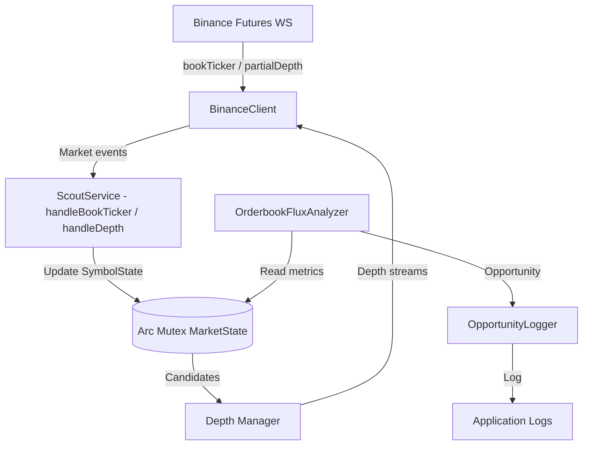

# Binance Futures USDT Scanner Service Design (Rust)

## 1. Architectural Overview
The system scans Binance Futures USDT pairs using microstructure analysis and logs top trading opportunities. It runs asynchronously using Rust and `tokio`. Since operations are completely I/O-bound, a single multi-threaded runtime is sufficient.

## 2. Layers (src/)
| Layer | Module | Responsibility |
|---|---|---|
| Entry | `main.rs` | `tracing` setup, service lifecycle management (SIGINT) |
| Orchestration | `service.rs` | `ScoutService`, `OpportunityLogger`; socket lifecycle, analysis loop, `Arc<Mutex<MarketState>>` sharing |
| Analytics | `analyzer.rs` | `OrderbookFluxAnalyzer`: candidate selection and opportunity scoring (pure logic) |
| Data Models | `models.rs` | `SymbolState`, `MarketState`, `Opportunity`, `Verdict` |
| Network | `client.rs` | `BinanceClient`: REST symbol exchange info (reqwest), WebSocket (tokio-tungstenite), exponential backoff + 20s heartbeat |
| Helpers | `utils.rs` | `parse_json`, `event_ts`, `now_ts`, `chunked` |
| Config | `config.rs` | Connection and analysis parameters (constants) |

Data sharing: Socket workers operate via `Arc<Mutex<MarketState>>`; handlers are passed to `BinanceClient` with `Box<dyn FnMut(Value) -> Pin<Box<dyn Future>>>` signatures. Analytics and model layers remain independent of I/O.

## 3. System Flowchart (Mermaid)


## 4. Build and Run
```
cd scout_rs
cargo build --release
./target/release/scout          # or in background via nohup
```

## 5. Technical Details
* **Speed**: 100ms depth updates; `tokio` multi-thread runtime.
* **Performance**: `serde_json::Value` parsing, windowed data retention via `VecDeque`, rustls for TLS (no OpenSSL dependency).
* **Reliability**: Exponential backoff (0.75s -> 10s ceiling) with jitter for WebSocket reconnects; 20s heartbeat ping.
* **Extensibility**: Analytics layer decoupled from I/O allows effortless addition of new market sources or signal strategies.