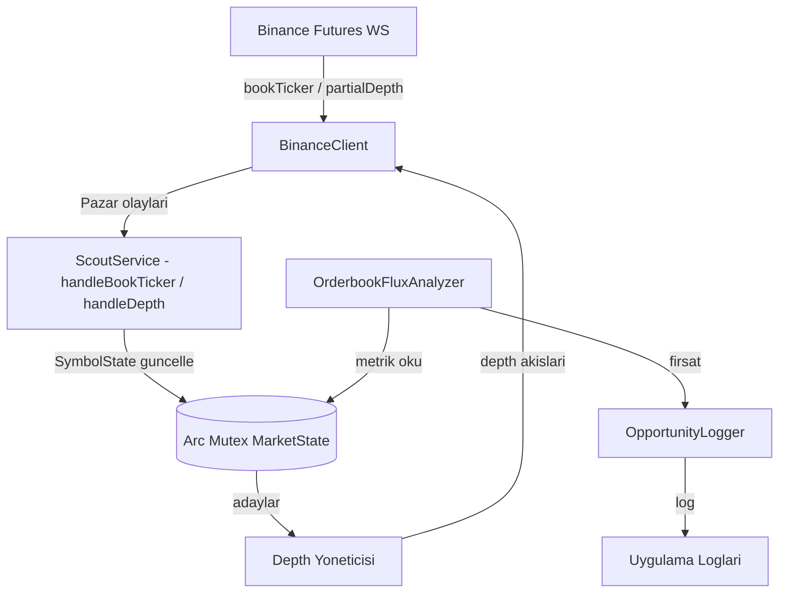

# Binance Futures USDT Tarama Servisi Tasarimi (Rust)

## 1. Mimari Genel Bakis
Sistem, Binance Futures USDT paritelerini mikroyapi analizi ile tarar ve en iyi firsati loglar. Rust + `tokio` ile asenkron calisir; islem tamamen I/O-bound oldugu icin tek multi-thread runtime yeterlidir.

## 2. Katmanlar (src/)
| Katman | Modul | Sorumluluk |
|---|---|---|
| Giris | `main.rs` | `tracing` kurulumu, servisi baslatma / durdurma (SIGINT) |
| Orkestrasyon | `service.rs` | `ScoutService`, `OpportunityLogger`; soket yasam dongusu, analiz dongusu, `Arc<Mutex<MarketState>>` paylasimi |
| Analiz | `analyzer.rs` | `OrderbookFluxAnalyzer`: aday secimi ve firsat derecelendirmesi (saf mantik) |
| Veri | `models.rs` | `SymbolState`, `MarketState`, `Opportunity`, `Verdict` |
| Iletisim | `client.rs` | `BinanceClient`: REST sembol listesi (reqwest), WebSocket (tokio-tungstenite), eksponansiyel backoff + 20s heartbeat |
| Yardimci | `utils.rs` | `parse_json`, `event_ts`, `now_ts`, `chunked` |
| Ayarlar | `config.rs` | Baglanti ve analiz parametreleri (sabitler) |

Veri paylasimi: soket iscileri `Arc<Mutex<MarketState>>` uzerinden calisir; handler'lar `Box<dyn FnMut(Value) -> Pin<Box<dyn Future>>>` imzasi ile `BinanceClient`'a verilir. Analiz ve model katmanlari I/O'dan bagimsizdir.

## 3. Sistem Akis Semasi (Mermaid)


## 4. Derleme ve Calistirma
```
cd scout_rs
cargo build --release
./target/release/scout          # veya: nohup ile arka planda
```

## 5. Teknik Detaylar
*   **Hiz**: 100ms derinlik guncellemeleri; `tokio` multi-thread runtime.
*   **Performans**: `serde_json::Value` isleme, `VecDeque` ile pencereli veri saklama, TLS icin rustls (OpenSSL gerektirmez).
*   **Guvenilirlik**: WebSocket kopmalarinda eksponansiyel backoff (0.75s -> 10s tavan) ve jitter; 20s heartbeat ping.
*   **Genisletilebilirlik**: Analiz katmani I/O'dan ayrik oldugundan yeni pazar kaynaklari veya sinyal stratejileri kolayca eklenebilir.