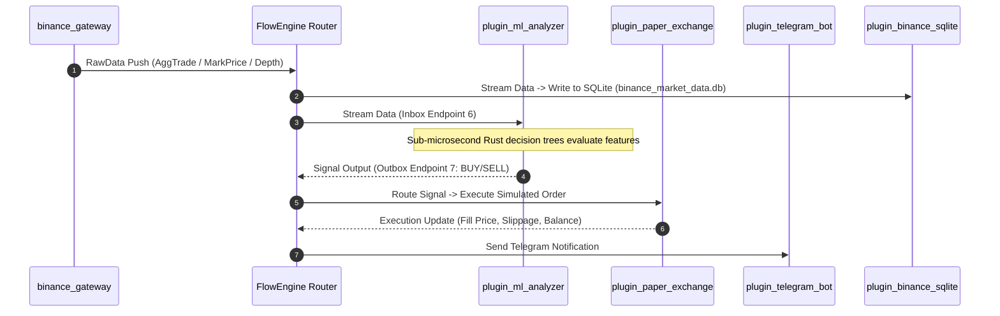
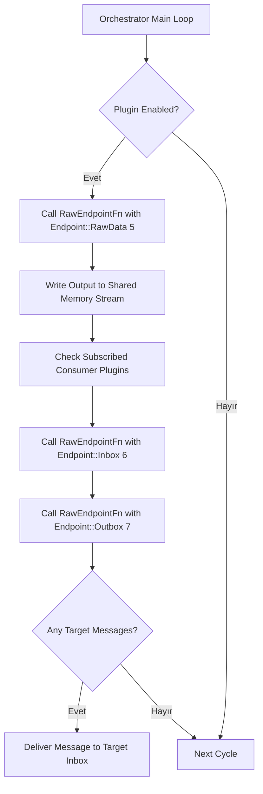

# Cycle Orchestrator (`cycle-orc`) - Modern Sistem Mimarisi Dokümantasyonu

> **Sürüm:** 2.0  
> **Lisans:** Özel / Proprietary  
> **Hedef:** Yüksek frekanslı piyasa verisi işleme, mikroyapı analizi, makine öğrenimi sinyal üretimi, kâğıt/canlı borsa yürütmesi ve zero-copy RAM tabanlı eklenti orkestrasyonu.

---

## 1. Genel Bakış ve Mimari Felsefe

**Cycle Orchestrator (`cycle-orc`)**, kripto para piyasalarında yüksek frekanslı (HFT) ve kantitatif alım-satım stratejilerini çalıştırmak için tasarlanmış, **Rust tabanlı sıfır-kopyalama (zero-copy) bellek veri aktarım sistemidir**.

Sistemin temel felsefesi **bütünleşik yekpare bir monolit yerine, sıfır bağımlılıklı çekirdek kabuk (kernel shell) ve dinamik yüklenebilir eklenti (plugin) mimarisi** üzerine kuruludur.

```
┌─────────────────────────────────────────────────────────────────────────────────────────┐
│                                 KULLANICI ARAYÜZLERİ                                    │
│   ┌────────────────────────┐  ┌────────────────────────┐  ┌──────────────────────────┐   │
│   │ Interactive Shell CLI  │  │ Terminal UI (Ratatui)  │  │ Axum Web Server / WebSock│   │
│   └───────────┬────────────┘  └───────────┬────────────┘  └────────────┬─────────────┘   │
└───────────────┼───────────────────────────┼────────────────────────────┼────────────────┘
                │                           │                            │
┌───────────────▼───────────────────────────▼────────────────────────────▼────────────────┐
│                              ORCHESTRATOR CORE (`crates/core`)                           │
│   ┌─────────────────────────────────────────────────────────────────────────────────┐   │
│   │ Orchestrator Manager (C-ABI Dynamic .so / .dll Shared Library Loader)           │   │
│   └────────────────────────────────────────┬────────────────────────────────────────┘   │
│   ┌────────────────────────────────────────▼────────────────────────────────────────┐   │
│   │ Flow Engine (DAG Tabanlı Sıfır-Kopyalama RAM Veri Yönlendirici & Stream Router) │   │
│   └────────────────────────────────────────┬────────────────────────────────────────┘   │
└────────────────────────────────────────────┼────────────────────────────────────────────┘
                                             │ C-ABI RawEndpointFn
┌────────────────────────────────────────────▼────────────────────────────────────────────┐
│                              EKLENTİ (PLUGIN) EKOSİSTEMİ                                │
│   ┌───────────────────────┐  ┌───────────────────────┐  ┌───────────────────────────┐   │
│   │ PRODUCERS             │  │ ANALYTICS & ML        │  │ EXECUTION & STORAGE       │   │
│   │ • binance_gateway     │  │ • plugin_spoofing     │  │ • binance_trader          │   │
│   │ • ohlcv_fetcher       │  │ • plugin_iceberg      │  │ • plugin_paper_exchange   │   │
│   │ • oi_fetcher          │  │ • plugin_ml_analyzer  │  │ • plugin_binance_sqlite   │   │
│   └───────────────────────┘  └───────────────────────┘  └───────────────────────────┘   │
└────────────────────────────────────────────┬────────────────────────────────────────────┘
                                             │
┌────────────────────────────────────────────▼────────────────────────────────────────────┐
│                    PYTHON ML SÜİTİ & VERİTABANI PERSİSTENCE TABAKASI                     │
│   ┌─────────────────────────────────────────────────────────────────────────────────┐   │
│   │ Python ML Suite (LightGBM, XGBoost, Model Training, Rust Code Generator)        │   │
│   │ Persistence: SQLite (binance_market_data.db, paper_exchange.db, tacusdt_backtest) │   │
│   └─────────────────────────────────────────────────────────────────────────────────┘   │
└─────────────────────────────────────────────────────────────────────────────────────────┘
```

### Temel Mimarî İlke ve Hedefler

1. **Sıfır-Kopyalama & Sıfır-Gecikme (Zero-Copy Shared Memory):** Piyasa verileri (Orderbook diffs, AggTrade, Ticker) heap üzerinde gereksiz kopyalanmaz. Eklentiler arası iletişim doğrudan RAM işaretçileri (pointers) ve atomic değişkenler üzerinden gerçekleşir.
2. **Strict C-ABI Kontratı:** Orkestratör çekirdeği hiçbir eklentiye derleme zamanı (compile-time) bağımlılığı taşımaz. Eklentiler `.so` (Linux) veya `.dll` (Windows) olarak derlenir ve çalışma zamanında (`libloading`) yüklenir.
3. **DAG (Yönlü Devretsiz Graf) Veri Akışı:** `flow_engine`, veri üreticileri (Producers), veri işleyicileri (Analytics) ve yürütücüler (Execution) arasındaki bağımlılıkları JSON yapılandırması üzerinden dinamik bağlar.
4. **Hibrit Rust + Python ML Mimarisi:** Model eğitimi Python (LightGBM/XGBoost/CatBoost) tarafında yapılır; karar ağaçları C/Rust sarmal koduna (`rust_filter_generator.py`) dönüştürülerek mikro-saniyeler seviyesinde Rust eklentisi içinde çalıştırılır.

---

## 2. Sistem Katmanları Mimarisi

### 2.1. Orkestrasyon ve Çekirdek Katmanı (`crates/core/orchestrator`)

Orkestratör çekirdeği iş mantığı, ağ istekleri veya veritabanı kodları içermez. Sadece eklenti yaşam döngüsünü (Lifecycle) yönetir ve C-ABI fonksiyon çağrılarını yönlendirir.

#### C-ABI Standard Endpoint Kontratı (`system.rs` & `endpoint.rs`)

Eklenti iletişim arayüzü sanal tablo (V-Table) maliyetini ortadan kaldırmak için C-ABI fonksiyon imzasına dayanır:

```rust
// RawEndpointFn: Sıfır-kopyalama C-ABI çağrı imzası
pub type RawEndpointFn = unsafe extern "C" fn(
    plugin_state: *mut c_void, 
    endpoint_id: u32, 
    payload: *const u8, 
    payload_len: usize, 
    out_buf: *mut u8, 
    out_max_len: usize
) -> usize;
```

#### Standart Endpoint Türleri (`StandardEndpoint`)

| Endpoint ID | İsim | Açıklama |
|---|---|---|
| `0` | `Start` | Eklenti iş parçacığını ve veri akışını başlatır. |
| `1` | `Stop` | Eklentiyi güvenli bir şekilde durdurur. |
| `2` | `IsWorking` | Eklentinin çalışır durumda olup olmadığını kontrol eder. |
| `3` | `DataValid` | Verinin güncel ve geçerli olup olmadığını doğrular. |
| `4` | `DataMonitor` | TUI / Web Arayüzü için canlı durum ve ham bellek izleme verisi sunar. |
| `5` | `RawData` | Üretici eklentilerden ham stream verisi çeker. |
| `6` | `Inbox` | Eklentiye mesaj/stream verisi iletir. |
| `7` | `Outbox` | Eklentiden dışarı giden mesaj/sinyal verilerini okur. |
| `8` | `GetSubscriptions` | Eklentinin abone olduğu stream listesini döndürür. |

---

### 2.2. Akış ve Yönlendirme Motoru (`crates/core/flow_engine`)

`flow_engine`, eklentiler arasında Pub/Sub veri akışını ve RPC tipi mesajlaşmayı yöneten DAG motorudur.

```rust
pub struct FlowEngine {
    pub plugins: std::sync::RwLock<Vec<PluginConfig>>,
    pub router: Arc<MemoryRouter>,
    pub last_pushed: std::sync::Mutex<std::collections::HashMap<(String, String), u64>>,
}
```

---

### 2.3. Eklenti Ekosistemi (`crates/plugins`)

Eklentiler 5 ana kategoride modüler olarak organize edilmiştir:

#### 1. Veri Üreticileri (Producers)
* **`binance_gateway`**: Binance Futures WebSocket bağlantılarını yönetir. `stream_markprice`, `stream_trades`, `stream_aggtrades`, `stream_depth`, `stream_bestprice`, `stream_liquidations` akışlarını yayınlar.
* **`ohlcv_fetcher`**: Binance REST API üzerinden istenen sembol ve zaman aralıklarında (1m, 5m, 15m, 1h) mum (OHLCV) verilerini toplar.
* **`oi_fetcher`**: Binance Open Interest (Açık Pozisyon) verilerini periyodik çeker.

#### 2. Analiz & Gösterge Eklentileri (Analytics)
* **Emir Defteri Mikroyapı Analizörleri:**
  * `plugin_spoofing`: Emir defterinde aldatıcı büyük duvar (spoofing) tespit eder.
  * `plugin_iceberg`: Gizli buzdağı (iceberg) emirlerini ve yenileme sıklıklarını algılar.
  * `plugin_absorption`: Belirli seviyelerdeki emir emilimini (absorption) analiz eder.
  * `plugin_bookticker_derivatives`: En iyi alış/satış fiyat ve miktar değişim türevlerini hesaplar.
  * `ms_analyzer`: Mum yapısı ve mikroyapı formasyonlarını derinlemesine inceleyerek sinyal üretir.
* **Likidite ve Oynaklık Göstergeleri:**
  * `plugin_amihud`: Amihud iliquidity (likiditesizlik) oranını hesaplar.
  * `plugin_price_impact`: Alış/satış emirlerinin piyasa fiyatına etkisini ölçer.
  * `plugin_atr`: ATR (Average True Range) oynaklık göstergesi.
  * `plugin_rsi`: RSI (Relative Strength Index) osilatör analizi.
  * `plugin_level_proximity`: Fiyatın kritik destek/direnç seviyelerine yakınlığını izler.
* **Strateji ve Backtest Eklentileri:**
  * `plugin_breakout`: Kırılım stratejisi sinyal oluşturucu.
  * `plugin_scout`: Piyasa durum tarayıcısı.
  * `plugin_bollinger_backtest`: Bollinger bantları strateji backtest eklentisi.
  * `plugin_all_bars_backtest`: Tüm mum formasyonları backtest çalıştırıcısı.
  * `plugin_back`: ML modellerine dayalı geriye dönük test motoru.
  * `plugin_ml_analyzer`: Yapay zeka/ML tabanlı canlı ticaret sinyal çıkarım eklentisi.
  * `plugin_tacusdt_1h`: TACUSDT 1 saatlik özel strateji eklentisi.

#### 3. Yürütme Motoru (Execution)
* **`binance_trader`**: Gerçek Binance Futures hesabı üzerinde HMAC SHA256 imzalı emri borsaya iletir, stop-loss / take-profit takibini yapar.
* **`plugin_paper_exchange`**: SQLite tabanlı (`data/paper_exchange.db`) simüle borsa motorudur. Kayma (slippage), komisyon, gerçekleşme (fill) ve PnL hesabını sıfır riskle canlı veri üzerinde simüle eder.

#### 4. Veri Depolama (Storage)
* **`plugin_binance_sqlite`**: Canlı akış verilerini `data/binance_market_data.db` SQLite veritabanına performanslı şekilde kaydeder.
* **`plugin_sqlite_query`**: Diğer eklentiler için veritabanı sorgulama arayüzü sağlar.

#### 5. Bildirim Sistemleri (Notifications)
* **`plugin_telegram_bot`**: Oluşan sinyalleri, emir gerçekleşmelerini, kâr/zarar durumlarını ve sistem sağlık uyarılarını anlık olarak Telegram kanallarına bildirir.

---

### 2.4. Makine Öğrenimi (ML) ve Sinyal Hattı (`ml_model_suite` & Python Scripts)

* **`ml_model_suite/dataset_exporter.py`**: SQLite veritabanından teknik göstergeleri öznitelik matrisine dönüştürür.
* **`ml_model_suite/model_trainer.py`**: LightGBM, XGBoost ve CatBoost modellerini eğitir.
* **`ml_model_suite/rust_filter_generator.py`**: Eğitilen karar ağaçlarını statik C/Rust koduna dönüştürür.

---

### 2.5. Arayüz ve Uygulama Katmanı

1. **Interactive Shell (CLI - `crates/apps/interactive_shell`):** Rustyline tabanlı komut satırı arayüzü.
2. **Terminal UI (TUI - `tui_interface`):** Ratatui & Crossterm canlı görselleştirme.
3. **Web Server & Dashboard (`web_server.rs`):** Axum REST API & WebSocket yayını.

---

## 3. Veri Akışı ve Mimari Şemalar

### 3.1. Uçtan Uca Veri İşleme Hattı (Sequence Diagram)



---

### 3.2. C-ABI Eklenti Çağrı Döngüsü



---

## 4. Donanım, İşletim Sistemi ve Performans Optimizasyonu

* **Core Pinning & İşlemci İzolasyonu (`online_cpus.sh` & `offline_cpus.sh`)**
* **GPU Yönetimi (`enable_gpu2.sh` & `disable_gpu2.sh`)**
* **Lock-Free Atomic State & Pre-allocated Memory Buffers**

---

## 5. Yapılandırma ve Topoloji Yapısı (`config/config.json`)

```json
[
  {
    "plugin_name": "plugin_binance_gateway",
    "enabled": true,
    "plugin_inputs": [],
    "plugin_params": {
      "symbols": ["BTCUSDT", "ETHUSDT", "TACUSDT"]
    },
    "plugin_outputs": ["stream_markprice", "stream_trades", "stream_aggtrades", "stream_depth"]
  },
  {
    "plugin_name": "plugin_ml_analyzer",
    "enabled": true,
    "plugin_inputs": [
      {
        "source": "plugin_ohlcv_fetcher",
        "stream_id": "ai_scanner_stream",
        "params": { "symbol": "TACUSDT", "interval": "15m", "limit": 150 }
      }
    ],
    "plugin_params": {
      "symbols": ["TACUSDT", "VELVETUSDT", "BTCUSDT"],
      "min_win_probability": 0.50
    },
    "plugin_outputs": ["stream_ai_trade_signals"]
  }
]
```

---

## 6. Derleme ve Çalıştırma Yönergeleri

```bash
# Release modunda derleme
cargo build --release

# Interactive Shell ile başlatma
cargo run --release -p interactive_shell
```

---

## 7. Market Structure Kırılımlarının Gerçek Zamanlı Piyasa Dinamikleriyle Modellenmesi (Teorik & Kantitatif Model)

### 7.1. Özet ve Giriş

Finansal piyasalarda destek ve direnç seviyelerinin kırılımını yalnızca fiyat hareketi üzerinden değerlendirmek yerine, seviyeye yaklaşma sürecindeki gerçek zamanlı piyasa dinamikleriyle açıklayan olasılıksal bir modeldir.

Market structure, fiyatın gelecekte hareket edebileceği **potansiyel alanı** tanımlarken; trade akışı (trade flow), order book, likidite ve likidasyon (liquidation) verileri bu potansiyelin piyasada gerçekten gerçekleşip gerçekleşmediğini ölçer.

$$
Potential \rightarrow Realization \rightarrow Sustainability
$$

---

### 7.2. Yaşam Döngüsü ve Durum Geçiş Akışı

```text
Market Structure
       ↓
     Level
       ↓
   Potential
       ↓
 Level Activation
       ↓
Pre-Breakout State
       ↓
   Breakout?
     ↙   ↘
   No     Yes
   ↓       ↓
 Wait   Realization
           ↓
     Sustainability
           ↓
    Position Decision
           ↓
         Outcome
           ↓
       New State
```

---

### 7.3. Matematiksel Formülasyon ve Seviye Aktivasyonu (Level Activation)

Bir $L = 100$ direnç seviyesi için activation zone $1m$ ATR ile tanımlanır:

$$
D = \frac{|P - L|}{ATR_{1m}}
$$

Eğer $D < k$ (örneğin $k=0.5$, $ATR_{1m}=0.80 \Rightarrow ActivationDistance=0.40$) ise seviye aktifleşir ($P_{activation} = 99.60$). Fiyat bu seviyeye ulaştığında **Level Event** başlar.

---

### 7.4. Olaya Göre Değişen Pre-Breakout Penceresi (Event-Relative Window)

Sabit zaman pencereleri yerine, kırılım gerçekleşene kadar geçen doğal piyasa süresi kullanılır:

$$
W_{pre} = t_{breakout} - t_{activation}
$$

Örneğin hareket 18 saniye sürdüyse $W_{pre} = 18s$ olur. Pencerenin uzunluğunu zamansal kısıtlar değil, piyasa olayının kendisi belirler.

---

### 7.5. Ön-Kırılım Piyasa Dinamikleri (Pre-Breakout Dynamics)

1. **Trade Flow & Delta Ratio:**
   $$
   Delta = BuyVolume - SellVolume
   $$
   $$
   DeltaRatio = \frac{BuyVolume - SellVolume}{BuyVolume + SellVolume}
   $$

2. **Order Book Likidite Tüketimi (Liquidity Depletion):**
   $$
   LiquidityDepletion = \frac{InitialLiquidity - FinalLiquidity}{InitialLiquidity}
   $$

3. **Fiyat Etkisi (Price Impact) vs. Emilim (Absorption):**
   $$
   Impact = \frac{\Delta P / P}{NormalizedVolume}
   $$
   * **Large Buy Flow + Large Price Impact:** Alışlar fiyatı itiyor (Yüksek Kırılım Kalitesi).
   * **Large Buy Flow + Small Price Impact:** Alışlar emiliyor (Absorption / Sahte Kırılım Riski).

4. **Likidasyon Dinamikleri (Liquidation Dynamics):**
   $$
   Price \uparrow \;\rightarrow\; ShortLiquidation \uparrow \;\rightarrow\; ForcedBuy \uparrow \;\rightarrow\; Price \uparrow
   $$

---

### 7.6. Olasılıksal Durum Modeli (State-Based Probability) ve Pozisyon Yönetimi

Model deterministik Al/Sat sinyali yerine koşullu olasılık hesaplar:

$$
P(Breakout \mid S_t) \quad \text{ve} \quad P(SustainedBreakout \mid S_t)
$$

Burada durum vektörü $S_t$:

$$
S_t = \{ Structure, Level, Flow, OrderBook, Liquidity, Liquidation, Volatility \}
$$

Risk tabanlı dinamik pozisyon büyüklüğü:

$$
Q = \frac{RiskCapital}{InvalidationDistance}
$$

$$
\boxed{
Structure \rightarrow Potential \rightarrow Activation \rightarrow Dynamics \rightarrow Realization \rightarrow Sustainability \rightarrow Decision \rightarrow Outcome \rightarrow NewState
}
$$

---

### 7.7. Araştırma Hipotezleri (H1 - H6)

* **H1:** Seviyeye yaklaşırken oluşan order-flow imbalance, breakout olasılığı hakkında anlamlı bilgi taşır.
* **H2:** Trade flow ile price impact arasındaki ilişki breakout kalitesini belirler.
* **H3:** Level etrafındaki liquidity depletion, breakout realization ile doğrudan ilişkilidir.
* **H4:** Pre-breakout likidasyon aktivitesi, kırılımın yönünü ve sürdürülebilirliğini tahmin eder.
* **H5:** Event-relative window, sabit zaman pencerelerine kıyasla daha yüksek bilgi kazancı sağlar.
* **H6:** Breakout realization ile breakout sustainability istatistiksel olarak birbirinden ayrılabilir.

---

### 7.8. Deney Tasarımı ve Başarı Ölçütleri

Modellerin tahmin gücü aşamalı olarak karşılaştırılır:
* **Model A:** Market Structure
* **Model B:** Market Structure + OHLCV
* **Model C:** Market Structure + Trade Flow
* **Model D:** Market Structure + Trade Flow + Order Book
* **Model E:** Market Structure + Trade Flow + Order Book + Liquidation
* **Model F:** Model E + Event-Relative Window

**Ana Araştırma Sorusu:** $Does \;\; F > A ?$

**Değerlendirme Metrikleri:** Precision, Recall, F1, ROC-AUC, PR-AUC, Brier Score, Kalibrasyon (Probability Calibration), Expected Value, Max Drawdown, Sharpe Ratio, Profit Factor.

---

## 8. Özet ve Sonuç

**Cycle Orchestrator (`cycle-orc`)**, C-ABI tabanlı sıfır-kopyalama mimarisi, DAG veri akış motoru, zengin mikroyapı analiz eklentileri, C/Rust seviyesinde çalışan makine öğrenimi karar ağaçları ve **Market Structure Event-Driven Kırılım Modeli** ile endüstriyel standartlarda kantitatif işlem altyapısı sunmaktadır.
