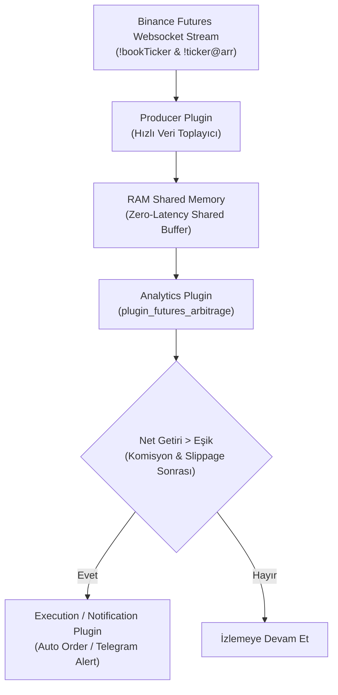

# Binance Futures USDT Paritelerinde Arbitraj Taraması ve Eklenti Mimari Tasarımı

Bu doküman, Binance Futures piyasasındaki tüm USDT işlem çiftlerini anlık tarayarak arbitraj fırsatlarını tespit eden bir eklentinin (plugin) teknik mimarisini, arbitraj yöntemlerini ve uygulama esaslarını içermektedir.

---

## 1. Hedeflenen Arbitraj Stratejileri

Binance Futures üzerinde otomatik olarak taranabilecek 3 temel arbitraj yöntemi bulunmaktadır:

### 1.1 Spot-Futures (Basis / Funding Rate) Arbitrajı
* **Çalışma Prensibi:** Spot piyasada varlık satın alınırken, Futures piyasasında eşit miktarda SHORT pozisyon açılır (Delta Neutral - Fiyat yön riskinden bağımsız).
* **Getiri Kaynağı:** Her 8 saatte bir ödenen **Fonlama Oranı (Funding Rate)** ve Spot-Futures fiyatları arasındaki vadeli prim (Basis).
* **Tarama Hedefi:** Tüm USDT paritelerinin yıllıklandırılmış fonlama getirilerini (Funding APR) anlık karşılaştırarak en yüksek nakit akışını sağlayan pariteleri seçmek.

### 1.2 Sürekli (Perpetual) - Vadeli (Quarterly) Takvim Arbitrajı (Calendar Spread)
* **Çalışma Prensibi:** Sürekli sözleşme (`PERPETUAL`) ile belirli vadeli sözleşme (`QUARTERLY`) arasındaki fiyat sapması taranır.
* **Getiri Kaynağı:** Vadeli sözleşmeler vade sonu yaklaştıkça spot/perpetual fiyatına yakınlaşmak zorundadır (Convergence).
* **Tarama Hedefi:** Aşırı primli veya skontolu vadeli sözleşmeler arasındaki yayılımı (spread) tespit etmek.

### 1.3 İstatistiksel Arbitraj & Korelasyon (Pairs Trading / Lead-Lag)
* **Çalışma Prensibi:** Birbiriyle %95+ tarihsel korelasyona sahip paritelerin (örneğin BTC-ETH veya yüksek korelasyonlu Layer-1 projeleri) anlık fiyat rasyosu takip edilir.
* **Getiri Kaynağı:** Bir paritenin milisaniyelik gecikmeyle (lead-lag) geride kalması durumunda rasyo ortalamaya dönene kadar işlem yapılır.

---

## 2. Eklenti (Plugin) Mimarisi ve Akış Şeması

`cycle-orc` mimarisine uyumlu `plugin_futures_arbitrage` tasarımı aşağıdaki veri akış hattına (data pipeline) dayanır:



---

## 3. Matematiksel Model ve Kar-Zarar Hesaplama

Eklenti, her veri paketinde RAM üzerinde aşağıdaki net kârlılık formülünü çalıştırır:

$$\text{Net Getiri \%} = \text{Spread \%} + \text{Fonlama Oranı \%} - (\text{Komisyon \%} + \text{Tahmini Kayma/Slippage \%})$$

### Komisyon ve Oynaklık Hesabı:
* **Taker Komisyonu:** Giriş ve çıkışta toplam $2 \times \text{Taker Fee}$ (ör. $\%0.04 \times 2 = \%0.08$).
* **Tahta Derinliği (Orderbook Depth):** Sadece en iyi alış-satış (Bid/Ask) fiyatına bakılmaz; hedeflenen işlem hacminin (ör. 10.000 USDT) tahtadaki kayma tutarı hesaplanır.

---

## 4. Kritik Mühendislik ve Uygulama Zorlukları

1. **Veri Hacmi ve Rate Limit:**
   * 300+ pariteyi ayrı ayrı polling ile sormak API rate-limit engeline takılır. 
   * **Çözüm:** Binance'in toplu WebSocket kanalları olan `!bookTicker` (tüm tahtaların en iyi bid/ask değerleri) ve `!ticker@arr` kullanılır.

2. **Bacak Riski (Leg Execution Risk):**
   * Arbitrajın bir ayağı dolup diğer ayağı dolmazsa açık pozisyon riski doğar.
   * **Çözüm:** RAM tabanlı Rust bellek mimarisi ile emir gönderim gecikmesi (latency) minimuma indirilir.

3. **Likidite ve Slippage:**
   * Düşük hacimli altcoinlerde yüksek görünen fiyat farkları tahtada derinlik olmaması sebebiyle gerçekleşmeyebilir. Eklenti derinlik süzgeci (minimum volume filter) uygulamalıdır.

---

## 5. Örnek JSON Çıktısı (RAM Metrics)

Eklentinin `DataMonitor` üzerinden RAM'e yayınlayacağı analiz çıktısı:

```json
{
  "timestamp_ms": 1771976323000,
  "top_opportunities": [
    {
      "symbol": "BTCUSDT",
      "strategy": "Funding_Rate_Basis",
      "spot_price": 65000.0,
      "futures_price": 65120.0,
      "basis_pct": 0.184,
      "funding_rate_8h_pct": 0.045,
      "annualized_apr_pct": 51.4,
      "net_profit_est_pct": 0.149,
      "status": "OPPORTUNITY_FOUND"
    }
  ]
}
```
