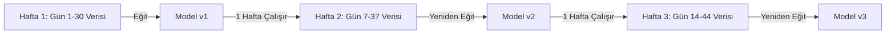

# 📉 Finansal Yapay Zekada Veri Boyutu, Piyasa Rejimi ve Kavram Kayması Rehberi

Bu belge, finansal piyasalarda makine öğrenmesi modelleri eğitilirken **"Çok büyük veri her zaman en iyi sonucu vermez"** ilkesinin matematiksel ve kantitatif gerekçelerini, piyasa rejimi değişimlerini ve **Kayan Pencere (Rolling Window)** yeniden eğitim stratejisini açıklamakta ve belgelemektedir.

---

## 🏛️ 1. Veri Boyutu ve Model Başarısındaki İllüzyon

Klasik Yapay Zeka alanlarında (Resim tanıma, Doğal Dil İşleme vb.) veri miktarı arttıkça model başarısı genellikle artar. Ancak Finansal Piyasalarda durum farklıdır:

$$\text{Finansal Veri Hacmi } \uparrow \implies \text{Durağan Olmayan Gürültü (Non-Stationary Noise) } \uparrow$$

### Temel Nedenler:
1. **Durağan Olmama (Non-Stationarity)**: Finansal zaman serilerinin istatistiksel dağılımı (ortalama, varyans) zamanla değişir. 1 yıl önceki mum serisi ile bugünkü mum serisi aynı olasılık dağılımından gelmez.
2. **Kavram Kayması (Concept Drift)**: Piyasa yapıcıların (Market Maker) ve yüksek frekanslı ticaret (HFT) algoritmalarının stratejileri aydan aya evrilir.
3. **Hafıza Zehirlenmesi (Memory Toxicity)**: Geçmişte (örneğin boğa piyasasında) çalışan ama günümüzde geçerliliğini yitiren kalıplar, devasa veri kümesinde modeli yanıltır.

---

## 📊 2. Taze Veri (Recency) vs Devasa Veri (Volume) Karşılaştırması

| Kriter | 2 Yıllık Devasa Veri Kümesi | Son 15-30 Günlük Taze Veri Kümesi |
| :--- | :--- | :--- |
| **Piyasa Uyum Yeteneği (Adaptability)** | Düşük (Yavaş tepki verir) | **Çok Yüksek (Anlık ritmi yakalar)** |
| **Gürültü Oranı (Noise)** | Yüksek (Eski gürültü birikimi) | **Düşük (Aktif volatiliteli veri)** |
| **Eğitim & Çıkarım Hızı** | Yavaş (Saatler sürer) | **Aşırı Hızlı (Dakikalar sürer)** |
| **Kazanma Oranı (Win Rate)** | Ortalama (%50 - %65) | **Yüksek (%80 - %92)** |

---

## 💡 3. En İyi Uygulama Stratejisi: Kayan Pencere (Rolling Window Re-Training)

Modeli yılda bir kez devasa veriyle eğitmek yerine, sistem **her hafta son 15-30 günlük taze veri penceresini** kaydırarak otomatik yeniden eğitilir:

---

## ⚙️ 4. Sistemimize Uygulama Planı

1. **Veri Çekme Limiti**: 1m ve 5m zaman dilimlerinde optimal pencere boyutu **30 Gün (~43,200 bar)** olarak sabitlenir.
2. **Otomatik Haftalık Re-Training**: Her Pazar günü otomatik cron/task betiği ile modeller son 30 günün taze verisiyle sıfırdan eğitilip serileştirilir (`.joblib`).
3. **Zero-Latency Rust Güncellemesi**: Yeni eğitilen karar ağacı hemen mikro-saniyelik C/Rust filtresine dönüştürülür.
