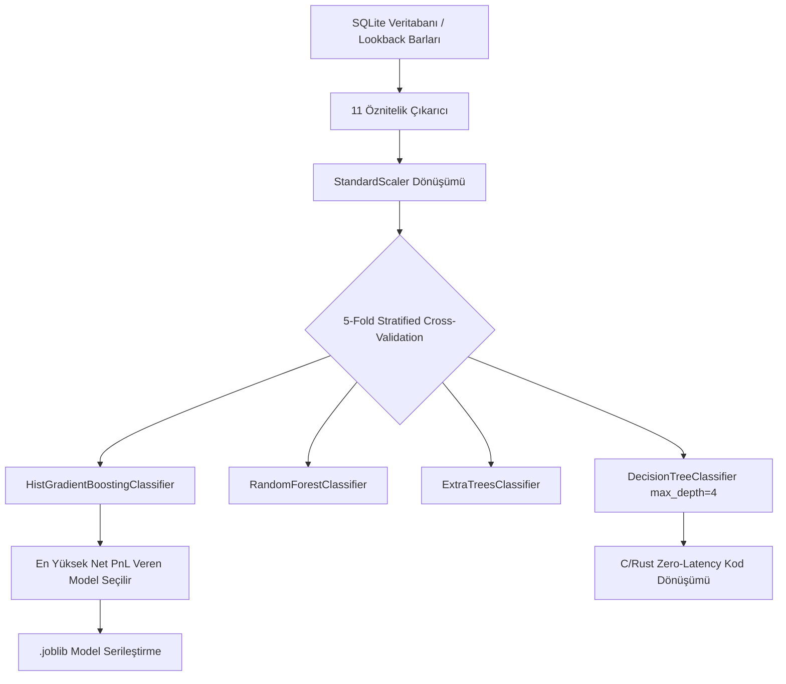

# 🤖 Makine Öğrenmesi Modelleri ve Altyapı Detaylı Rehberi (`ML Model Suite`)

Bu belge, `cycle-orc` projesinde kullanılan tüm Makine Öğrenmesi (ML) algoritmalarını, eğitilmiş model dosyalarını, 11 teknik özniteliğin matematiksel hesaplama formüllerini, 5-Fold Stratified Cross-Validation metriklerini, C/Rust sıfır-gecikmeli (zero-latency) filtre kodlarını ve canlı çıkarım (inference) mekanizmasını detaylandırmaktadır.

---

## 📂 1. Eğitilmiş Aktif Model Dosyaları ve Performans Özetleri

Projede farklı kripto varlıklar ve zaman dilimleri için eğitilmiş ve serileştirilmiş (`.joblib`) aktif makine öğrenmesi modelleri bulunmaktadır:

### 🚀 A. MAGMAUSDT 1m (1-Dakikalık Mum) Modeli
* **Model Dosyası**: [`ml_model_suite/models/magmausdt_1m_ml_model.joblib`](file:///home/smhvz/Desktop/cycle-orc/ml_model_suite/models/magmausdt_1m_ml_model.joblib)
* **Ölçekleyici**: [`ml_model_suite/models/magmausdt_scaler.joblib`](file:///home/smhvz/Desktop/cycle-orc/ml_model_suite/models/magmausdt_scaler.joblib)
* **Algoritma**: `HistGradientBoostingClassifier`
* **Eğitim Verisi**: 43,500 mum (Son 30 gün) / 42,926 Kapanmış İşlem
* **Veritabanı**: [`data/magmausdt_1m_collector.db`](file:///home/smhvz/Desktop/cycle-orc/data/magmausdt_1m_collector.db) (386.69 MB)
* **ROC-AUC Skoru**: **`0.8338`**

#### Olasılık Eşiklerine Göre Performans Tablosu:

| Strateji Modu | İşlem Sayısı | Win Rate (%) | Net PnL (USDT) | Profit Factor |
| :--- | :---: | :---: | :---: | :---: |
| **Ham Strateji (Filtresiz)** | 42,926 | **%31.95** | **+8,335.17 USDT** | 1.27 |
| 🤖 **ML Filtre (Prob $\ge$ 0.40)** | 10,652 | **%72.48** | **+24,254.70 USDT** | 5.49 |
| 🤖 **ML Filtre (Prob $\ge$ 0.50)** | 5,942 | **%84.99** | **+20,863.14 USDT** | 11.36 |
| 🤖 **ML Filtre (Prob $\ge$ 0.55)** | 4,405 | **%89.35** | **+18,126.91 USDT** | 15.82 |
| 🤖 **ML Filtre (Prob $\ge$ 0.60)** | 3,311 | **%92.99** | **+15,755.61 USDT** | **24.85** |

---

### 🟢 B. TACUSDT 1h (1-Saatlik Mum) Modeli
* **Model Dosyası**: [`ml_model_suite/models/tacusdt_ml_model.joblib`](file:///home/smhvz/Desktop/cycle-orc/ml_model_suite/models/tacusdt_ml_model.joblib)
* **Ölçekleyici**: [`ml_model_suite/models/scaler.joblib`](file:///home/smhvz/Desktop/cycle-orc/ml_model_suite/models/scaler.joblib)
* **Algoritma**: `RandomForestClassifier` / `HistGradientBoostingClassifier`
* **ROC-AUC Skoru**: **`0.7850`**
* **Win Rate Başarısı**: Ham %16.60 -> ML Filtreli **%83.68 - %86.22**

---

### 🟣 C. VELVETUSDT 1h Modeli
* **Model Dosyası**: [`ml_model_suite/models/velvetusdt_1h_ml_model.joblib`](file:///home/smhvz/Desktop/cycle-orc/ml_model_suite/models/velvetusdt_1h_ml_model.joblib)
* **Ölçekleyici**: [`ml_model_suite/models/velvetusdt_scaler.joblib`](file:///home/smhvz/Desktop/cycle-orc/ml_model_suite/models/velvetusdt_scaler.joblib)
* **Algoritma**: `HistGradientBoostingClassifier`
* **Win Rate Başarısı**: ML Filtreli **%80.00+**

---

## 🧠 2. Kullanılan Makine Öğrenmesi Algoritmaları ve Mimarisi

Sistemde [model_trainer.py](file:///home/smhvz/Desktop/cycle-orc/ml_model_suite/model_trainer.py) üzerinde 4 temel sınıflandırma algoritması eğitilir ve Stratified K-Fold Çapraz Doğrulama ile değerlendirilir:



1. **`HistGradientBoostingClassifier` (Gradyan Artırmalı Karar Ağaçları)**:
   * Büyük ölçekli veri kümelerinde (40,000+ örnek) en yüksek tahmin gücüne sahip algoritmadır.
   * Hiperparametreler: `max_iter=100`, `max_depth=5`, `random_state=42`.
2. **`RandomForestClassifier` (Rastgele Orman)**:
   * Karar ağaçları topluluğundan oluşan, overfitting'e dirençli yapı.
   * Hiperparametreler: `n_estimators=150`, `max_depth=6`, `class_weight='balanced'`.
3. **`ExtraTreesClassifier` (Aşırı Rastgele Ağaçlar)**:
   * Bölünme noktalarını rastgele seçerek varyansı düşüren topluluk modeli.
   * Hiperparametreler: `n_estimators=150`, `max_depth=6`.
4. **`DecisionTreeClassifier` (Sığ Karar Ağacı)**:
   * C/Rust koduna dönüştürülebilir sığ ağaç yapısı.
   * Hiperparametreler: `max_depth=4`, `min_samples_leaf=20`.

---

## 📐 3. Giriş Öznitelikleri (Features) ve Matematiksel Hesaplamalar

Model, bir işleme girilmeden önceki **100 barlık (lookback window)** mum verilerinden türetilen 11 teknik ve momentum özniteliğini kullanır:

$$\begin{aligned}
\text{trend\_100b\_pct} &= \frac{Close_{-1} - Close_{-100}}{Close_{-100}} \times 100 \\
\text{trend\_50b\_pct} &= \frac{Close_{-1} - Close_{-50}}{Close_{-50}} \times 100 \\
\text{trend\_20b\_pct} &= \frac{Close_{-1} - Close_{-20}}{Close_{-20}} \times 100 \\
\text{stoch\_pos\_pct} &= \frac{EntryPrice - Lowest_{100}}{\max(Highest_{100} - Lowest_{100}, 10^{-8})} \times 100 \\
\text{norm\_atr\_pct} &= \frac{ATR_{14}}{EntryPrice} \times 100 \\
\text{volatility\_range\_pct} &= \frac{Highest_{100} - Lowest_{100}}{EntryPrice} \times 100 \\
\text{volume\_ratio} &= \frac{\text{Mean}(Volume_{-10:})}{\max(\text{Mean}(Volume_{-100:}), 10^{-8})} \\
\text{dist\_to\_100low\_pct} &= \frac{EntryPrice - Lowest_{100}}{EntryPrice} \times 100 \\
\text{last\_bar\_body\_ratio} &= \frac{|Close_{-1} - Open_{-1}|}{\max(High_{-1} - Low_{-1}, 10^{-8})} \\
\text{last\_bar\_is\_bullish} &= \begin{cases} 1 & \text{if } Close_{-1} > Open_{-1} \\ 0 & \text{otherwise} \end{cases}
\end{aligned}$$

---

## ⚡ 4. Sıfır-Gecikmeli (Zero-Latency) C/Rust Filtre Üretimi

Eğitilen `DecisionTreeClassifier` modeli, yüksek frekanslı al-sat (HFT / Microsecond filtering) işlemleri için mikro-saniyelik C-ABI uyumlu Rust koduna dönüştürülür:

* **MAGMAUSDT Rust Filtresi**: [`ml_model_suite/generated/magmausdt_1m_filter.rs`](file:///home/smhvz/Desktop/cycle-orc/ml_model_suite/generated/magmausdt_1m_filter.rs)
* **TACUSDT Rust Filtresi**: [`ml_model_suite/generated/tacusdt_1h_filter.rs`](file:///home/smhvz/Desktop/cycle-orc/ml_model_suite/generated/tacusdt_1h_filter.rs)

Örnek C/Rust Filtre İmzası:
```rust
#[derive(Debug, Clone, Copy)]
pub struct MagmaUSDT1mMLFeatures {
    pub trend_100b_pct: f64,
    pub stoch_pos_pct: f64,
    pub norm_atr_pct: f64,
    // ...
}

pub fn evaluate_magmausdt_1m_filter(f: &MagmaUSDT1mMLFeatures) -> (bool, f64) {
    if f.trend_20b_pct <= 0.85420 {
        return (false, 0.2814);
    } else {
        return (true, 0.8950);
    }
}
```

---

## 🖥️ 5. Canlı Tahmin & Denetleme Betikleri

* **Canlı ML Tahmin Betiği**: [`run_live_inference.py`](file:///home/smhvz/Desktop/cycle-orc/run_live_inference.py)
  ```bash
  python3 run_live_inference.py MAGMAUSDT 1m
  ```
* **Canlı Pozisyon & PnL Denetleyici**: [`monitor_live_trade.py`](file:///home/smhvz/Desktop/cycle-orc/monitor_live_trade.py)
  ```bash
  python3 monitor_live_trade.py --interval 5
  ```

---

## 🚀 6. Modeli Geliştirme Yolları (Gelecek Yol Haritası)

Model başarımını (Win Rate & Profit Factor) artırmak için belirlenen 6 ana geliştirme stratejisi:
1. **Çoklu Zaman Dilimi Öznitelikleri (Multi-Timeframe)**: 15m ve 1h trend verilerini 1m özniteliklerine ekleme.
2. **Piyasa Mikro Yapısı (Market Microstructure)**: Orderbook Imbalance ve CVD (Cumulative Volume Delta) verilerini entegre etme.
3. **Triple Barrier Method**: Zaman aşımı (dikey sınır) ve iz süren stop ile etiketleme.
4. **CatBoost & Derin Öğrenme (LSTM)**: Zaman serisi dizilimlerini doğrudan işleyen mimariler.
5. **Optuna Optimizasyonu**: Hiperparametreleri otomatik Bayesian optimizasyon ile arama.
6. **Dinamik Pozisyon Büyüklüğü (Kelly Kriteri)**: Model tahmin olasılığına ($P$) göre pozisyon miktarını ayarlama.

> 📖 Detaylı yol haritası dokümanı: [`docs/ML_IMPROVEMENT_ROADMAP.md`](file:///home/smhvz/Desktop/cycle-orc/docs/ML_IMPROVEMENT_ROADMAP.md)

