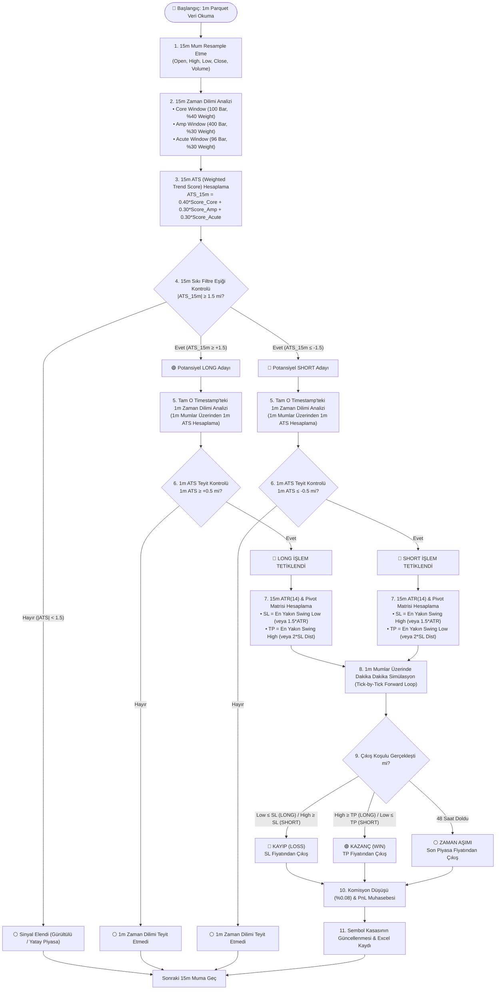

# 🛠️ MSMP 2.0 (MS ANALYZER) ALGORİTMİK AKIŞ ŞEMASI VE SİSTEM MİMARİSİ RAPORU

Bu belge, **MSMP 2.0 (Market Structure & Microstructure Plugin)** motoru ile uyguladığımız çoklu zaman dilimli (15m + 1m) trend takip ve destek/direnç ticaret sisteminin eksiksiz algoritmik akış şemasını ve matematiksel formüllerini içermektedir.

---

## 📐 1. Uçtan Uca Algoritmik Akış Şeması (Flowchart)

---

## 🧮 2. Matematiksel Formüller ve Katman Yapısı

### 1. Katman: Log-Fiyat OLS Regresyonu ve Trend Skoru
Son $N=50$ mumun kapanış fiyatlarının doğal logaritması $\ln(P_i)$ alınarak Doğrusal Regresyon (OLS) uygulanır:

$$\text{Slope} = \frac{N \sum (i \cdot \ln P_i) - \sum i \sum \ln P_i}{N \sum i^2 - (\sum i)^2}$$

$$\text{Belirleme Katsayısı } (R^2) = \frac{SS_{xy}^2}{SS_{xx} \cdot SS_{yy}}$$

$$\text{Fiyat Eğimi} = \text{Slope} \times P_{\text{son}}$$

$$\text{Ham Trend Skoru} = \left( \frac{\text{Fiyat Eğimi}}{\text{ATR}(14)} \right) \times 10 \times R^2$$

$$\text{Trend Skoru} = \max\left(-10.0, \min\left(10.0, \text{Ham Trend Skoru}\right)\right)$$

---

### 2. Katman: Zamansal Ağırlıklı Merge (ATS)
Üç farklı zaman penceresinden gelen trend skorları birleştirilir:

$$\text{ATS} = \left( \text{Score}_{\text{Core}} \times 0.40 \right) + \left( \text{Score}_{\text{Amp}} \times 0.30 \right) + \left( \text{Score}_{\text{Acute}} \times 0.30 \right)$$

- **Core Penceresi**: Son 100 bar (%40 Ağırlık)
- **Amplified Penceresi**: Son 400 bar (%30 Ağırlık)
- **Acute Penceresi**: Son 96 bar (%30 Ağırlık)

---

### 3. Katman: Dinamik Pivot Eşik Sistemi (Swing High & Low)
Eşik değeri $\text{Eşik} = \text{ATR}(14) \times 0.25$ olmak üzere $W=3$ mumluk pencerede:

- **Swing High (SH)**: $P_i \ge P_{i-j}$ ve $P_i \ge P_{i+j}$ ($\forall j \in [1, 2, 3]$) ve $(High_i - Low_i) \ge \text{Eşik}$
- **Swing Low (SL)**: $P_i \le P_{i-j}$ ve $P_i \le P_{i+j}$ ($\forall j \in [1, 2, 3]$) ve $(High_i - Low_i) \ge \text{Eşik}$

---

## 📌 3. Sıkı Filtreleme Parametreleri Tablosu

| Parametre | Değer | Açıklama |
| :--- | :--- | :--- |
| **15m ATS Giriş Eşiği** | **$\ge |\pm 1.5|$** | Sadece güçlü 15m trendlerinde işleme girilir |
| **1m ATS Giriş Eşiği** | **$\ge |\pm 0.5|$** | 1m zaman diliminin 15m ile aynı yönde olması şartı |
| **Pozisyon Büyüklüğü** | **$100.00 USDT** | Sabit pozisyon büyüklüğü |
| **Başlangıç Kasası** | **$100.00 USDT** | Sembol başı bağımsız bakiye |
| **Borsa Komisyonu** | **%0.08** | Çift taraflı Taker işlem komisyonu |
| **Maksimum Tutma Süresi** | **48 Saat (2.880 dakika)** | Zamana dayalı otomatik çıkış |
