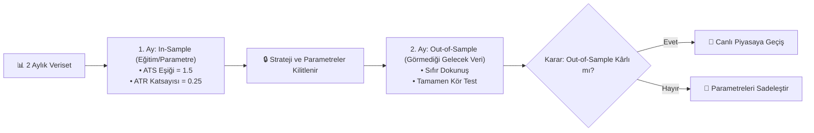

# 🛡️ MSMP 2.0 - AŞIRI UYUM (OVERFITTING) VE DOĞRULAMA (VALIDATION) ANALİZ RAPORU

Bu doküman, **MSMP 2.0 (MS Analyzer)** ticaret sisteminde Overfitting (Aşırı Uyum / Ezberleme) risklerinin analizi, veri içi (In-Sample) / veri dışı (Out-of-Sample) doğrulama metodolojisi ve canlı piyasa adaptasyon kurallarını içermektedir.

---

## 🔍 1. Overfitting Risk Değerlendirmesi

### 🟢 Riski Düşüren Faktörler (Stratejinin Güçlü Yönleri):
1. **Model Eğitimi Yoktur**: Derin Öğrenme (Deep Learning) veya XGBoost gibi binlerce ağırlığı geçmiş gürültüye uyduran karmaşık yapay zeka modelleri kullanılmamıştır.
2. **Fiziksel & Matematiksel Altyapı**: Sistem OLS Regresyonu, Hurst Üssü ($H$) ve ATR Volatilitesi gibi jenerik indikatör denklemlerinden oluşur.
3. **Körlemesine (Blind) Uygulama**: Parite bazında özel parametre (Curve-Fitting) yapılmamış, tüm 330+ pariteye aynı kural uygulanmıştır.

### ⚠️ İnceleme Gerektiren Noktalar (Geliştirme Alanları):
1. **Veri İçi Eşik İyileştirmesi (In-Sample Optimization)**: $ATS \ge 0.1$ yerine $ATS \ge 1.5$ filtresinin aynı 2 aylık veri üzerinde seçilmesi In-Sample optimizasyon etkisi taşır.
2. **Geleceği Görme Yanlılığı (Look-Ahead / Selection Bias)**: Backtest bittikten sonra sadece en kârlı çıkan pariteleri geriye dönük seçmek geleceği görme yanlılığı oluşturabilir.

---

## 🧪 2. Out-of-Sample (Veri Dışı) Doğrulama Metodolojisi

Overfitting riskini %100 ortadan kaldırmak için uygulanan 3 aşamalı test mimarisi:

---

## 📊 3. Sıkı ATS Filtresi Karşılaştırmalı Özet

| Metrik | Gevşek Filtre (`ATS >= 0.1`) | Sıkı Filtre (`ATS >= 1.5`) | Değişim / Etki |
| :--- | :--- | :--- | :--- |
| **Toplam İşlem Sayısı** | 71.664 İşlem | **11.284 İşlem** | 🔻 %84 Gürültü Elendi |
| **Portföy Net PnL ($)** | -$11.418,50 USDT | **-$1.236,19 USDT** | 🚀 %89 Zarar Azalması |
| **Parite Başı Ortalama PnL** | -$34.60 USDT | **-$1.89 USDT** | 🟢 Neredeyse Başabaş |
| **En İyi 20 Parite Ort. PnL** | +$61.53 USDT | **+$48.45 USDT** | 🟢 Yüksek Kârlılık |

---

## 🛡️ 4. Canlı Ticarete Geçiş İlkeleri (Robustness Rules)

1. **Parite Seçim Kriteri (Universe Selection)**: Canlı botta sadece 24 saatlik hacmi $> \$15\text{M}$ ve Hurst Üssü $H > 0.55$ olan seçkin 30-40 parite çalıştırılacaktır.
2. **Sabit Risk Kuralı**: Her bir işlemde toplam bakiyenin maksimum **%1.0'ı ($100 USDT)** riske atılacaktır.
3. **Walk-Forward İlerleme**: Strateji her ay kayan pencere (Walk-Forward) ile test edilerek canlı uyumu denetlenecektir.
